# 🗺️ Graphify — Kiến trúc Flutter App

```mermaid
graph TB
    %% ======================== MAIN ========================
    MAIN["main.dart / app.dart"] --> DI["DI / Providers"]
    MAIN --> ROUTER["GoRouter"]
    MAIN --> THEME["Theme (M3)"]

    %% ======================== LAYERS ========================
    subgraph LAYER0["📦 DI Container"]
        direction LR
        DI0["core/di/di.dart"]
        DI1["core_di_providers.dart"]
        DI2["repository_providers.dart"]
        DI3["usecase_providers.dart"]
        DI4["app_providers.dart"]
    end

    subgraph LAYER1["🎨 Core"]
        direction LR
        C1["Config"]
        C2["Widgets"]
        C3["Services"]
        C4["Utils"]
        C5["Extensions"]
        C6["Router"]
        C7["Theme"]
        C8["Dialogs"]
        C9["Strategy"]
    end

    subgraph LAYER2["📡 Data"]
        direction LR
        D1["Models<br/>(fromJSON/toJSON)"]
        D2["API Repositories<br/>(NestJS calls)"]
        D3["Local Repositories<br/>(SharedPrefs)"]
    end

    subgraph LAYER3["🧠 Domain"]
        direction LR
        DO1["Entities"]
        DO2["Repository Interfaces"]
        DO3["Use Cases"]
    end

    subgraph LAYER4["🖥️ Features / Screens"]
        direction LR
        F_AUTH["Auth"]
        F_HOME["Home"]
        F_TOUR["Tournament"]
        F_TEAM["Teams"]
        F_BRACKET["Bracket"]
        F_MATCH["Match / Score"]
        F_LIVE["Live"]
        F_RANK["Rankings"]
        F_PROFILE["Profile"]
    end

    subgraph LAYER5["⚡ Providers (State)"]
        direction LR
        P1["auth_provider.dart"]
        P2["ranking_provider.dart"]
        P3["query_providers.dart"]
        P4["team_notifier.dart"]
        P5["match_control_notifier.dart"]
        P6["theme_provider.dart"]
        P7["tournament_action_notifier.dart"]
        P8["standings_provider.dart"]
        P9["token_management_notifier.dart"]
        P10["user_provider.dart"]
        P11["saved_tournaments_provider.dart"]
        P12["network_providers.dart"]
    end

    %% ======================== LAYER 1: CORE DETAIL ========================
    subgraph CORE_CONFIG["⚙️ Config"]
        C1A["app_constants.dart"]
        C1B["app_spacing.dart"]
        C1C["app_typography.dart"]
        C1D["global_error_handler.dart"]
    end

    subgraph CORE_WIDGETS["🧩 Core Widgets"]
        C2A["app_action_button.dart"]
        C2B["app_bottom_nav.dart"]
        C2C["floating_bottom_nav.dart"]
        C2D["app_text_field.dart"]
        C2E["form_section.dart"]
        C2F["section_header.dart"]
        C2G["vnsport_header.dart"]
        C2H["responsive_layout.dart"]
        C2I["sport_icon_widget.dart"]
        C2J["status_indicator.dart"]
        C2K["info_chip.dart"]
        C2L["score_stepper.dart"]
        C2M["app_focusable.dart"]
        C2N["custom_error_widget.dart"]
        C2O["app_info_dialog.dart"]
        C2P["match_card_compact.dart"]
        C2Q["match_card_detail.dart"]
        C2R["match_card_live.dart"]
    end

    subgraph CORE_SERVICES["🔌 Core Services"]
        C3A["dio_client.dart<br/>(Bearer + refresh)"]
        C3B["api_response.dart"]
        C3C["bracket_graph_service.dart"]
        C3D["draw_service.dart<br/>(Fisher-Yates)"]
        C3E["excel_export_service.dart"]
        C3F["penalty_service.dart"]
        C3G["token_manager.dart"]
        C3H["app_logger.dart"]
    end

    subgraph CORE_UTILS["🛠️ Utils"]
        C4A["bracket_generator.dart<br/>(Single Elim)"]
        C4B["token_generator.dart"]
        C4C["date_parser.dart"]
        C4D["date_formatter_utils.dart"]
        C4E["navigation_helpers.dart"]
        C4F["status_helpers.dart"]
    end

    subgraph CORE_EXT["🔗 Extensions"]
        C5A["string_extensions.dart"]
        C5B["match_extensions.dart"]
        C5C["animation_extensions.dart"]
    end

    subgraph CORE_ROUTER["🧭 Router"]
        C6A["app_router.dart<br/>(15+ routes)"]
    end

    subgraph CORE_THEME["🎭 Theme"]
        C7A["app_theme.dart"]
    end

    subgraph CORE_DIALOG["💬 Dialogs"]
        C8A["confirm_dialog.dart"]
    end

    subgraph CORE_STRAT["🧠 Strategy Pattern"]
        C9A["penalty_strategy.dart"]
    end

    C1 --> CORE_CONFIG
    C2 --> CORE_WIDGETS
    C3 --> CORE_SERVICES
    C4 --> CORE_UTILS
    C5 --> CORE_EXT
    C6 --> CORE_ROUTER
    C7 --> CORE_THEME
    C8 --> CORE_DIALOG
    C9 --> CORE_STRAT

    %% ======================== LAYER 2: DATA DETAIL ========================
    subgraph DATA_MODELS["📄 Models"]
        D1A["user_model.dart"]
        D1B["tournament_model.dart"]
        D1C["team_model.dart"]
        D1D["match_model.dart"]
        D1E["match_event_model.dart"]
        D1F["penalty_model.dart"]
        D1G["token_model.dart"]
        D1H["standing_model.dart"]
        D1I["ranking_model.dart"]
        D1J["saved_tournament_model.dart"]
    end

    subgraph DATA_API["🌐 API Repositories"]
        D2A["api_auth_repository.dart"]
        D2B["api_tournament_repository.dart"]
        D2C["api_team_repository.dart"]
        D2D["api_match_repository.dart"]
        D2E["api_token_repository.dart"]
        D2F["api_ranking_repository.dart"]
        D2G["api_user_repository.dart"]
    end

    subgraph DATA_LOCAL["💾 Local"]
        D3A["app_session_repository.dart"]
        D3B["shared_prefs_local_session_repository.dart"]
    end

    D1 --> DATA_MODELS
    D2 --> DATA_API
    D3 --> DATA_LOCAL

    %% ======================== LAYER 3: DOMAIN DETAIL ========================
    subgraph DOMAIN_ENT["🧬 Entities"]
        DO1A["user.dart"]
        DO1B["tournament.dart"]
        DO1C["team.dart"]
        DO1D["match.dart"]
        DO1E["match_event.dart"]
        DO1F["penalty.dart"]
        DO1G["token.dart"]
        DO1H["ranking.dart"]
        DO1I["standing.dart"]
        DO1J["auth_session.dart"]
        DO1K["saved_tournament.dart"]
    end

    subgraph DOMAIN_REPO["📋 Repo Interfaces"]
        DO2A["auth_repository.dart"]
        DO2B["tournament_repository.dart"]
        DO2C["team_repository.dart"]
        DO2D["match_repository.dart"]
        DO2E["token_repository.dart"]
        DO2F["ranking_repository.dart"]
        DO2G["user_repository.dart"]
        DO2H["session_repository.dart"]
        DO2I["local_session_repository.dart"]
    end

    subgraph DOMAIN_UC["🎯 Use Cases"]
        DO3A["login_with_email_use_case.dart"]
        DO3B["register_with_email_use_case.dart"]
        DO3C["login_with_google_use_case.dart"]
        DO3D["clear_session_use_case.dart"]
        DO3E["save_invite_token_use_case.dart"]
        DO3F["restore_saved_invite_token_use_case.dart"]
        DO3G["validate_invite_token_use_case.dart"]
        DO3H["create_tournament_use_case.dart"]
        DO3I["delete_tournament_use_case.dart"]
        DO3J["finalize_tournament_use_case.dart"]
        DO3K["publish_tournament_draw_use_case.dart"]
        DO3L["reset_tournament_draw_use_case.dart"]
    end

    DO1 --> DOMAIN_ENT
    DO2 --> DOMAIN_REPO
    DO3 --> DOMAIN_UC

    %% ======================== LAYER 4: FEATURES ========================
    subgraph FEAT_AUTH["🔐 Auth"]
        FA1["splash_screen.dart"]
        FA2["login_register_screen.dart"]
        FA3["token_entry_screen.dart"]
        FA4["gsi_button_mobile.dart"]
        FA5["gsi_button_web.dart"]
        FA6["gsi_button_stub.dart"]
    end

    subgraph FEAT_HOME["🏠 Home"]
        FH1["home_screen.dart<br/>(Wave + Search + 4 tabs)"]
        FH2["qr_scanner_screen.dart"]
        FH3["explore_tab.dart"]
        FH4["tournament_card.dart"]
        FH5["token_input_sheet.dart"]
    end

    subgraph FEAT_TOUR["🏆 Tournament"]
        FT1["tournament_detail_screen.dart"]
        FT2["create_tournament_screen.dart<br/>⚠️ Only 3 fields"]
        FT3["tournament_intro_screen.dart<br/>⚠️ Basic"]
        FT4["token_management_screen.dart<br/>⚠️ Missing features"]
        FT5["tournament_info_form.dart"]
        FT6["tournament_settings_form.dart"]
    end

    subgraph FEAT_TEAM["👥 Teams"]
        FTE1["team_list_screen.dart"]
        FTE2["add_team_screen.dart<br/>⚠️ No Excel/CSV import"]
    end

    subgraph FEAT_BRACKET["📊 Bracket"]
        FB1["bracket_view_screen.dart<br/>(Double Elim graphview)"]
        FB2["auto_draw_screen.dart"]
        FB3["cross_table_view.dart<br/>⚠️ Round Robin basic"]
        FB4["match_node_card.dart"]
    end

    subgraph FEAT_MATCH["🎾 Match"]
        FM1["score_input_screen.dart<br/>(Ref + events + penalty)"]
        FM2["live_score_screen.dart"]
        FM3["team_score_card.dart"]
        FM4["match_event_renderer.dart"]
        FM5["admin_edit_score_dialog.dart"]
        FM6["match_settings_dialog.dart"]
        FM7["injury_input_dialog.dart"]
        FM8["penalty_input_dialog.dart"]
    end

    subgraph FEAT_LIVE["🔴 Live"]
        FL1["live_match_screen.dart"]
    end

    subgraph FEAT_RANK["📈 Rankings"]
        FR1["leaderboard_screen.dart<br/>🔴 12 users fake"]
        FR2["user_ranking_detail_screen.dart<br/>🔴 Fake data"]
    end

    subgraph FEAT_PROF["👤 Profile"]
        FP1["profile_screen.dart"]
        FP2["edit_profile_screen.dart"]
        FP3["change_password_screen.dart"]
    end

    F_AUTH --> FEAT_AUTH
    F_HOME --> FEAT_HOME
    F_TOUR --> FEAT_TOUR
    F_TEAM --> FEAT_TEAM
    F_BRACKET --> FEAT_BRACKET
    F_MATCH --> FEAT_MATCH
    F_LIVE --> FEAT_LIVE
    F_RANK --> FEAT_RANK
    F_PROFILE --> FEAT_PROF

    %% ======================== DATA FLOW ========================
    subgraph LEGEND["📌 Legend"]
        L_GREEN["🟢 Done — UI + API real"]
        L_YELLOW["🟡 Has UI, needs work"]
        L_RED["🔴 Mock/Fake/Stub"]
        L_GRAY["⚪ Neutral / waiting"]
    end

    %% ======================== EDGES: DI -> ALL ========================
    DI0 -.-> DI1 -.-> DI2 -.-> DI3 -.-> DI4

    %% ======================== EDGES: DATA FLOW ========================
    API_NESTJS["☁️ NestJS Backend"] -.->|"REST /auth/mobile/*"| D2A
    API_NESTJS -.->|"REST /tournaments/*"| D2B
    API_NESTJS -.->|"REST /teams/*"| D2C
    API_NESTJS -.->|"REST /matches/*"| D2D
    API_NESTJS -.->|"REST /tokens/*"| D2E
    API_NESTJS -.->|"REST /rankings/*"| D2F
    API_NESTJS -.->|"REST /users/*"| D2G

    D2A -.->|implements| DO2A
    D2B -.->|implements| DO2B
    D2C -.->|implements| DO2C
    D2D -.->|implements| DO2D
    D2E -.->|implements| DO2E
    D2F -.->|implements| DO2F
    D2G -.->|implements| DO2G

    D3A -.-> DO2H
    D3B -.-> DO2I

    DO2A -.-> DO3A
    DO2A -.-> DO3B
    DO2A -.-> DO3C
    DO2B -.-> DO3H
    DO2B -.-> DO3I
    DO2B -.-> DO3J
    DO2B -.-> DO3K
    DO2B -.-> DO3L

    DO3A -.-> P1
    DO3B -.-> P1
    DO3H -.-> P7
    D2F -.-> P2
    D2C -.-> P4
    D2D -.-> P5
    D2B -.-> P8
    D2E -.-> P9
    D2G -.-> P10
    D3B -.-> P11

    P1 -.-> C6A
    P1 -.-> MAIN
    P6 -.-> THEME
    P6 -.-> MAIN

    P2 -.-> FR1
    P2 -.-> FR2
    P4 -.-> FTE1
    P4 -.-> FTE2
    P5 -.-> FM1
    P5 -.-> FM2
    P7 -.-> FT2
    P8 -.-> FT1
    P9 -.-> FT4
    P10 -.-> FP1
    P11 -.-> MAIN
    P12 -.-> C3A

    C3A -.->|"HTTP"| API_NESTJS

    %% ======================== STYLING ========================
    classDef green fill:#27ae60,color:#fff,stroke:#1e8449
    classDef yellow fill:#f39c12,color:#fff,stroke:#d68910
    classDef red fill:#e74c3c,color:#fff,stroke:#c0392b
    classDef neutral fill:#5d6d7e,color:#fff,stroke:#34495e
    classDef accent fill:#8e44ad,color:#fff,stroke:#6c3483
    classDef core fill:#2c3e50,color:#fff,stroke:#1a252f
    classDef data fill:#0d7c3f,color:#fff,stroke:#0a5e30
    classDef domain fill:#1a5276,color:#fff,stroke:#0f3a54
    classDef feature fill:#7b241c,color:#fff,stroke:#5e1a15
    classDef provider fill:#b7950b,color:#fff,stroke:#8e7608
    classDef legendGreen fill:#27ae60,color:#fff
    classDef legendYellow fill:#f39c12,color:#fff
    classDef legendRed fill:#e74c3c,color:#fff

    class C1,C2,C3,C4,C5,C6,C7,C8,C9 core
    class D1,D2,D3 data
    class DO1,DO2,DO3 domain
    class F_AUTH,F_HOME,F_TOUR,F_TEAM,F_BRACKET,F_MATCH,F_LIVE,F_RANK,F_PROFILE feature
    class P1,P2,P3,P4,P5,P6,P7,P8,P9,P10,P11,P12 provider

    class L_GREEN,L_GRAY legendGreen
    class L_YELLOW legendYellow
    class L_RED legendRed

    %% Feature-level status colors
    class FT2,FT3,FT4 yellow
    class FTE2 yellow
    class FM1,FM2,FM3,FM4,FM5,FM6,FM7,FM8 green
    class FB3 yellow
    class FR1,FR2 red
    class FH2 green
    class P2,P3 red
    class FH1 yellow
```



---

## 🌳 Cây thư mục (đầy đủ)

```
lib/
├── main.dart                          # Entry point
├── app.dart                           # MaterialApp.router
│
├── core/
│   ├── config/
│   │   ├── app_constants.dart
│   │   ├── app_spacing.dart
│   │   ├── app_theme.dart             # M3 dark/light
│   │   ├── app_typography.dart
│   │   └── global_error_handler.dart
│   │
│   ├── di/
│   │   ├── di.dart                    # Container setup
│   │   ├── core_di_providers.dart
│   │   ├── repository_providers.dart
│   │   └── usecase_providers.dart
│   │
│   ├── router/
│   │   └── app_router.dart            # 15+ GoRouter routes + role guard
│   │
│   ├── services/
│   │   ├── dio_client.dart            # 🔌 Bearer + refresh 401
│   │   ├── api_response.dart
│   │   ├── bracket_graph_service.dart
│   │   ├── draw_service.dart          # Fisher-Yates shuffle
│   │   ├── excel_export_service.dart
│   │   ├── penalty_service.dart
│   │   ├── token_manager.dart
│   │   └── app_logger.dart
│   │
│   ├── utils/
│   │   ├── bracket_generator.dart     # Single Elimination
│   │   ├── token_generator.dart
│   │   ├── date_parser.dart
│   │   ├── date_formatter_utils.dart
│   │   ├── navigation_helpers.dart
│   │   └── status_helpers.dart
│   │
│   ├── strategy/
│   │   └── penalty_strategy.dart
│   │
│   ├── extensions/
│   │   ├── string_extensions.dart
│   │   ├── match_extensions.dart
│   │   └── animation_extensions.dart
│   │
│   ├── dialogs/
│   │   └── confirm_dialog.dart
│   │
│   └── widgets/
│       ├── app_action_button.dart
│       ├── app_bottom_nav.dart
│       ├── floating_bottom_nav.dart
│       ├── app_text_field.dart
│       ├── form_section.dart
│       ├── section_header.dart
│       ├── vnsport_header.dart
│       ├── responsive_layout.dart
│       ├── sport_icon_widget.dart
│       ├── status_indicator.dart
│       ├── info_chip.dart
│       ├── score_stepper.dart
│       ├── app_focusable.dart
│       ├── custom_error_widget.dart
│       ├── app_info_dialog.dart
│       └── match_card/
│           ├── match_card_compact.dart
│           ├── match_card_detail.dart
│           └── match_card_live.dart
│
├── data/
│   ├── models/
│   │   ├── user_model.dart
│   │   ├── tournament_model.dart
│   │   ├── team_model.dart
│   │   ├── match_model.dart
│   │   ├── match_event_model.dart
│   │   ├── penalty_model.dart
│   │   ├── token_model.dart
│   │   ├── ranking_model.dart
│   │   ├── standing_model.dart
│   │   ├── saved_tournament_model.dart
│   │   └── app_models.dart           # Barrel export
│   │
│   ├── repositories/
│   │   ├── api/
│   │   │   ├── api_auth_repository.dart
│   │   │   ├── api_tournament_repository.dart
│   │   │   ├── api_team_repository.dart
│   │   │   ├── api_match_repository.dart
│   │   │   ├── api_token_repository.dart
│   │   │   ├── api_ranking_repository.dart
│   │   │   └── api_user_repository.dart
│   │   └── local/
│   │       ├── app_session_repository.dart
│   │       └── shared_prefs_local_session_repository.dart
│   │
├── domain/
│   ├── entities/
│   │   ├── user.dart
│   │   ├── tournament.dart
│   │   ├── team.dart
│   │   ├── match.dart
│   │   ├── match_event.dart
│   │   ├── penalty.dart
│   │   ├── token.dart
│   │   ├── ranking.dart
│   │   ├── standing.dart
│   │   ├── auth_session.dart
│   │   └── saved_tournament.dart
│   │
│   ├── repositories/
│   │   ├── auth_repository.dart
│   │   ├── tournament_repository.dart
│   │   ├── team_repository.dart
│   │   ├── match_repository.dart
│   │   ├── token_repository.dart
│   │   ├── ranking_repository.dart
│   │   ├── user_repository.dart
│   │   ├── session_repository.dart
│   │   └── local_session_repository.dart
│   │
│   └── usecases/
│       └── auth/
│       │   ├── login_with_email_use_case.dart
│       │   ├── login_with_google_use_case.dart
│       │   ├── register_with_email_use_case.dart
│       │   ├── clear_session_use_case.dart
│       │   ├── save_invite_token_use_case.dart
│       │   ├── restore_saved_invite_token_use_case.dart
│       │   └── validate_invite_token_use_case.dart
│       └── tournament/
│           ├── create_tournament_use_case.dart
│           ├── delete_tournament_use_case.dart
│           ├── finalize_tournament_use_case.dart
│           ├── publish_tournament_draw_use_case.dart
│           └── reset_tournament_draw_use_case.dart
│
├── features/
│   ├── auth/
│   │   ├── screens/
│   │   │   ├── splash_screen.dart
│   │   │   ├── login_register_screen.dart
│   │   │   └── token_entry_screen.dart
│   │   └── widgets/
│   │       ├── gsi_button_mobile.dart
│   │       ├── gsi_button_web.dart
│   │       └── gsi_button_stub.dart
│   │
│   ├── home/
│   │   ├── screens/
│   │   │   ├── home_screen.dart          # 🟡 ELO/wins mock
│   │   │   └── qr_scanner_screen.dart
│   │   └── widgets/
│   │       ├── explore_tab.dart
│   │       ├── tournament_card.dart
│   │       └── token_input_sheet.dart
│   │
│   ├── tournament/
│   │   ├── screens/
│   │   │   ├── tournament_detail_screen.dart
│   │   │   ├── create_tournament_screen.dart   # 🟡
│   │   │   ├── tournament_intro_screen.dart    # 🟡
│   │   │   └── token_management_screen.dart    # 🟡
│   │   └── widgets/
│   │       ├── tournament_info_form.dart
│   │       └── tournament_settings_form.dart
│   │
│   ├── teams/
│   │   ├── screens/
│   │   │   ├── team_list_screen.dart
│   │   │   └── add_team_screen.dart       # 🟡
│   │
│   ├── bracket/
│   │   ├── screens/
│   │   │   ├── bracket_view_screen.dart
│   │   │   └── auto_draw_screen.dart
│   │   └── widgets/
│   │       ├── cross_table_view.dart       # 🟡
│   │       └── match_node_card.dart
│   │
│   ├── match/
│   │   ├── screens/
│   │   │   ├── score_input_screen.dart
│   │   │   └── live_score_screen.dart
│   │   └── widgets/
│   │       ├── team_score_card.dart
│   │       ├── match_event_renderer.dart
│   │       ├── admin_edit_score_dialog.dart
│   │       ├── match_settings_dialog.dart
│   │       ├── injury_input_dialog.dart
│   │       └── penalty_input_dialog.dart
│   │
│   ├── live/
│   │   └── screens/
│   │       └── live_match_screen.dart
│   │
│   ├── rankings/
│   │   ├── screens/
│   │   │   ├── leaderboard_screen.dart        # 🔴 Fake
│   │   │   └── user_ranking_detail_screen.dart # 🔴 Fake
│   │
│   ├── profile/
│   │   ├── screens/
│   │   │   ├── profile_screen.dart
│   │   │   ├── edit_profile_screen.dart
│   │   │   └── change_password_screen.dart
│   │
│   ├── explore/
│   │   └── widgets/
│   │       ├── live_match_card.dart
│   │       └── tournament_card.dart
│   │
│   └── live_score/
│       └── screens/
│           └── live_score_screen.dart
│
└── providers/
    ├── app_providers.dart
    ├── auth_provider.dart
    ├── match_control_notifier.dart
    ├── network_providers.dart            # 🔴 Stream.value(0)
    ├── query_providers.dart              # 🔴 Presence offline
    ├── ranking_provider.dart             # 🔴 12 users fake
    ├── saved_tournaments_provider.dart
    ├── standings_provider.dart
    ├── team_notifier.dart
    ├── theme_provider.dart
    ├── token_management_notifier.dart
    ├── tournament_action_notifier.dart
    └── user_provider.dart
```

---

## 📊 Thống kê kiến trúc

| Thành phần | Số file | Trạng thái |
|---|---|---|
| **Core — Config** | 5 | 🟢 |
| **Core — DI** | 4 | 🟢 |
| **Core — Router** | 1 | 🟢 |
| **Core — Services** | 8 | 🟢 |
| **Core — Utils** | 6 | 🟢 |
| **Core — Strategy** | 1 | 🟢 |
| **Core — Extensions** | 3 | 🟢 |
| **Core — Dialogs** | 1 | 🟢 |
| **Core — Widgets** | 18 | 🟢 |
| **Data — Models** | 11 | 🟢 mapping API chưa chuẩn |
| **Data — API Repos** | 7 | 🟢 |
| **Data — Local Repos** | 2 | 🟢 |
| **Domain — Entities** | 11 | 🟢 |
| **Domain — Repo Interfaces** | 9 | 🟢 |
| **Domain — Use Cases** | 12 | 🟢 |
| **Providers** | 13 | 🟡🔴 (ranking, presence mock) |
| **Feature — Auth** | 6 | 🟢 |
| **Feature — Home** | 5 | 🟡 ELO/wins mock |
| **Feature — Tournament** | 6 | 🟡 create/intro/token sơ sài |
| **Feature — Teams** | 2 | 🟡 thiếu import |
| **Feature — Bracket** | 4 | 🟡 Round Robin basic |
| **Feature — Match** | 8 | 🟢 |
| **Feature — Live** | 1 | 🟢 |
| **Feature — Rankings** | 2 | 🔴 fake |
| **Feature — Profile** | 3 | 🟢 |
| **Feature — Explore** | 2 | 🟢 |
| **Tổng** | **155 Dart files** | ~55% hoàn thiện |
