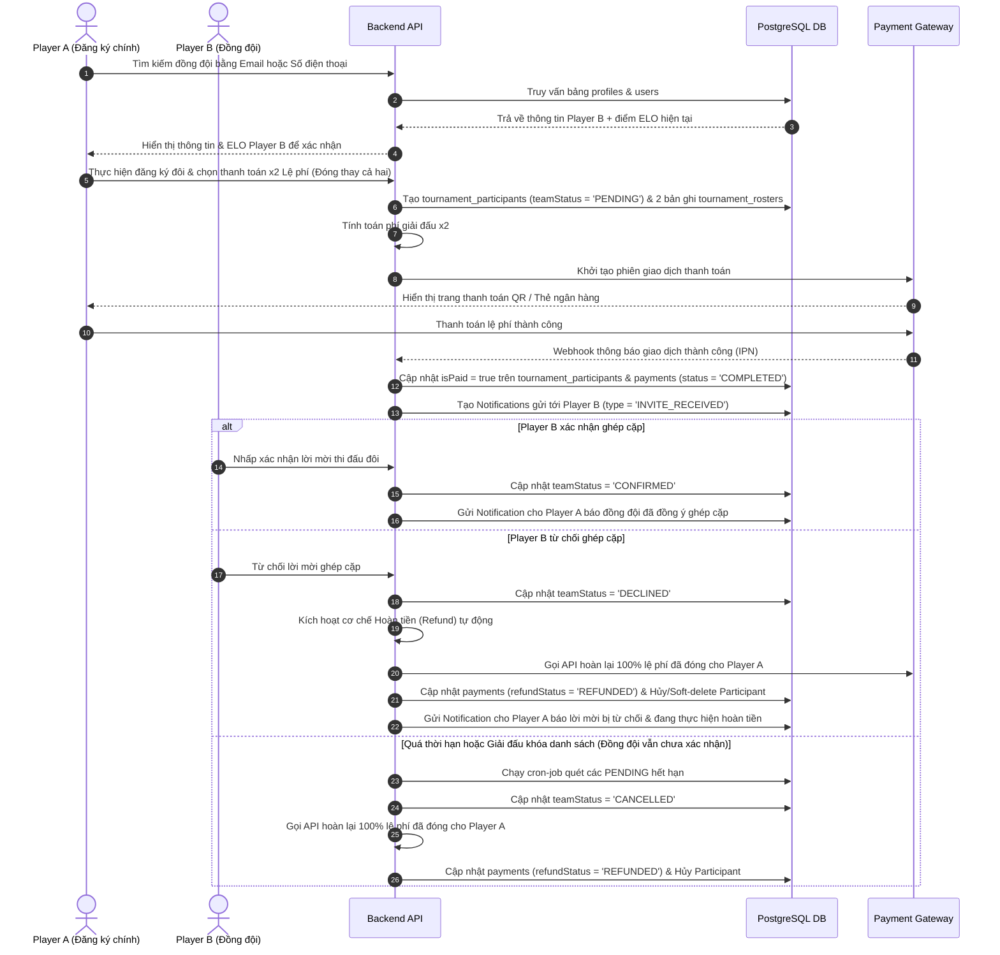

# 🗄️ DATABASE SCHEMA — PostgreSQL (Supabase) with Drizzle ORM

Tài liệu này đặc tả toàn bộ cấu trúc cơ sở dữ liệu quan hệ (PostgreSQL) được quản lý và định nghĩa thông qua **Drizzle ORM**, triển khai trên hạ tầng **Supabase**. Cơ sở dữ liệu này được thiết kế để phục vụ cho hệ thống quản lý giải đấu thể thao chuyên nghiệp (hỗ trợ các môn đơn/đôi như Pickleball, Cầu lông, Tennis, Bóng đá...).

---

## 1. Entity Relationship Diagram (ERD)

Dưới đây là sơ đồ Mermaid ERD mô tả các mối quan hệ thực thể cốt lõi trong hệ thống:

```mermaid
erDiagram
    users ||--o| profiles : "has profile"
    users ||--o{ auth_providers : "has social accounts"
    users ||--o{ user_to_roles : "has roles"
    roles ||--o{ user_to_roles : "assigned to"
    users ||--o{ sessions : "active sessions"
    
    parent_tournaments ||--o{ tournaments : "groups"
    users ||--o{ parent_tournaments : "created by"
    users ||--o{ tournaments : "created by"
    communities ||--o{ tournaments : "hosts"
    categories ||--o{ tournaments : "categorized by"
    tournament_venues ||--o{ tournaments : "located at"
    
    tournaments ||--o{ tournament_stages : "has stages"
    tournament_stages ||--o{ tournament_groups : "has groups"
    tournament_venues ||--o{ tournament_stages : "located at"
    
    tournaments ||--o{ tournament_participants : "registers"
    tournament_groups ||--o{ tournament_participants : "belongs to"
    users ||--o{ tournament_participants : "registered by"
    
    tournament_participants ||--o{ tournament_rosters : "members"
    users ||--o{ tournament_rosters : "user reference"
    
    tournament_groups ||--o{ matches : "contains"
    tournament_participants ||--o{ matches : "participant 1"
    tournament_participants ||--o{ matches : "participant 2"
    tournament_participants ||--o{ matches : "winner"
    venue_courts ||--o{ matches : "played on"
    users ||--o{ matches : "referee / confirmed by"
    
    tournament_participants ||--o{ match_players : "mapped to"
    matches ||--o{ match_players : "has rosters"
    users ||--o{ match_players : "user playing"
    
    matches ||--o{ match_disputes : "disputed on"
    users ||--o{ match_disputes : "filed / resolved by"
    
    tournament_groups ||--o{ group_standings : "tracks standings"
    tournament_participants ||--o{ group_standings : "points of"
    
    categories ||--o{ elo_tiers : "defines ranges"
    users ||--o{ user_ranks : "belongs to"
    categories ||--o{ user_ranks : "categorized under"
    communities ||--o{ user_ranks : "optional community ELO"
    elo_tiers ||--o| user_ranks : "current tier"
    users ||--o{ elo_history_logs : "tracked in"
    categories ||--o{ elo_history_logs : "logged by category"
    
    users ||--o{ payments : "paid by"
    tournaments ||--o{ payments : "for tournament"
    tournament_participants ||--o{ payments : "tied to registration"
    payments ||--o{ payment_status_logs : "logged changes"
    
    tournaments ||--o{ organizer_payouts : "payout for"
    users ||--o{ organizer_payouts : "organizer profile / processed by"
    organizer_payouts ||--o{ payout_status_logs : "logged changes"
    
    users ||--o{ communities : "created by / approved by"
    provinces ||--o{ communities : "province location"
    districts ||--o{ communities : "district location"
    wards ||--o{ communities : "ward location"
    communities ||--o{ community_sports : "supports"
    categories ||--o{ community_sports : "sport type"
    communities ||--o{ community_members : "has members"
    users ||--o{ community_members : "user profile / invited / approved"
    
    users ||--o{ notifications : "sent to (receiver) / from (sender)"
    matches ||--o{ match_comments : "commented on"
    users ||--o{ match_comments : "author"
    matches ||--o{ match_reactions : "liked by"
    users ||--o{ match_reactions : "user"
```



---

## 2. Chi tiết các bảng (Table Schemas)

### 2.1 Thành phần Hệ thống Người dùng (User & Authentication)

#### Bảng `users`
Bảng lưu trữ thông tin tài khoản cơ bản.
* **id**: `uuid` (PK, default: `gen_random_uuid()`)
* **email**: `varchar(255)` (Unique, Not Null) - Địa chỉ email đăng nhập chính.
* **passwordHash**: `text` (Nullable) - Mật khẩu đã hash (null nếu dùng login social).
* **isEmailVerified**: `boolean` (Default: `false`) - Trạng thái xác minh email.
* **isMock**: `boolean` (Default: `false`) - Đánh dấu tài khoản giả lập được tạo để test/fill bracket.
* **acceptedTosAt**: `timestamp with time zone` (Nullable) - Thời gian đồng ý Điều khoản Dịch vụ.
* **createdAt**: `timestamp with time zone` (Default: `now()`)
* **updatedAt**: `timestamp with time zone` (Default: `now()`)
* **deletedAt**: `timestamp with time zone` (Nullable) - Phục vụ Soft Delete.

#### Bảng `profiles`
Bảng lưu trữ thông tin cá nhân mở rộng của người dùng.
* **id**: `uuid` (PK, default: `gen_random_uuid()`)
* **userId**: `uuid` (Unique, FK -> `users.id`, onDelete: `cascade`)
* **fullName**: `varchar(255)` (Not Null) - Họ và tên đầy đủ.
* **avatarUrl**: `text` (Nullable) - Đường dẫn ảnh đại diện.
* **coverUrl**: `text` (Nullable) - Ảnh bìa trang cá nhân.
* **phoneNumber**: `varchar(20)` (Nullable) - Số điện thoại liên lạc.
* **dateOfBirth**: `date` (Nullable) - Ngày sinh.
* **gender**: `varchar(20)` (Nullable) - Giới tính (`MALE`, `FEMALE`, `OTHER`).
* **address**: `text` (Nullable) - Địa chỉ.
* **bio**: `text` (Nullable) - Tiểu sử cá nhân.
* **provinceCode**: `varchar(20)` (FK -> `provinces.code`, onDelete: `set null`) - Mã tỉnh/thành.
* **isVerified**: `boolean` (Default: `false`) - Người dùng đã được định danh/xác minh (tích xanh).
* **updatedAt**: `timestamp with time zone` (Default: `now()`)

#### Bảng `auth_providers`
Quản lý các phương thức liên kết mạng xã hội (Google, Facebook...).
* **id**: `uuid` (PK)
* **userId**: `uuid` (FK -> `users.id`, onDelete: `cascade`)
* **provider**: `varchar(50)` (Not Null) - Ví dụ: `GOOGLE`, `FACEBOOK`.
* **providerUserId**: `varchar(255)` (Not Null) - ID người dùng từ nhà cung cấp.
* **providerEmail**: `varchar(255)` (Nullable)
* **providerAvatarUrl**: `text` (Nullable)
* **providerDisplayName**: `varchar(255)` (Nullable)
* **accessToken**: `text` (Nullable)
* **refreshToken**: `text` (Nullable)
* **tokenExpiresAt**: `timestamp with time zone` (Nullable)
* **createdAt** / **updatedAt**: `timestamp with time zone`

#### Bảng `roles` & `user_to_roles`
Phân quyền hệ thống (ví dụ: `SUPER_ADMIN`, `ORGANIZER`, `REFEREE`, `PLAYER`).
* **roles**:
  * **id**: `uuid` (PK)
  * **name**: `varchar(100)` (Unique, Not Null) - Tên quyền (ví dụ: `Ban Tổ Chức`).
  * **slug**: `varchar(100)` (Unique, Not Null) - Slug định danh (ví dụ: `organizer`).
  * **description**: `text`
* **user_to_roles**:
  * **id**: `uuid` (PK)
  * **userId**: `uuid` (FK -> `users.id`, onDelete: `cascade`)
  * **roleId**: `uuid` (FK -> `roles.id`, onDelete: `cascade`)
  * **assignedAt**: `timestamp with time zone` (Default: `now()`)
  * **assignedBy**: `uuid` (FK -> `users.id`, onDelete: `set null`)

#### Bảng `sessions`
Theo dõi các phiên làm việc và Refresh Token của người dùng.
* **id**: `uuid` (PK)
* **userId**: `uuid` (FK -> `users.id`, onDelete: `cascade`)
* **refreshToken**: `text` (Unique, Not Null)
* **userAgent**: `text`
* **ipAddress**: `varchar(45)`
* **isRevoked**: `boolean` (Default: `false`)
* **revokedAt**: `timestamp with time zone` (Nullable)
* **expiresAt**: `timestamp with time zone` (Not Null)
* **createdAt**: `timestamp with time zone` (Default: `now()`)

---

### 2.2 Thành phần Quản lý Giải đấu (Tournaments & Stages)

#### Bảng `parent_tournaments`
Quản lý chuỗi giải đấu lớn hoặc giải đấu mẹ chứa nhiều nhánh/hạng mục con.
* **id**: `uuid` (PK)
* **name**: `varchar(255)` (Not Null)
* **description**: `text` (Nullable)
* **bannerUrl** / **logoUrl**: `text` (Nullable)
* **sports**: `jsonb` - Mảng chứa danh sách các môn thi đấu (`string[]`).
* **createdBy**: `uuid` (FK -> `users.id`, onDelete: `restrict`)
* **createdAt** / **updatedAt** / **deletedAt**: `timestamp with time zone`

#### Bảng `tournaments`
Thông tin chi tiết một giải đấu (hạng mục thi đấu cụ thể).
* **id**: `uuid` (PK)
* **parentId**: `uuid` (FK -> `parent_tournaments.id`, onDelete: `cascade`)
* **communityId**: `uuid` (FK -> `communities.id`, onDelete: `set null`) - CLB/Cộng đồng đăng cai giải đấu.
* **categoryId**: `uuid` (FK -> `categories.id`, Not Null) - Bộ môn thi đấu (Pickleball, Badminton...).
* **createdBy**: `uuid` (FK -> `users.id`, onDelete: `restrict`)
* **name**: `varchar(255)` (Not Null)
* **description**: `text` (Nullable)
* **status**: `varchar(50)` (Default: `DRAFT`) - Các trạng thái: `DRAFT`, `PUBLISHED`, `REGISTRATION`, `LOCKED`, `IN_PROGRESS`, `COMPLETED`, `CANCELLED`.
* **matchType**: `varchar(50)` (Default: `DOUBLES`) - Thể thức thi đấu: `SINGLES` (Đơn), `DOUBLES` (Đôi).
* **sportRules**: `jsonb` (Not Null) - Cấu hình luật đấu của môn thể thao (ví dụ: số set thắng, điểm chạm thắng...).
* **tournamentConfig**: `jsonb` (Not Null) - Cấu hình giải đấu (ví dụ: thể thức loại trực tiếp `SINGLE_ELIMINATION`, vòng tròn `ROUND_ROBIN`, chia bảng...).
* **entryFee**: `numeric(12, 2)` (Default: `0.00`) - Lệ phí tham gia cho mỗi người đăng ký.
* **platformFeePercentage**: `numeric(5, 2)` (Default: `5.00`) - % phí nền tảng thu từ BTC.
* **platformFeePerPlayer**: `integer` (Default: `10000`) - Số tiền cố định nền tảng thu trên mỗi VĐV đăng ký thi đấu.
* **registrationStartDate** / **registrationEndDate**: `timestamp with time zone` (Nullable)
* **maxParticipants**: `integer` (Nullable) - Giới hạn số lượng cặp đấu hoặc VĐV tham gia.
* **startDate** / **endDate**: `timestamp with time zone` (Nullable)
* **venueId**: `uuid` (FK -> `tournament_venues.id`, onDelete: `set null`) - Nơi diễn ra giải đấu.
* **tournamentType**: `varchar(50)` (Default: `CLUB`) - Phân loại giải đấu (`CLUB`, `OPEN`, `SERIES`).
* **bannerUrl** / **logoUrl**: `text` (Nullable)
* **galleryImages**: `text[]` (Default: `'{}'::text[]`) - Thư viện ảnh của giải đấu.
* **prizeDescription**: `text` (Nullable)
* **prizes**: `jsonb` (Default: `'[]'::jsonb`) - Cơ cấu giải thưởng (Nhất, Nhì, Ba...).
* **inviteCode**: `varchar(20)` (Unique, Nullable) - Mã mời tham tự giải đấu bảo mật.
* **visibility**: `varchar(50)` (Default: `PUBLIC`) - Độ hiển thị (`PUBLIC`, `PRIVATE`).
* **genderRestriction**: `varchar(20)` (Nullable) - Giới hạn giới tính (`MALE_ONLY`, `FEMALE_ONLY`, `ANY`).
* **contactInfo**: `jsonb` - Thông tin liên hệ BTC (email, hotline...).
* **city**: `varchar(100)` (Nullable)
* **reservedSlotsCount**: `integer` (Default: `0`) - Số suất được giữ chỗ trước (không mở đăng ký tự do).
* **isRanked**: `boolean` (Default: `true`) - Giải đấu này có tính điểm ELO hệ thống hay không.
* **isRegistrationLocked**: `boolean` (Default: `false`) - Khóa đóng đăng ký sớm.
* **createdAt** / **updatedAt** / **deletedAt**: `timestamp with time zone`

> [!IMPORTANT]
> **Ràng buộc Dữ liệu (Constraints) của `tournaments`:**
> - `entry_fee_non_negative`: `entry_fee >= 0`
> - `platform_fee_valid`: `platform_fee_percentage >= 0 AND platform_fee_percentage <= 100`

#### Bảng `tournament_stages`
Mỗi giải đấu có một hoặc nhiều giai đoạn (ví dụ: Giai đoạn 1: Vòng bảng, Giai đoạn 2: Vòng loại trực tiếp Knockout).
* **id**: `uuid` (PK)
* **tournamentId**: `uuid` (FK -> `tournaments.id`, onDelete: `cascade`)
* **name**: `varchar(255)` (Not Null) - Tên giai đoạn (ví dụ: `Vòng Bảng`, `Vòng Chung Kết`).
* **type**: `varchar(50)` (Not Null) - Loại giai đoạn (`ROUND_ROBIN`, `SINGLE_ELIMINATION`, `DOUBLE_ELIMINATION`).
* **order**: `integer` (Not Null) - Thứ tự giai đoạn diễn ra (bắt đầu từ 1).
* **roundConfig**: `jsonb` (Nullable) - Cấu hình chia vòng đấu.
* **venueId**: `uuid` (FK -> `tournament_venues.id`, onDelete: `set null`)
* **scheduledDate**: `date` (Nullable)
* **notificationNote**: `text` (Nullable)
* **matchSettings**: `jsonb` (Nullable)

#### Bảng `tournament_groups`
Bảng đấu con trong các giai đoạn thi đấu (đặc biệt quan trọng đối với Round Robin).
* **id**: `uuid` (PK)
* **stageId**: `uuid` (FK -> `tournament_stages.id`, onDelete: `cascade`)
* **name**: `varchar(255)` (Not Null) - Tên bảng đấu (ví dụ: `Bảng A`, `Bảng B`).

---

### 2.3 Quản lý Đăng ký & Thành viên Đội (Registrations & Rosters)

#### Bảng `tournament_participants`
Cặp đấu (Doubles Team) hoặc cá nhân (Singles VĐV) đăng ký tham dự giải đấu.
* **id**: `uuid` (PK)
* **tournamentId**: `uuid` (FK -> `tournaments.id`, onDelete: `cascade`)
* **groupId**: `uuid` (FK -> `tournament_groups.id`, onDelete: `set null`) - Bảng đấu được phân bổ (sau khi bốc thăm).
* **registeredBy**: `uuid` (FK -> `users.id`, onDelete: `restrict`) - Người thực hiện đăng ký và thanh toán lệ phí giải.
* **teamName**: `varchar(255)` (Not Null) - Tên hiển thị (ví dụ: tên cá nhân hoặc tên cặp đôi "Nguyễn Văn A / Trần Văn B").
* **seed**: `integer` (Nullable) - Hạt giống giải đấu.
* **points**: `integer` (Default: `0`) - Điểm số tích lũy tại giải đấu.
* **isPaid**: `boolean` (Default: `false`) - Trạng thái đã đóng đủ lệ phí tham gia giải đấu.
* **teamInviteToken**: `varchar(50)` (Unique, Nullable) - Token để gửi cho đồng đội (Player B) xác nhận tham gia ghép cặp đấu Doubles.
* **teamStatus**: `varchar(50)` (Default: `PENDING`) - Trạng thái đăng ký:
  - `PENDING`: Đang đợi đồng đội xác nhận lời mời (chỉ áp dụng với thể thức Doubles).
  - `CONFIRMED`: Đã đầy đủ thành viên và được duyệt tham gia.
  - `DECLINED`: Lời mời ghép cặp bị đồng đội từ chối.
  - `CANCELLED`: Người đăng ký hủy yêu cầu hoặc quá hạn xác nhận.
* **isMock**: `boolean` (Default: `false`) - Đánh dấu VĐV giả lập phục vụ sinh bracket mẫu.
* **registeredAt**: `timestamp with time zone` (Default: `now()`)

#### Bảng `tournament_rosters`
Danh sách VĐV chi tiết nằm trong mỗi Participant (1 VĐV với Single, 2 VĐV với Doubles).
* **id**: `uuid` (PK)
* **participantId**: `uuid` (FK -> `tournament_participants.id`, onDelete: `cascade`)
* **userId**: `uuid` (FK -> `users.id`, onDelete: `restrict`) - Liên kết tới user cụ thể hệ thống.
* **role**: `varchar(50)` (Default: `MAIN`) - Vai trò (`MAIN` - Thành viên chính thức, `SUB` - Dự bị).
* **joinedAt**: `timestamp with time zone` (Default: `now()`)

---

### 2.4 Quản lý Trận đấu & Kết quả (Matches & Standings)

#### Bảng `matches`
Lưu trữ thông tin chi tiết các trận đấu trong giải.
* **id**: `uuid` (PK)
* **groupId**: `uuid` (FK -> `tournament_groups.id`, onDelete: `cascade`)
* **participant1Id**: `uuid` (FK -> `tournament_participants.id`, Nullable) - Cặp đấu/VĐV 1.
* **participant2Id**: `uuid` (FK -> `tournament_participants.id`, Nullable) - Cặp đấu/VĐV 2 (có thể null nếu chờ nhánh thắng/thua).
* **winnerId**: `uuid` (FK -> `tournament_participants.id`, Nullable) - ID đội thắng cuộc.
* **status**: `varchar(50)` (Default: `SCHEDULED`) - Trạng thái trận: `SCHEDULED` (Chưa diễn ra), `LIVE` (Đang thi đấu), `COMPLETED` (Đã kết thúc), `DISPUTED` (Đang tranh chấp kết quả), `WALKOVER` (Xử thắng do bỏ cuộc).
* **scoreDetails**: `jsonb` (Default: `'{}'::json`) - Chi tiết điểm số từng set đấu (ví dụ: `[{"p1": 11, "p2": 8}, {"p1": 9, "p2": 11}, {"p1": 11, "p2": 5}]`).
* **p1SetsWon**: `integer` (Default: `0`) - Số set thắng của Participant 1.
* **p2SetsWon**: `integer` (Default: `0`) - Số set thắng của Participant 2.
* **totalSetsPlayed**: `integer` (Default: `0`)
* **roundNumber**: `integer` (Not Null) - Vòng đấu thứ mấy trong giai đoạn.
* **matchOrder**: `integer` (Not Null) - Thứ tự của trận đấu trong vòng đấu đó.
* **bracketBranch**: `varchar(50)` (Default: `MAIN`) - Nhánh đấu (`MAIN` - Nhánh chính/thắng, `LOSERS` - Nhánh thua, `THIRD_PLACE` - Tranh hạng ba).
* **isBye**: `boolean` (Default: `false`) - Trận đấu được miễn đấu (thắng trực tiếp do lẻ đội).
* **nextMatchId**: `uuid` (Nullable) - Tự liên kết tới Trận đấu tiếp theo mà đội Thắng sẽ tiến vào.
* **loserNextMatchId**: `uuid` (Nullable) - Tự liên kết tới Trận đấu tiếp theo ở nhánh thua (Double Elimination).
* **courtId**: `uuid` (FK -> `venue_courts.id`, onDelete: `set null`)
* **courtName**: `text` (Nullable) - Tên sân denormalized để hiển thị nhanh.
* **courtAddress**: `text` (Nullable)
* **refereeId**: `uuid` (FK -> `users.id`, onDelete: `set null`) - Trọng tài bắt chính trận đấu.
* **scoreConfirmedBy**: `uuid` (FK -> `users.id`, onDelete: `set null`) - Người xác nhận kết quả (Trọng tài hoặc BTC).
* **scoreConfirmedAt**: `timestamp with time zone` (Nullable)
* **matchEvidenceImages**: `text[]` (Default: `'{}'::text[]`) - Ảnh biên bản, minh chứng kết quả thi đấu.
* **scheduledAt** / **startedAt** / **completedAt**: `timestamp with time zone` (Nullable)
* **updatedAt** / **deletedAt**: `timestamp with time zone`

> [!IMPORTANT]
> **Ràng buộc Dữ liệu (Constraints) của `matches`:**
> - `sets_non_negative`: `p1_sets_won >= 0 AND p2_sets_won >= 0`
> - `different_participants`: Đảm bảo `participant1_id` và `participant2_id` không trùng nhau (trừ khi một trong hai trường bị NULL).

#### Bảng `match_players`
Lưu trữ thông tin lịch sử VĐV nào trực tiếp tham gia trận đấu cụ thể (dành cho mục đích truy vấn, thống kê và cập nhật điểm ELO cá nhân sau trận đấu).
* **id**: `uuid` (PK)
* **matchId**: `uuid` (FK -> `matches.id`, onDelete: `cascade`)
* **participantId**: `uuid` (FK -> `tournament_participants.id`, onDelete: `cascade`)
* **userId**: `uuid` (FK -> `users.id`, onDelete: `restrict`)
* **status**: `varchar(50)` (Default: `PLAYED`) - Trạng thái (`PLAYED`, `DID_NOT_PLAY`).

#### Bảng `match_disputes`
Ghi nhận khiếu nại tranh chấp kết quả trận đấu từ VĐV.
* **id**: `uuid` (PK)
* **matchId**: `uuid` (FK -> `matches.id`, onDelete: `restrict`)
* **filedBy**: `uuid` (FK -> `users.id`, onDelete: `restrict`) - Người gửi khiếu nại.
* **reason**: `text` (Not Null) - Lý do khiếu nại.
* **evidenceUrls**: `text[]` (Default: `'{}'::text[]`) - Ảnh/Video bằng chứng.
* **status**: `varchar(50)` (Default: `OPEN`) - Trạng thái giải quyết (`OPEN`, `RESOLVED`, `REJECTED`).
* **resolvedBy**: `uuid` (FK -> `users.id`, onDelete: `set null`) - Quản trị viên/BTC đứng ra giải quyết.
* **resolutionNote**: `text` (Nullable)
* **createdAt** / **resolvedAt**: `timestamp with time zone`

#### Bảng `group_standings`
Bảng xếp hạng điểm số tạm thời trong giai đoạn thi đấu Vòng tròn (Round Robin).
* **id**: `uuid` (PK)
* **groupId**: `uuid` (FK -> `tournament_groups.id`, onDelete: `cascade`)
* **participantId**: `uuid` (FK -> `tournament_participants.id`, onDelete: `cascade`)
* **played**: `integer` (Default: `0`) - Số trận đã đấu.
* **won**: `integer` (Default: `0`) - Số trận thắng.
* **lost**: `integer` (Default: `0`) - Số trận thua.
* **draws**: `integer` (Default: `0`) - Số trận hòa.
* **pointsFor**: `integer` (Default: `0`) - Tổng điểm thắng ghi được (tổng điểm set thắng hoặc hiệu số phụ).
* **pointsAgainst**: `integer` (Default: `0`) - Tổng điểm thua bị ghi.
* **totalPoints**: `integer` (Default: `0`) - Tổng điểm xếp hạng tích lũy (ví dụ: thắng +3 điểm, hòa +1 điểm).
* **updatedAt**: `timestamp with time zone` (Default: `now()`)

---

### 2.5 Hệ thống ELO & Ranks

Hệ thống ELO được thiết kế độc lập theo từng **Bộ môn (Category)**, **Thể thức (Đơn/Đôi)** và có thể tính riêng theo **Cộng đồng/CLB (Community)** hoặc **Hệ thống chung (Global)**.

#### Bảng `categories`
Lưu trữ danh sách các môn thể thao hệ thống hỗ trợ.
* **id**: `uuid` (PK)
* **name**: `varchar(255)` (Unique, Not Null) - Ví dụ: `Pickleball`, `Badminton`.
* **slug**: `varchar(255)` (Unique, Not Null) - Ví dụ: `pickleball`, `badminton`.
* **description**: `text` (Nullable)
* **categoryConfig**: `jsonb` (Default: `'{}'::jsonb`)

#### Bảng `elo_tiers`
Mốc xếp hạng tương ứng với điểm ELO của bộ môn.
* **id**: `uuid` (PK)
* **categoryId**: `uuid` (FK -> `categories.id`, onDelete: `cascade`)
* **name**: `varchar(100)` (Not Null) - Tên hạng (Ví dụ: `Low Tier D`, `High Tier D`, `Tier S`).
* **minElo**: `integer` (Not Null) - Điểm ELO tối thiểu để đạt rank.
* **maxElo**: `integer` (Not Null) - Điểm ELO tối đa cho rank.
* **iconUrl**: `text` (Nullable)

> [!IMPORTANT]
> **Ràng buộc Dữ liệu (Constraints) của `elo_tiers`:**
> - `elo_range_valid`: `min_elo < max_elo`

#### Bảng `user_ranks`
Bảng chứa điểm ELO hiện tại của từng người chơi theo bộ môn và thể thức thi đấu.
* **id**: `uuid` (PK)
* **userId**: `uuid` (FK -> `users.id`, onDelete: `cascade`)
* **categoryId**: `uuid` (FK -> `categories.id`, onDelete: `cascade`)
* **communityId**: `uuid` (Nullable, FK -> `communities.id`, onDelete: `cascade`) - Nếu `null`, đây là điểm ELO Global hệ thống.
* **matchType**: `varchar(50)` (Not Null) - `SINGLES` hoặc `DOUBLES`.
* **eloPoints**: `integer` (Default: `1000`) - Điểm số ELO bắt đầu từ 1000.
* **tierId**: `uuid` (FK -> `elo_tiers.id`, onDelete: `set null`) - Tham chiếu tới Tier hiện tại.
* **shieldActive**: `boolean` (Default: `false`) - Khiên bảo vệ điểm ELO khi lên hạng mới.
* **matchesPlayed** / **matchesWon**: `integer` (Default: `0`)
* **winStreak**: `integer` (Default: `0`) - Chuỗi thắng hiện tại.
* **updatedAt**: `timestamp with time zone` (Default: `now()`)

> [!IMPORTANT]
> **Ràng buộc Dữ liệu (Constraints) của `user_ranks`:**
> - `elo_non_negative`: `elo_points >= 0`
> - `wins_lte_played`: `matches_won <= matches_played`
> - `user_category_rank_unique_idx`: Khóa duy nhất (Unique composite key) trên bộ bốn cột: `(user_id, category_id, match_type, community_id)`.

#### Bảng `elo_history_logs`
Nhật ký chi tiết mọi thay đổi ELO sau từng trận đấu của người dùng.
* **id**: `uuid` (PK)
* **userId**: `uuid` (FK -> `users.id`, onDelete: `cascade`)
* **categoryId**: `uuid` (FK -> `categories.id`, onDelete: `cascade`)
* **matchId**: `uuid` (Nullable) - Kết nối tới trận đấu tạo ra sự thay đổi ELO này.
* **reason**: `varchar(100)` (Nullable) - Lý do biến động (ví dụ: `MATCH_WIN`, `MATCH_LOSS`, `SYSTEM_ADJUSTMENT`).
* **previousElo**: `integer` (Not Null) - Điểm ELO trước trận đấu.
* **newElo**: `integer` (Not Null) - Điểm ELO sau trận đấu.
* **changedPoints**: `integer` (Not Null) - Số điểm ELO cộng hoặc trừ (ví dụ: `+16`, `-12`).
* **createdAt**: `timestamp with time zone` (Default: `now()`)

#### Bảng `community_rankings`
Bảng xếp hạng ELO thu nhỏ dành riêng cho các thành viên trong 1 câu lạc bộ / cộng đồng cụ thể.
* **id**: `uuid` (PK)
* **communityId**: `uuid` (FK -> `communities.id`, onDelete: `cascade`)
* **userId**: `uuid` (FK -> `users.id`, onDelete: `cascade`)
* **categoryId**: `uuid` (FK -> `categories.id`, onDelete: `cascade`)
* **eloPoints**: `integer` (Default: `1000`)
* **matchesPlayed** / **matchesWon** / **winStreak**: `integer` (Default: `0`)
* **updatedAt**: `timestamp with time zone`

---

### 2.6 Giao dịch & Thanh toán (Payments & Payouts)

#### Bảng `payments`
Theo dõi các giao dịch đóng lệ phí giải đấu của người chơi thông qua cổng thanh toán trực tuyến.
* **id**: `uuid` (PK)
* **userId**: `uuid` (FK -> `users.id`, onDelete: `restrict`) - Người trực tiếp trả tiền.
* **participantId**: `uuid` (FK -> `tournament_participants.id`, onDelete: `restrict`) - Liên kết tới bản ghi đăng ký thi đấu.
* **tournamentId**: `uuid` (FK -> `tournaments.id`, onDelete: `restrict`)
* **amount**: `numeric(12, 2)` (Not Null) - Số tiền giao dịch thực tế.
* **platformFeeAmount**: `numeric(12, 2)` (Nullable) - Phí nền tảng khấu trừ.
* **status**: `varchar(50)` (Default: `PENDING`) - Trạng thái: `PENDING`, `COMPLETED`, `FAILED`, `REFUNDED`, `PARTIALLY_REFUNDED`.
* **refundStatus**: `varchar(50)` (Nullable) - Trạng thái hoàn tiền: `NOT_REFUNDED`, `PENDING`, `REFUNDED`, `FAILED`.
* **refundedAmount**: `numeric(12, 2)` (Default: `0.00`) - Số tiền đã hoàn lại thành công.
* **paymentGateway**: `varchar(50)` (Nullable) - Ví dụ: `VNPAY`, `MOMO`, `STRIPE`.
* **transactionReference**: `varchar(255)` (Unique, Nullable) - Mã tham chiếu giao dịch phía Cổng thanh toán.
* **gatewayResponse**: `jsonb` (Nullable) - Lưu toàn bộ payload phản hồi từ cổng thanh toán để đối soát lỗi.
* **paidAt**: `timestamp with time zone` (Nullable)
* **createdAt**: `timestamp with time zone` (Default: `now()`)

> [!IMPORTANT]
> **Ràng buộc Dữ liệu (Constraints) của `payments`:**
> - `amount_positive`: `amount > 0`

#### Bảng `payment_status_logs`
Lịch sử thay đổi trạng thái giao dịch thanh toán để phục vụ Audit Trail phòng ngừa gian lận.
* **id**: `uuid` (PK)
* **paymentId**: `uuid` (FK -> `payments.id`, onDelete: `restrict`)
* **previousStatus** / **newStatus**: `varchar(50)` (Not Null)
* **changedBy**: `uuid` (FK -> `users.id`, onDelete: `set null`)
* **reason**: `text` (Nullable)
* **ipAddress**: `varchar(45)` (Nullable)
* **createdAt**: `timestamp with time zone` (Default: `now()`)

#### Bảng `organizer_payouts` & `payout_status_logs`
Quản lý việc chuyển tiền giải đấu thu được về tài khoản ngân hàng của Ban tổ chức giải đấu.
* **organizer_payouts**:
  * **id**: `uuid` (PK)
  * **tournamentId**: `uuid` (FK -> `tournaments.id`, onDelete: `restrict`)
  * **organizerId**: `uuid` (FK -> `users.id`, onDelete: `restrict`)
  * **totalCollected**: `numeric(12, 2)` - Tổng số tiền thu được từ người chơi đóng phí giải đấu.
  * **amountRequested**: `numeric(12, 2)` - Số tiền thực BTC yêu cầu rút về.
  * **platformFeeRetained**: `numeric(12, 2)` - Số tiền phí hệ thống giữ lại.
  * **bankName** / **bankAccountNumber** / **bankAccountName**: `varchar`
  * **status**: `varchar(50)` (Default: `PENDING`) - Trạng thái: `PENDING`, `APPROVED`, `PROCESSED`, `REJECTED`.
  * **holdUntil**: `timestamp with time zone` - Ngày tạm giữ tiền (thông thường là 3 ngày sau khi giải đấu kết thúc tốt đẹp).
  * **disbursedAt** / **processedAt**: `timestamp with time zone`
  * **transactionProofUrl**: `text` (Nullable) - Hình ảnh hóa đơn chuyển khoản ngân hàng thành công của Platform.
* **payout_status_logs**:
  * **id**: `uuid` (PK)
  * **payoutId**: `uuid` (FK -> `organizer_payouts.id`)
  * **previousStatus** / **newStatus**: `varchar(50)`
  * **note**: `text`

---

### 2.7 Cộng đồng & Câu lạc bộ (Communities)

#### Bảng `communities`
* **id**: `uuid` (PK)
* **name**: `varchar(255)` (Not Null)
* **description**: `text`
* **logoUrl** / **bannerUrl**: `text`
* **creatorId**: `uuid` (FK -> `users.id`, onDelete: `restrict`)
* **provinceCode** / **districtCode** / **wardCode**: `varchar(20)` (FK -> `provinces`/`districts`/`wards`) - Phân loại khu vực hoạt động của CLB.
* **visibility**: `varchar(50)` (Default: `PUBLIC`)
* **joinMode**: `varchar(50)` (Default: `OPEN`) - Chế độ duyệt thành viên (`OPEN`, `APPROVAL_REQUIRED`, `INVITE_ONLY`).
* **joinQuestions**: `jsonb` (`string[]`) - Các câu hỏi BTC đặt ra khi muốn xin gia nhập.
* **rules**: `text` - Nội quy CLB.
* **locationAddress**: `text` - Địa chỉ sân nhà của CLB.
* **locationGeolocation**: `geography(Point, 4326)` - Tọa độ GPS phục vụ thuật toán tìm kiếm CLB gần đây.
* **socialLinks**: `jsonb` (Facebook, Zalo, Website...).
* **status**: `varchar(50)` (Default: `ACTIVE`)
* **createdAt** / **updatedAt** / **deletedAt**: `timestamp with time zone`

#### Bảng `community_members`
Thành viên tham gia CLB.
* **id**: `uuid` (PK)
* **communityId**: `uuid` (FK -> `communities.id`, onDelete: `cascade`)
* **userId**: `uuid` (FK -> `users.id`, onDelete: `cascade`)
* **role**: `varchar(50)` (Default: `MEMBER`) - Vai trò trong CLB (`OWNER` - Chủ CLB, `ADMIN` - Quản trị viên, `MEMBER` - Thành viên).
* **status**: `varchar(50)` (Default: `JOINED`) - Trạng thái thành viên (`PENDING_APPROVAL`, `JOINED`, `BLOCKED`).
* **joinedAt**: `timestamp with time zone` (Default: `now()`)

---

### 2.8 Các bảng hỗ trợ khác

#### Bảng `notifications`
Hệ thống thông báo đẩy (Real-time qua Websocket + DB persistence).
* **id**: `uuid` (PK)
* **receiverId**: `uuid` (FK -> `users.id`, onDelete: `cascade`) - Người nhận thông báo.
* **senderId**: `uuid` (Nullable, FK -> `users.id`, onDelete: `set null`) - Người gửi / thực hiện hành động tạo thông báo.
* **type**: `varchar(100)` (Not Null) - Các loại thông báo: `MATCH_READY`, `REFEREE_ASSIGNED`, `MATCH_COMPLETED`, `INVITE_RECEIVED`, `PAYMENT_COMPLETED`, `ANNOUNCEMENT`.
* **title**: `text` (Not Null)
* **content**: `text` (Not Null)
* **redirectUrl**: `text` (Nullable) - Đường dẫn chuyển hướng ứng dụng khi click vào thông báo.
* **isRead**: `boolean` (Default: `false`) - Trạng thái đã đọc hay chưa.
* **createdAt**: `timestamp with time zone` (Default: `now()`)

#### Bảng `provinces`, `districts`, `wards`
Danh mục phân cấp địa giới hành chính Việt Nam (Tỉnh/Thành -> Quận/Huyện -> Phường/Xã) hỗ trợ tìm kiếm giải đấu/cộng đồng theo khu vực địa lý.
* `provinces` (code PK, name, nameEn, fullName, fullNameEn, codeName, createdAt)
* `districts` (code PK, name, nameEn, fullName, fullNameEn, codeName, provinceCode FK -> `provinces.code` cascade, createdAt)
* `wards` (code PK, name, nameEn, fullName, fullNameEn, codeName, districtCode FK -> `districts.code` cascade, createdAt)

#### Bảng `tournament_venues` & `venue_courts`
Quản lý sân thi đấu và sơ đồ sân chi tiết của giải đấu.
* `tournament_venues` (id PK, name, locationAddress, locationGeolocation, imagesUrls, createdAt, deletedAt)
* `venue_courts` (id PK, venueId FK -> `tournament_venues.id` cascade, courtName, status)

#### Bảng `advertisements`
Quản lý banner quảng cáo của ứng dụng.
* **id**: `uuid` (PK)
* **title**: `varchar(255)` (Not Null)
* **imageUrl** / **targetUrl**: `text` (Not Null)
* **placementSlot**: `varchar(100)` (Not Null) - Vị trí hiển thị (ví dụ: `HOME_HERO`, `TOURNAMENT_SIDEBAR`).
* **viewsCount** / **clicksCount**: `integer` (Default: `0`)
* **startDate** / **endDate**: `timestamp with time zone` (Not Null)
* **isActive**: `boolean` (Default: `true`)
* **createdAt**: `timestamp with time zone` (Default: `now()`)
> [!IMPORTANT]
> **Ràng buộc Dữ liệu:** `ads_date_valid` (`startDate < endDate`)

#### Bảng `audit_logs`
Lưu trữ nhật ký vết hoạt động quản trị hệ thống.
* **id**: `uuid` (PK)
* **userId**: `uuid` (FK -> `users.id`, onDelete: `set null`) - Người thực hiện hành động.
* **action**: `varchar(100)` (Not Null) - Hành động (`CREATE`, `UPDATE`, `DELETE`, `BAN_USER`...).
* **tableName**: `varchar(100)` (Not Null) - Tên bảng chịu tác động.
* **recordId**: `uuid` (Not Null) - ID bản ghi chịu tác động.
* **oldValues** / **newValues**: `jsonb` (Nullable) - Payload trước/sau khi thay đổi.
* **ipAddress**: `varchar(45)` / **userAgent**: `text`
* **createdAt**: `timestamp with time zone` (Default: `now()`)

#### Bảng `community_gallery`
Thư viện ảnh sinh hoạt của các Câu lạc bộ/Cộng đồng.
* **id**: `uuid` (PK)
* **communityId**: `uuid` (FK -> `communities.id`, onDelete: `cascade`)
* **uploaderId**: `uuid` (FK -> `users.id`, onDelete: `set null`)
* **imageUrl**: `text` (Not Null)
* **caption**: `varchar(500)` (Nullable)
* **createdAt**: `timestamp with time zone` (Default: `now()`)

#### Các bảng Quản trị Admin (`verification_tickets`, `user_bans`, `system_configs`, `reports`)
* **verification_tickets**: Yêu cầu xác minh danh tính/cấp tích xanh.
  * **id**: `uuid` (PK)
  * **userId**: `uuid` (FK -> `users.id`, onDelete: `cascade`)
  * **evidenceUrls**: `text[]` (Not Null) - Ảnh giấy tờ, minh chứng.
  * **contactPhone**: `varchar(20)` (Not Null)
  * **status**: `varchar(50)` (Default: `PENDING`) - `PENDING`, `APPROVED`, `REJECTED`.
  * **rejectReason**: `text`
  * **reviewedBy**: `uuid` (FK -> `users.id`, onDelete: `set null`)
  * **createdAt** / **updatedAt**: `timestamp with time zone`
* **user_bans**: Nhật ký cấm người dùng vi phạm quy chế.
  * **id**: `uuid` (PK)
  * **userId**: `uuid` (FK -> `users.id`, onDelete: `cascade`)
  * **bannedBy**: `uuid` (FK -> `users.id`, onDelete: `restrict`)
  * **reason**: `text` (Not Null)
  * **banType**: `varchar(50)` (Default: `SOFT_BAN`) - `WARN`, `SOFT_BAN`, `HARD_BAN`.
  * **expiresAt**: `timestamp with time zone` (Nullable - null nếu cấm vĩnh viễn)
  * **createdAt**: `timestamp with time zone`
  * **isActive**: `boolean` (Default: `true`)
* **system_configs**: Cấu hình tham số động của hệ thống.
  * **key**: `varchar(100)` (PK) - Ví dụ: `PLATFORM_FEE_PERCENTAGE`, `DEFAULT_ELO_START`.
  * **value**: `text` (Not Null)
  * **description**: `text`
  * **updatedBy**: `uuid` (FK -> `users.id`, onDelete: `restrict`)
  * **updatedAt**: `timestamp with time zone`
* **reports**: Báo cáo tố cáo vi phạm nội dung hoặc hành vi người chơi.
  * **id**: `uuid` (PK)
  * **reporterId**: `uuid` (FK -> `users.id`, onDelete: `cascade`)
  * **targetType**: `varchar(50)` (Not Null) - `USER`, `TOURNAMENT`.
  * **targetId**: `uuid` (Not Null)
  * **reason**: `text` (Not Null)
  * **evidenceUrls**: `text[]` (Default: `'{}'::text[]`)
  * **status**: `varchar(50)` (Default: `PENDING`) - `PENDING`, `RESOLVED`, `REJECTED`.
  * **resolvedBy**: `uuid` (FK -> `users.id`, onDelete: `set null`)
  * **resolutionNote**: `text`
  * **createdAt** / **resolvedAt**: `timestamp with time zone`

---

### 2.9 Thành phần Chuỗi giải đấu (Tournament Series)
Cơ sở dữ liệu hỗ trợ tổ chức chuỗi giải đấu phân cấp (Series) có tích điểm PSR để tranh vé vào vòng chung kết tổng (Wildcard/Direct Entry).

#### Bảng `tournament_series`
Thông tin chuỗi giải đấu lớn.
* **id**: `uuid` (PK)
* **name**: `varchar(255)` (Not Null)
* **slug**: `varchar(255)` (Unique, Not Null)
* **description** / **bannerUrl** / **logoUrl**: `text`
* **organizerId**: `uuid` (FK -> `users.id`, onDelete: `restrict`)
* **status**: `varchar(50)` (Default: `DRAFT`) - `DRAFT`, `ACTIVE`, `COMPLETED`, `CANCELLED`.
* **startDate** / **endDate**: `timestamp with time zone`
* **totalPrize**: `numeric(12, 2)` - Tổng giải thưởng chuỗi.
* **rules**: `jsonb` (Not Null) - Cấu hình tính điểm PSR.
* **visibility**: `varchar(50)` (Default: `PUBLIC`)
* **createdAt** / **updatedAt** / **deletedAt**: `timestamp with time zone`

#### Bảng `series_legs`
Chặng đấu cụ thể nằm trong chuỗi giải.
* **id**: `uuid` (PK)
* **seriesId**: `uuid` (FK -> `tournament_series.id`, onDelete: `cascade`)
* **name**: `varchar(100)` (Not Null) - Tên chặng (ví dụ: `Chặng Miền Bắc`, `Chặng Miền Nam`).
* **order**: `integer` (Not Null) - Thứ tự chặng đấu.
* **startDate** / **endDate**: `timestamp with time zone`
* **status**: `varchar(50)` (Default: `UPCOMING`) - `UPCOMING`, `ONGOING`, `COMPLETED`.
* **directEntrySlots**: `integer` (Default: `2`) - Số vé vào thẳng vòng chung kết chặng.
* **wildcardSlots**: `integer` (Default: `16`) - Số vé vớt.
* **rulesOverride**: `jsonb` (Nullable) - Ghi đè cấu hình điểm nếu chặng có luật riêng.
* **createdAt**: `timestamp with time zone`

#### Bảng `series_events`
Liên kết một Giải đấu con (`tournaments`) vào một Chặng đấu cụ thể.
* **id**: `uuid` (PK)
* **legId**: `uuid` (FK -> `series_legs.id`, onDelete: `cascade`)
* **tournamentId**: `uuid` (Unique, FK -> `tournaments.id`, onDelete: `cascade`) - Mỗi giải đấu thuộc tối đa một sự kiện trong chặng.
* **region**: `varchar(100)` (Nullable)
* **order**: `integer` (Not Null)
* **pointMultiplier**: `real` (Default: `1.0`) - Hệ số nhân điểm của sự kiện (ví dụ: giải Major x1.5).
* **createdAt**: `timestamp with time zone`

#### Bảng `series_standings`
Bảng xếp hạng tổng điểm PSR của người chơi trong chặng đấu.
* **id**: `uuid` (PK)
* **legId**: `uuid` (FK -> `series_legs.id`, onDelete: `cascade`)
* **userId**: `uuid` (FK -> `users.id`, onDelete: `restrict`)
* **categoryId**: `uuid` (FK -> `categories.id`, onDelete: `restrict`)
* **totalPsrPoints**: `integer` (Default: `0`) - Tổng điểm tích lũy.
* **eventsPlayed**: `integer` (Default: `0`) - Số sự kiện đã tham gia.
* **bestRank**: `integer` (Nullable) - Thứ hạng tốt nhất đạt được.
* **directEntry** / **wildcardEntry** / **lockedOut**: `boolean` (Default: `false`) - Trạng thái vé đi tiếp hoặc bị loại.
* **qualifiedEventId**: `uuid` (FK -> `series_events.id`, onDelete: `set null`) - Sự kiện giúp VĐV đạt vé đi tiếp.
* **updatedAt**: `timestamp with time zone`

#### Bảng `psr_point_logs`
Nhật ký chi tiết quá trình cộng điểm PSR của người chơi sau mỗi giải đấu thuộc chặng.
* **id**: `uuid` (PK)
* **standingId**: `uuid` (FK -> `series_standings.id`, onDelete: `cascade`)
* **eventId**: `uuid` (FK -> `series_events.id`, onDelete: `cascade`)
* **participantId**: `uuid` (FK -> `tournament_participants.id`, onDelete: `cascade`)
* **rankAchieved**: `integer` (Not Null) - Thứ hạng đạt được tại giải đấu.
* **basePoints**: `integer` (Not Null) - Điểm cơ bản theo thứ hạng.
* **bonusPoints**: `integer` (Default: `0`) - Điểm thưởng phụ.
* **multiplier**: `real` (Not Null) - Hệ số nhân.
* **totalPoints**: `integer` (Not Null) - Số điểm PSR thực tế nhận được.
* **isDirectEntry**: `boolean` (Default: `false`)
* **createdAt**: `timestamp with time zone`

#### Bảng `series_invitations` & `series_managers`
Quản trị nhân sự của chuỗi giải đấu (Co-Organizer, Trọng tài chặng...).
* **series_invitations**:
  * **id**: `uuid` (PK)
  * **seriesId**: `uuid` (FK -> `tournament_series.id`, onDelete: `cascade`)
  * **email** / **phone**: `varchar`
  * **role**: `varchar(50)` (Not Null) - `CO_ORGANIZER`, `REFEREE`, `CLERK`.
  * **status**: `varchar(50)` (Default: `PENDING`) - `PENDING`, `ACCEPTED`, `REJECTED`.
  * **createdAt**: `timestamp with time zone`
* **series_managers**:
  * **id**: `uuid` (PK)
  * **seriesId**: `uuid` (FK -> `tournament_series.id`, onDelete: `cascade`)
  * **userId**: `uuid` (FK -> `users.id`, onDelete: `cascade`)
  * **role**: `varchar(50)` (Not Null) - `CO_ORGANIZER`, `REFEREE`, `CLERK`.
  * **createdAt**: `timestamp with time zone`

---

## 3. Cơ chế Thiết kế Đặc thù (System Dynamics)

### 3.1 Cấu hình Phân bậc Xếp hạng ELO (ELO Tier Configurations)

Hệ thống quy chuẩn ELO bắt đầu từ mốc **1000 ELO**. Điểm số cách nhau **100 ELO** là một cấp bậc xếp hạng (Tier). 

Cấu hình chi tiết các Tier ELO như sau:
1. **Low Tier D**: `1000` đến `1100` ELO.
2. **High Tier D**: `1100` đến `1200` ELO.
3. **Low Tier C**: `1200` đến `1300` ELO.
4. **High Tier C**: `1300` đến `1400` ELO.
5. **Low Tier B**: `1400` đến `1500` ELO.
6. **High Tier B**: `1500` đến `1600` ELO.
7. **Low Tier A**: `1600` đến `1700` ELO.
8. **High Tier A**: `1700` đến `1800` ELO.
9. **Tier S**: `>= 1800` ELO (Đặc biệt: Rank S có chế độ giới hạn đặc thù - chỉ vinh danh những người chơi xuất sắc nhất trên đỉnh bảng xếp hạng).

#### Logic ELO của Cặp đôi (Doubles ELO calculation):
Khi hai người chơi (Player A và Player B) đăng ký đấu cặp thể thức Doubles:
$$\text{ELO Cặp Đôi (Trung bình)} = \frac{\text{ELO}_{\text{Player A}} + \text{ELO}_{\text{Player B}}}{2}$$
- Điểm ELO trung bình này sẽ được gán cố định cho bản ghi `tournament_participants` của đội đó và giữ nguyên trong suốt giải đấu để xếp hạt giống và phân nhánh.
- Dù sau này tại các giải đấu khác hai người chơi này không ghép cặp cùng nhau nữa (tạo cặp đôi mới với người khác), dữ liệu lịch sử ELO trung bình của cặp đôi cũ tại giải đấu đã tham gia vẫn được lưu trữ nguyên vẹn để làm minh chứng đối soát lịch sử giải đấu.

---

### 3.2 Quy trình Đăng ký Đôi (Doubles Registration Flow)

Thể thức thi đấu đôi (Doubles) yêu cầu sự phối hợp xác nhận giữa 2 người chơi cùng quy trình thanh toán lệ phí đặc thù:



#### Quy tắc Hoàn tiền (Refund Rules) liên quan tới hủy đăng ký:
* **Hủy đăng ký hợp lệ (Đồng đội từ chối hoặc hết hạn xác nhận)**: Hoàn lại $100\%$ số tiền lệ phí giải đấu cho Player A đã đóng và hủy tư cách đăng ký cặp đấu đó.
* **Người chơi tự chủ động rút lui trước khi giải đấu chốt danh sách (Before Registration Lock)**: Hoàn lại $100\%$ lệ phí giải đấu.
* **Người chơi xin rút lui sau khi giải đấu đã chốt danh sách hoặc giải đấu đang diễn ra**: BTC không hoàn lại lệ phí, người chơi mất số tiền đã đóng.
* **Ban Tổ Chức (BTC) chủ động hủy tư cách tham gia của đội thi đấu (Kick out)**: Hệ thống bắt buộc phải thực hiện hoàn tiền $100\%$ lệ phí cho người chơi đã nộp.

---

## 4. Ví dụ truy vấn dữ liệu bằng Drizzle ORM

Dưới đây là một số ví dụ viết mã TypeScript sử dụng thư viện Drizzle ORM để thực hiện truy vấn và thao tác trên cơ sở dữ liệu Supabase:

### 4.1 Lấy bảng xếp hạng ELO của một Bộ môn (Ví dụ: Pickleball - Thể thức Đơn)
```typescript
import { db } from '@/database';
import { userRanks, users, profiles } from '@/database/schema';
import { eq, and, desc } from 'drizzle-orm';

async function getPickleballSinglesLeaderboard(categoryId: string) {
  return await db
    .select({
      userId: users.id,
      fullName: profiles.fullName,
      avatarUrl: profiles.avatarUrl,
      eloPoints: userRanks.eloPoints,
      matchesPlayed: userRanks.matchesPlayed,
      matchesWon: userRanks.matchesWon,
    })
    .from(userRanks)
    .innerJoin(users, eq(userRanks.userId, users.id))
    .innerJoin(profiles, eq(profiles.userId, users.id))
    .where(
      and(
        eq(userRanks.categoryId, categoryId),
        eq(userRanks.matchType, 'SINGLES'),
        eq(userRanks.communityId, null) // Lấy bảng xếp hạng Global hệ thống
      )
    )
    .orderBy(desc(userRanks.eloPoints))
    .limit(100);
}
```

### 4.2 Đăng ký Giải đấu Đôi (Tạo transaction đăng ký và hóa đơn thanh toán)
```typescript
import { db } from '@/database';
import { tournamentParticipants, tournamentRosters, payments } from '@/database/schema';

async function registerDoublesTeamTransaction({
  tournamentId,
  registeredByUserId,
  partnerUserId,
  teamName,
  inviteToken,
  entryFeeAmount,
}: {
  tournamentId: string;
  registeredByUserId: string;
  partnerUserId: string;
  teamName: string;
  inviteToken: string;
  entryFeeAmount: number;
}) {
  return await db.transaction(async (tx) => {
    // 1. Tạo bản ghi Đội tham gia (ở trạng thái PENDING đợi partner xác nhận)
    const [participant] = await tx
      .insert(tournamentParticipants)
      .values({
        tournamentId,
        registeredBy: registeredByUserId,
        teamName,
        teamInviteToken: inviteToken,
        teamStatus: 'PENDING',
        isPaid: false,
      })
      .returning();

    // 2. Tạo bản ghi Roster cho Người đăng ký chính (Player A)
    await tx.insert(tournamentRosters).values({
      participantId: participant.id,
      userId: registeredByUserId,
      role: 'MAIN',
    });

    // 3. Tạo bản ghi Roster cho Đồng đội được mời (Player B)
    await tx.insert(tournamentRosters).values({
      participantId: participant.id,
      userId: partnerUserId,
      role: 'MAIN',
    });

    // 4. Khởi tạo hóa đơn thanh toán x2 lệ phí giải
    const doubleFee = entryFeeAmount * 2;
    const [payment] = await tx
      .insert(payments)
      .values({
        userId: registeredByUserId,
        participantId: participant.id,
        tournamentId,
        amount: doubleFee.toString(),
        status: 'PENDING',
        refundStatus: 'NOT_REFUNDED',
      })
      .returning();

    return { participantId: participant.id, paymentId: payment.id };
  });
}
```
