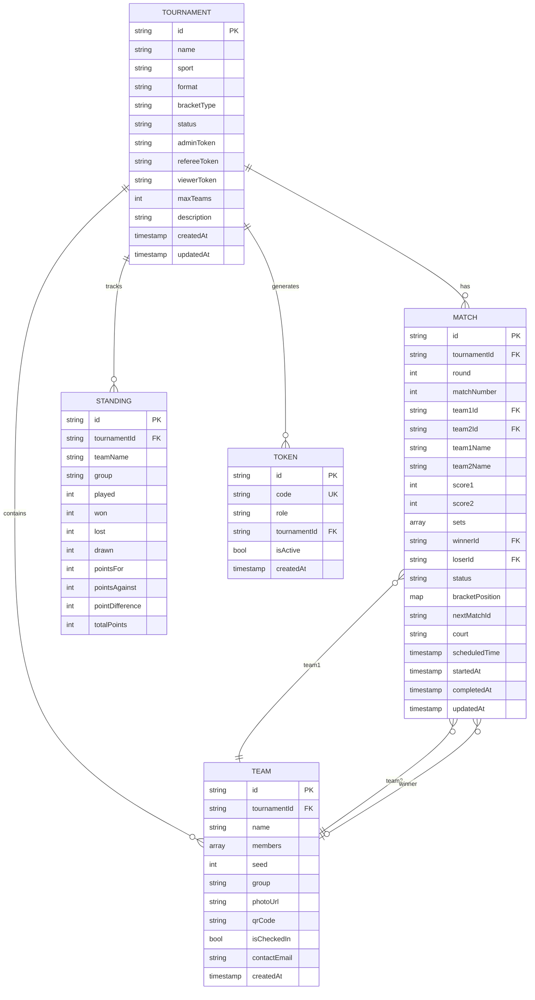

# 🗄️ DATABASE SCHEMA — Firestore Data Model

---

## 1. Entity Relationship Diagram



---

## 2. Collection Details

### 2.1 `tournaments/{tournamentId}`

Top-level collection. Mỗi document đại diện cho 1 giải đấu.

| Field | Type | Required | Default | Description |
|---|---|---|---|---|
| `id` | `string` | ✅ | auto-gen | UUID unique |
| `name` | `string` | ✅ | — | Tên giải: "Giải CL Mùa hè 2025" |
| `sport` | `string` | ✅ | — | Enum: `pickleball`, `badminton`, `football`, `tennis` |
| `format` | `string` | ✅ | — | Enum: `singles`, `doubles`, `team_5`, `team_7`, `team_11` |
| `bracketType` | `string` | ✅ | — | Enum: `single_elimination`, `double_elimination`, `round_robin` |
| `status` | `string` | ✅ | `draft` | Enum: `draft`, `registration`, `drawing`, `in_progress`, `completed` |
| `adminToken` | `string` | ✅ | auto-gen | Token cho Admin: `ADM-XXXX-XXXX` |
| `refereeToken` | `string` | ✅ | auto-gen | Token cho Trọng tài: `REF-XXXX-XXXX` |
| `viewerToken` | `string` | ✅ | auto-gen | Token cho Viewer: `VWR-XXXX-XXXX` |
| `maxTeams` | `int` | ✅ | 16 | Giới hạn số đội: 4, 8, 16, 32, 64 |
| `description` | `string` | ❌ | `""` | Mô tả thêm |
| `createdAt` | `timestamp` | ✅ | `now()` | Thời gian tạo |
| `updatedAt` | `timestamp` | ✅ | `now()` | Thời gian cập nhật gần nhất |

**Indexes:**
```
- status (ASC) + createdAt (DESC) → Lọc giải theo trạng thái
```

**Dart Model:**
```dart
class Tournament {
  final String id;
  final String name;
  final String sport;        // 'pickleball' | 'badminton' | 'football' | 'tennis'
  final String format;       // 'singles' | 'doubles' | 'team_5' | 'team_7' | 'team_11'
  final String bracketType;  // 'single_elimination' | 'double_elimination' | 'round_robin'
  final String status;       // 'draft' | 'registration' | 'drawing' | 'in_progress' | 'completed'
  final String adminToken;
  final String refereeToken;
  final String viewerToken;
  final int maxTeams;
  final String description;
  final DateTime createdAt;
  final DateTime updatedAt;
}
```

---

### 2.2 `tournaments/{tournamentId}/teams/{teamId}`

Subcollection dưới tournament. Mỗi document đại diện cho 1 đội hoặc 1 VĐV.

| Field | Type | Required | Default | Description |
|---|---|---|---|---|
| `id` | `string` | ✅ | auto-gen | UUID unique |
| `name` | `string` | ✅ | — | Tên đội hoặc tên VĐV |
| `members` | `array<string>` | ❌ | `[]` | Danh sách tên thành viên |
| `seed` | `int` | ❌ | `0` | Hạt giống (0 = không seed) |
| `group` | `string` | ❌ | `""` | Bảng đấu: "A", "B", "C" (Round Robin) |
| `photoUrl` | `string` | ❌ | `""` | URL ảnh đội/VĐV trên Firebase Storage |
| `qrCode` | `string` | ✅ | auto-gen | ID cho QR: `VDV_001` |
| `isCheckedIn` | `bool` | ✅ | `false` | Đã check-in chưa |
| `contactEmail` | `string` | ❌ | `""` | Email liên hệ |
| `createdAt` | `timestamp` | ✅ | `now()` | Thời gian tạo |

**Indexes:**
```
- group (ASC) + seed (ASC) → Lấy đội theo bảng & hạt giống
- isCheckedIn (ASC) → Lọc đội chưa check-in
```

**Dart Model:**
```dart
class Team {
  final String id;
  final String name;
  final List<String> members;
  final int seed;
  final String group;
  final String photoUrl;
  final String qrCode;
  final bool isCheckedIn;
  final String contactEmail;
  final DateTime createdAt;
}
```

---

### 2.3 `tournaments/{tournamentId}/matches/{matchId}`

Subcollection dưới tournament. Mỗi document đại diện cho 1 trận đấu. **Đây là collection được đọc real-time bởi Viewer.**

| Field | Type | Required | Default | Description |
|---|---|---|---|---|
| `id` | `string` | ✅ | auto-gen | UUID unique |
| `round` | `int` | ✅ | — | Vòng đấu (1 = vòng 1) |
| `matchNumber` | `int` | ✅ | — | Số thứ tự trận trong vòng |
| `team1Id` | `string` | ❌ | `""` | ID đội 1 (trống nếu chưa xác định) |
| `team2Id` | `string` | ❌ | `""` | ID đội 2 |
| `team1Name` | `string` | ❌ | `"TBD"` | Tên đội 1 (denormalized) |
| `team2Name` | `string` | ❌ | `"TBD"` | Tên đội 2 (denormalized) |
| `score1` | `int` | ✅ | `0` | Điểm đội 1 hiện tại |
| `score2` | `int` | ✅ | `0` | Điểm đội 2 hiện tại |
| `sets` | `array<map>` | ❌ | `[]` | Chi tiết từng set: `[{score1: 21, score2: 18}, ...]` |
| `winnerId` | `string` | ❌ | `""` | ID đội thắng |
| `loserId` | `string` | ❌ | `""` | ID đội thua |
| `status` | `string` | ✅ | `scheduled` | Enum: `scheduled`, `live`, `completed`, `walkover` |
| `bracketPosition` | `map` | ✅ | — | `{bracket: "winners", round: 1, position: 0}` |
| `nextMatchId` | `string` | ❌ | `""` | ID trận tiếp theo (đội thắng vào) |
| `loserNextMatchId` | `string` | ❌ | `""` | ID trận nhánh thua (Double Elimination) |
| `court` | `string` | ❌ | `""` | Sân thi đấu: "Sân 1", "Sân 2" |
| `scheduledTime` | `timestamp` | ❌ | `null` | Giờ dự kiến |
| `startedAt` | `timestamp` | ❌ | `null` | Giờ bắt đầu thực tế |
| `completedAt` | `timestamp` | ❌ | `null` | Giờ kết thúc |
| `updatedAt` | `timestamp` | ✅ | `now()` | Cập nhật gần nhất |

**Indexes:**
```
- status (ASC) + round (ASC)           → Lọc trận live theo vòng
- round (ASC) + matchNumber (ASC)       → Sắp xếp bracket
- bracketPosition.bracket (ASC) + bracketPosition.round (ASC) → Double elimination
```

**Dart Model:**
```dart
class Match {
  final String id;
  final int round;
  final int matchNumber;
  final String team1Id;
  final String team2Id;
  final String team1Name;
  final String team2Name;
  final int score1;
  final int score2;
  final List<SetScore> sets;
  final String winnerId;
  final String loserId;
  final String status;         // 'scheduled' | 'live' | 'completed' | 'walkover'
  final BracketPosition bracketPosition;
  final String nextMatchId;
  final String loserNextMatchId;
  final String court;
  final DateTime? scheduledTime;
  final DateTime? startedAt;
  final DateTime? completedAt;
  final DateTime updatedAt;
}

class SetScore {
  final int score1;
  final int score2;
}

class BracketPosition {
  final String bracket;   // 'winners' | 'losers'
  final int round;
  final int position;
}
```

---

### 2.4 `tournaments/{tournamentId}/standings/{teamId}`

Subcollection cho bảng xếp hạng (Round Robin). Document ID = team ID.

| Field | Type | Required | Default | Description |
|---|---|---|---|---|
| `id` | `string` | ✅ | team ID | Trùng với team ID |
| `teamName` | `string` | ✅ | — | Tên đội (denormalized) |
| `group` | `string` | ✅ | — | Bảng đấu: "A", "B" |
| `played` | `int` | ✅ | `0` | Số trận đã đấu |
| `won` | `int` | ✅ | `0` | Số trận thắng |
| `lost` | `int` | ✅ | `0` | Số trận thua |
| `drawn` | `int` | ✅ | `0` | Số trận hòa |
| `pointsFor` | `int` | ✅ | `0` | Tổng điểm ghi được |
| `pointsAgainst` | `int` | ✅ | `0` | Tổng điểm bị ghi |
| `pointDifference` | `int` | ✅ | `0` | Hiệu số (pointsFor - pointsAgainst) |
| `totalPoints` | `int` | ✅ | `0` | Điểm xếp hạng (3W + 1D) |

**Indexes:**
```
- group (ASC) + totalPoints (DESC) + pointDifference (DESC)  → Bảng xếp hạng
```

**Dart Model:**
```dart
class Standing {
  final String id;
  final String teamName;
  final String group;
  final int played;
  final int won;
  final int lost;
  final int drawn;
  final int pointsFor;
  final int pointsAgainst;
  final int pointDifference;
  final int totalPoints;
}
```

---

### 2.5 `tokens/{tokenId}`

Top-level collection. Quản lý token xác thực.

| Field | Type | Required | Default | Description |
|---|---|---|---|---|
| `id` | `string` | ✅ | auto-gen | UUID unique |
| `code` | `string` | ✅ | auto-gen | Token code: `ADM-X7K9-M2P4` |
| `role` | `string` | ✅ | — | Enum: `admin`, `referee`, `viewer` |
| `tournamentId` | `string` | ✅ | — | ID giải đấu token thuộc về |
| `isActive` | `bool` | ✅ | `true` | Token còn hoạt động không |
| `createdAt` | `timestamp` | ✅ | `now()` | Thời gian tạo |

**Indexes:**
```
- code (ASC)                            → Lookup token khi user nhập
- tournamentId (ASC) + role (ASC)       → Lấy tokens của 1 giải
- isActive (ASC) + code (ASC)           → Validate token active
```

**Dart Model:**
```dart
class TokenModel {
  final String id;
  final String code;
  final String role;        // 'admin' | 'referee' | 'viewer'
  final String tournamentId;
  final bool isActive;
  final DateTime createdAt;
}
```

---

## 3. Query Patterns

### Các query thường dùng

```dart
// 1. Validate token khi user nhập
final token = await firestore
    .collection('tokens')
    .where('code', isEqualTo: inputCode)
    .where('isActive', isEqualTo: true)
    .limit(1)
    .get();

// 2. Lấy danh sách đội trong giải (realtime)
final teamsStream = firestore
    .collection('tournaments/$tournamentId/teams')
    .orderBy('createdAt')
    .snapshots();

// 3. Lấy trận đấu đang live (realtime cho Viewer)
final liveStream = firestore
    .collection('tournaments/$tournamentId/matches')
    .where('status', isEqualTo: 'live')
    .snapshots();

// 4. Lấy toàn bộ bracket (realtime)
final bracketStream = firestore
    .collection('tournaments/$tournamentId/matches')
    .orderBy('round')
    .orderBy('matchNumber')
    .snapshots();

// 5. Bảng xếp hạng theo bảng (Round Robin)
final standingsStream = firestore
    .collection('tournaments/$tournamentId/standings')
    .where('group', isEqualTo: 'A')
    .orderBy('totalPoints', descending: true)
    .orderBy('pointDifference', descending: true)
    .snapshots();

// 6. Cập nhật điểm trận đấu (Referee/Admin)
await firestore
    .doc('tournaments/$tournamentId/matches/$matchId')
    .update({
      'score1': newScore1,
      'score2': newScore2,
      'updatedAt': FieldValue.serverTimestamp(),
    });
```

---

## 4. Data Migration & Versioning

```dart
// Thêm field schemaVersion vào tournament
// để hỗ trợ migration trong tương lai
{
  "schemaVersion": 1,
  // ... other fields
}

// Khi cần migration:
// 1. Đọc schemaVersion
// 2. Apply migration functions tuần tự
// 3. Update schemaVersion
```

---

## 5. Firestore Pricing Estimation

| Operation | Free tier (daily) | Estimated usage |
|---|---|---|
| Reads | 50,000 | ~5,000/giải/ngày (real-time listeners) |
| Writes | 20,000 | ~500/giải/ngày (nhập điểm) |
| Deletes | 20,000 | ~50/giải (hiếm khi xóa) |
| Storage | 1 GB | ~10 MB/giải |

→ **Với giải đấu quy mô < 64 đội, hoàn toàn nằm trong Free Tier của Firebase.**
