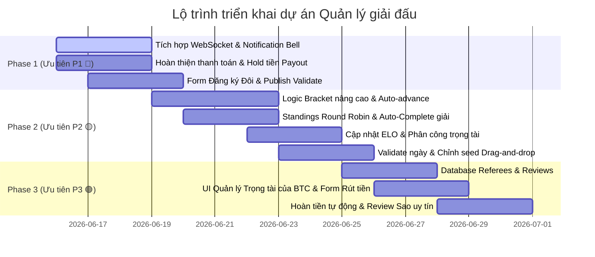

# 🗺️ LỘ TRÌNH PHÁT TRIỂN CHI TIẾT — TOURNAMENT MANAGEMENT APP

Tài liệu này đóng vai trò là bản thiết kế kỹ thuật (technical specification) và lộ trình phát triển chi tiết từng bước (step-by-step roadmap) cho cả **Backend (NestJS + Drizzle ORM)** và **Frontend (Next.js 14 + Zustand + Tailwind)**. Đội ngũ phát triển cần tuân thủ cấu trúc thư mục, các ràng buộc dữ liệu, và các tiêu chí nghiệm thu dưới đây để đảm bảo chất lượng phần mềm.

---

## 📌 PHÂN CHIA CÁC PHASE THEO MỨC ƯU TIÊN



---

## 🧭 BẢNG ÁNH XẠ TRẠNG THÁI (UI STEPPER VS DATABASE STATUS)

Để tránh xung đột trạng thái giải đấu trong suốt vòng đời vận hành, hệ thống tuân thủ bảng quy định ánh xạ dưới đây:

| Stepper Bước (UI) | Trạng thái Database (`status`) | Ý nghĩa & Quyền hạn | Ràng buộc Khóa cấu hình |
|---|---|---|---|
| **0. Bản nháp** | `DRAFT` | Giải đấu vừa được tạo. BTC chỉnh sửa mọi thông tin. | *Không khóa.* BTC thay đổi ELO, Lệ phí, Thể thức tùy ý. |
| **-** | `PENDING_APPROVAL` | Đang chờ Admin duyệt (chỉ áp dụng đối với giải `isRanked = true`). | Khóa chỉnh sửa cấu hình cốt lõi. |
| **1. Nhận Đăng ký** | `REGISTRATION_OPEN` | Người chơi đăng ký tự do ngoài trang chủ. | **Khóa cứng cấu hình cốt lõi** (Lệ phí, Thể thức Đơn/Đôi, ELO Limits). |
| **2. Bracket Nháp & Chốt DS** | `REGISTRATION_CLOSED` <br> hoặc `UPCOMING` | Danh sách VĐV được chốt. Hệ thống hiển thị Bracket nháp. | Cho phép BTC kéo thả thay đổi hạt giống (Seed) và bấm "Reset Bracket" để sinh lại sơ đồ nháp thoải mái. |
| **3. Khai mạc & Thi đấu** | `IN_PROGRESS` | Giải đấu chính thức bắt đầu thi đấu. | **Khóa vĩnh viễn tính năng Reset Bracket**. Các trận đấu được phân công trọng tài và nhập điểm. |
| **4. Hoàn thành** | `COMPLETED` | Tất cả trận đấu kết thúc. Hệ thống tự động tính ELO VĐV. | Khóa toàn bộ dữ liệu. BTC được phép gửi yêu cầu thanh toán (Payout) doanh thu giải đấu. |

---

## 🔴 PHASE 1: CÁC TÍNH NĂNG CỐT LÕI (P1)

Phase này tập trung vào việc hoàn thiện hệ thống thông báo, các ràng buộc thanh toán, và các luồng đăng ký/phát hành giải đấu.

### 1.1 Backend — Cập nhật `holdUntil` & Tính `totalCollected` Thực tế
* **Mục tiêu**: Xử lý logic giữ tiền Payout theo phân quyền (Organizer vs Player thường) và tính toán doanh thu thực tế thay vì hardcode.

#### Step 1.1.1: Cập nhật logic `holdUntil` dựa theo Role người tạo giải
- **File cần sửa**: `backend-api_qlgiaidau/src/modules/payments/payments.service.ts`
- **Hàm cần sửa**: `requestPayout(organizerId: string, data: PayoutRequestDto)`
- **Logic chi tiết**:
  - Truy vấn thông tin Role của `organizerId` từ bảng `user_to_roles` và `roles`.
  - Nếu user có role `ORGANIZER`: `holdUntil` = `null` (được quyền yêu cầu rút tiền bất kỳ lúc nào khi giải bắt đầu).
  - Nếu user có role `PLAYER` (hoặc các role thường khác): `holdUntil` = ngày kết thúc giải đấu (`tournaments.endDate`).
- **Acceptance Criteria**:
  - Khi một Player thường tạo giải public và yêu cầu payout, trường `hold_until` trong bảng `organizer_payouts` phải được gán bằng ngày kết thúc của giải đấu.
  - Khi một Organizer (BTC chính thức) gửi yêu cầu payout, `hold_until` phải là `null`.

#### Step 1.1.2: Tính tổng số tiền thu được (`totalCollected`) từ dữ liệu thực tế
- **File cần sửa**: `backend-api_qlgiaidau/src/modules/payments/payments.service.ts`
- **Hàm cần sửa**: `requestPayout` và `getPayoutDetails` (nếu có)
- **Logic chi tiết**:
  - Xóa bỏ dòng mock `const totalCollected = 20000000;`.
  - Thực hiện query database thông qua `PaymentsRepository` để tính tổng số tiền (`amount`) của tất cả các giao dịch trong bảng `payments` có:
    - `tournamentId` trùng với giải đấu yêu cầu.
    - `status` = `'COMPLETED'`.
    - `participantId` không phải `null` (các giao dịch đóng lệ phí tham gia của VĐV).
- **Acceptance Criteria**:
  - API trả về đúng số tiền thực thu dựa trên số lượng VĐV đã thanh toán phí tham gia.
  - Nếu giải đấu chưa có ai đóng phí, `totalCollected` trả về `0` và chặn không cho rút tiền.

---

### 1.2 Backend — Hoàn thiện việc Tích hợp Notification
* **Mục tiêu**: Đảm bảo tất cả các sự kiện quan trọng trong hệ thống đều kích hoạt việc gửi thông báo tới người dùng liên quan.

#### Step 1.2.1: Inject Notification Service vào các Module nghiệp vụ
- **Các file cần sửa**:
  - `backend-api_qlgiaidau/src/modules/tournaments/tournaments.module.ts`
  - `backend-api_qlgiaidau/src/modules/matches/matches.module.ts`
  - `backend-api_qlgiaidau/src/modules/payments/payments.module.ts`
- **Logic chi tiết**: Import `NotificationsModule` và inject `NotificationsService` vào các services tương ứng.
- **Các trigger thông báo cần thêm**:
  1. **Thanh toán lệ phí thành công**: Gửi tới VĐV đăng ký.
     - *Nội dung*: `Bạn đã đăng ký thành công giải đấu {tournamentName}.`
  2. **Bị loại khỏi giải đấu (Kick/Từ chối duyệt)**: Gửi tới VĐV.
     - *Nội dung*: `Đơn đăng ký tham gia giải đấu {tournamentName} của bạn đã bị từ chối.`
  3. **Mời trọng tài**: Gửi tới User được mời.
     - *Nội dung*: `Bạn nhận được lời mời làm trọng tài cho giải đấu {tournamentName}.`
  4. **Phân công trọng tài**: Gửi tới trọng tài được gán.
     - *Nội dung*: `Bạn đã được phân công bắt chính trận đấu {matchName} vào lúc {scheduledAt}.`
  5. **Có kết quả trận đấu**: Gửi tới các VĐV tham gia trận đấu đó.
     - *Nội dung*: `Trận đấu của bạn tại giải {tournamentName} đã có kết quả. Xem ngay!`

---

### 1.3 Frontend — WebSocket & Notification Bell
* **Mục tiêu**: Nhận thông báo real-time từ server và hiển thị giao diện thông báo trực quan cho người dùng.

#### Step 1.3.1: Tích hợp WebSocket Client
- **Thư viện cần cài**: `pnpm add socket.io-client` tại `frontend-web_qlgiaidau`.
- **File cần sửa/tạo mới**: Tạo file hook `frontend-web_qlgiaidau/src/hooks/useSocket.ts`.
- **Logic chi tiết**: Kết nối tới gateway socket của backend, lắng nghe sự kiện `notification` và cập nhật state của client.

#### Step 1.3.2: Giao diện Notification Bell trên Header
- **File cần sửa**: `frontend-web_qlgiaidau/src/components/layout/Header.tsx` (hoặc file Navbar chính).
- **Giao diện & Logic**:
  - Nút hình chiếc chuông 🔔 kèm số đếm thông báo chưa đọc màu đỏ nổi bật (badge).
  - Khi click vào chuông, hiển thị popover danh sách 5 thông báo mới nhất.
  - Có nút "Đánh dấu tất cả đã đọc" (gọi API `PATCH /notifications/read-all`).
  - Có đường dẫn "Xem tất cả" chuyển hướng đến trang `/notifications`.
- **Acceptance Criteria**:
  - Khi backend bắn notification qua socket, số trên chuông tăng lên ngay lập tức mà không cần F5.

---

### 1.4 Frontend — Validate Ràng buộc trước khi Publish
* **Mục tiêu**: Ngăn chặn BTC gửi yêu cầu phát hành giải đấu khi thông tin cơ bản chưa được điền đầy đủ.

#### Step 1.4.1: Form Validation trước Publish
- **File cần sửa**: `frontend-web_qlgiaidau/src/app/organizer/tournaments/[id]/manage/page.tsx`
- **Logic chi tiết**: Trước khi gửi request lên API `/publish`, frontend phải kiểm tra tính hợp lệ của **8 trường bắt buộc**:
  1. `name` (Tên giải đấu): Không được trống.
  2. `categoryId` (Bộ môn): Đã chọn.
  3. `matchType` (Thể thức Đơn/Đôi): Đã chọn.
  4. `entryFee` (Lệ phí tham gia): Khác `null`.
  5. `venueId` (Địa điểm tổ chức): Đã chọn.
  6. `registrationStartDate` & `registrationEndDate` (Thời gian đăng ký): Đã điền.
  7. `startDate` & `endDate` (Thời gian thi đấu): Đã điền.
  8. `format` hoặc `bracketType` (Thể thức nhánh đấu): Đã chọn.
- **Giao diện**:
  - Nếu thiếu trường, disable nút "Publish" hoặc khi click sẽ hiển thị Modal/Alert danh sách các trường còn thiếu với màu đỏ cảnh báo.
- **Acceptance Criteria**:
  - Không thể bấm Publish nếu chưa cấu hình địa điểm, lệ phí và thể thức sơ đồ.

---

### 1.5 Frontend — Form Đăng ký Đôi (Doubles Registration)
* **Mục tiêu**: Hỗ trợ VĐV đăng ký tham gia thể thức đôi bằng cách tìm và ghép cặp với người chơi khác trong hệ thống.

#### Step 1.5.1: Form nhập thông tin đồng đội
- **File cần sửa**: `frontend-web_qlgiaidau/src/app/(public)/tournaments/[id]/register/page.tsx`
- **Giao diện**:
  - Khi hình thức giải đấu là `DOUBLES`, hiển thị thêm phần **"Thông tin đồng đội"**.
  - Ô nhập input: **Email hoặc Số điện thoại** của đồng đội.
  - Nút **"Tìm kiếm"**: Gọi API `GET /users/search?q=...`
    - Nếu tìm thấy: Hiển thị Tên, Avatar, ELO của đồng đội kèm trạng thái ghép đôi.
    - Nếu không tìm thấy: Hiển thị lỗi *"Không tìm thấy người dùng này trên hệ thống. Đồng đội của bạn phải tạo tài khoản trước."*
- **Quy tắc lệ phí**:
  - Hiển thị rõ ràng: Phí đóng sẽ gấp đôi phí cơ bản (do đóng cho cả 2 người).
- **Acceptance Criteria**:
  - Đăng ký thành công sẽ tạo ra bản ghi `tournament_participants` có `teamStatus = 'PENDING'` và gửi link/mã token xác nhận đến đồng đội.

---

## 🟡 PHASE 2: BRACKET & QUẢN LÝ TRẬN ĐẤU (P2)

Phase này tập trung vào các giải thuật sinh bracket, tự động hóa luồng kết quả trận đấu, phân công trọng tài, và kiểm tra ELO.

### 2.0 Backend — Tối ưu hóa Schema bảng matches & Thiết lập Composite Indexes
* **Mục tiêu**: Tối ưu hóa hiệu năng truy vấn cho các tính năng xem Livescore và render sơ đồ Bracket.

#### Step 2.0.1: Cấu trúc lại Schema bảng `matches`
- **File cần sửa**: `backend-api_qlgiaidau/src/database/schema/matches.schema.ts`
- **Logic chi tiết**:
  - Chuyển trường `groupId` thành **Nullable** (loại bỏ ràng buộc `.notNull()`).
  - Thêm trường **`tournamentId`** (`uuid` Not Null, references tournaments.id onDelete cascade).
  - Thêm trường **`stageId`** (`uuid` Not Null, references tournament_stages.id onDelete cascade).
- **Phép migration**:
  - Chạy `pnpm drizzle-kit generate` để sinh file migration.
  - Chạy file script để apply migration vào PostgreSQL Supabase.

#### Step 2.0.2: Thiết lập Composite Indexes tối ưu
- **File cần sửa**: `backend-api_qlgiaidau/src/database/schema/matches.schema.ts`
- **Cấu hình chỉ mục (Indexes)**:
  - `idx_matches_tournament_status`: Composite Index trên hai cột `(tournament_id, status)` giúp tối ưu tốc độ load danh sách Livescore (không cần JOIN qua Group, Stage).
  - `idx_matches_stage_round_order`: Composite Index trên ba cột `(stage_id, round_number, match_order)` tăng tốc độ truy vấn hiển thị sơ đồ Bracket.
  - `idx_matches_referee_status`: Composite Index trên `(referee_id, status)` tối ưu xem lịch đấu trọng tài.

---

### 2.1 Backend — Giải thuật Bracket & Trạng thái Match
* **Mục tiêu**: Xử lý việc thăng hạng/hạ nhánh tự động trong sơ đồ giải đấu Single & Double Elimination và tính toán điểm số vòng tròn.

#### Step 2.1.1: Tự động đưa người thắng và nhánh thua vào vòng sau & Tự động xử lý BYE Slot
- **File cần sửa**: `backend-api_qlgiaidau/src/modules/matches/matches.service.ts` và `backend-api_qlgiaidau/src/modules/tournaments/bracket-generator.service.ts`
- **Hàm cần sửa**: `onMatchCompleted(matchId: string)` & `generateBracket()`
- **Logic chi tiết**:
  - Khi cập nhật điểm một trận đấu và chuyển trạng thái sang `COMPLETED`, tìm người thắng (`winnerId`) và người thua (`loserId`).
  - **Nhánh thắng (Winners Bracket)**:
    - Nếu có `nextMatchId`, điền `winnerId` vào slot còn trống (`participant1Id` hoặc `participant2Id`) của trận đấu sau.
  - **Nhánh thua (Losers Bracket - Double Elimination)**:
    - Nếu có `loserNextMatchId`, điền `loserId` vào slot tương ứng của nhánh thua.
  - **Trận BYE (Miễn đấu - Edge Case)**:
    - Khi khởi tạo bracket (UPCOMING), đối với bất kỳ trận đấu nào có một trong hai đối thủ là `BYE` (chưa gán VĐV do lẻ số lượng):
      - Thiết lập ngay `status` = `'COMPLETED'`.
      - Gán `winnerId` là VĐV thực tế duy nhất trong trận đấu đó.
      - Tự động điền VĐV thực tế đó vào trận đấu vòng sau (`nextMatchId`).
      - Bắn thông báo real-time tới VĐV: *"Bạn được miễn đấu (BYE) ở vòng {roundNumber} và tự động đi tiếp."*
- **Acceptance Criteria**:
  - Kết quả trận đấu hoàn thành ngay lập tức hiển thị VĐV ở trận đấu tiếp theo trong sơ đồ.
  - Khi tạo bracket với số VĐV lẻ, các trận đấu BYE tự động chuyển sang `COMPLETED` và VĐV được điền sẵn vào vòng sau.

#### Step 2.1.2: Xử lý trận đấu Grand Final Reset (Double Elimination)
- **File cần sửa**: `backend-api_qlgiaidau/src/modules/tournaments/bracket-generator.service.ts`
- **Logic chi tiết**:
  - Ở trận chung kết tổng (Grand Final - GF): Winner của Winners Final đấu với Winner của Losers Final.
  - Nếu người thắng Winners Final thắng trận GF -> Giải đấu kết thúc, người đó vô địch.
  - Nếu người thắng Losers Final thắng trận GF -> Tạo thêm một trận đấu phụ (Grand Final Reset) ngay sau đó vì người từ nhánh thắng mới chỉ thua 1 trận. Người thắng trận phụ này sẽ vô địch.

#### Step 2.1.3: Cập nhật Group Standings cho Round Robin (Đấu vòng tròn)
- **File cần sửa**: `backend-api_qlgiaidau/src/modules/matches/matches.service.ts`
- **Hàm cần sửa**: `updateGroupStandings(matchId: string)`
- **Logic chi tiết**:
  - Sau mỗi trận đấu vòng tròn hoàn thành, tính lại chỉ số cho cả 2 VĐV/Đội trong bảng `group_standings`:
    - Cộng `played` (số trận đã chơi) thêm 1.
    - Cộng `won` (thắng) hoặc `lost` (thua) tương ứng.
    - Tính điểm `totalPoints`: Thắng +3 điểm, Hòa +1 điểm (nếu có thể thức hòa), Thua +0 điểm.
    - Cập nhật hiệu số game thắng/thua (`pointsFor`, `pointsAgainst`).
- **Acceptance Criteria**:
  - Bảng xếp hạng vòng bảng tự động cập nhật chính xác điểm và hiệu số ngay sau khi lưu điểm trận đấu.

---

### 2.2 Backend — Tự động đóng Giải đấu & Cập nhật ELO
* **Mục tiêu**: Tự động chuyển trạng thái giải đấu sang kết thúc và tính toán lại thứ hạng ELO cho các vận động viên tham gia.

#### Step 2.2.1: Tự động chuyển trạng thái giải đấu sang `COMPLETED`
- **File cần sửa**: `backend-api_qlgiaidau/src/modules/matches/matches.service.ts`
- **Logic chi tiết**:
  - Sau khi cập nhật kết quả một trận đấu, kiểm tra xem tất cả các trận đấu của giải đấu đó (`tournamentId`) đã có trạng thái `COMPLETED` chưa.
  - Nếu toàn bộ trận đấu đã hoàn thành, thực hiện gọi hàm cập nhật trạng thái giải đấu thành `COMPLETED`.

#### Step 2.2.2: Kích hoạt cập nhật ELO cho VĐV
- **File cần sửa**: `backend-api_qlgiaidau/src/modules/rankings/rankings.service.ts`
- **Logic chi tiết**:
  - Khi giải đấu chuyển sang `COMPLETED` và có `isRanked = true`:
    - Duyệt qua tất cả các trận đấu trong giải.
    - Tính toán điểm ELO thay đổi cho từng cặp đấu dựa trên công thức chuẩn:
      $$R'_{A} = R_{A} + K \times (S_{A} - E_{A})$$
      Trong đó $K = 32$, $S_{A}$ là kết quả thực tế (1 = thắng, 0 = thua), $E_{A}$ là xác suất thắng kỳ vọng.
    - **Logic đặc thù cho Thể thức Đôi (Doubles ELO Scaling - Tránh "cõng điểm")**:
      - Khi tính ELO biến động $\Delta ELO$ cho cả cặp đấu (dựa trên ELO trung bình), số điểm cộng/trừ vào ELO đôi cá nhân của mỗi thành viên phải được co giãn (scale) theo độ lệch ELO của họ:
        - Nếu hai VĐV trong cặp đấu có chênh lệch ELO lớn (ví dụ: VĐV A có 1600 ELO, VĐV B có 1000 ELO, trung bình là 1300 ELO):
          - Khi thắng trận: VĐV có ELO cao hơn (VĐV A) nhận ít điểm cộng hơn (ví dụ: $+5$), còn VĐV có ELO thấp hơn (VĐV B) nhận điểm cộng chuẩn (ví dụ: $+15$) để kéo ELO về đúng thực tế và tránh việc gánh điểm trục lợi ELO.
          - Khi thua trận: VĐV có ELO cao hơn (VĐV A) bị trừ nhiều điểm hơn (vì đáng nhẽ ra phải gánh được trận đấu), VĐV có ELO thấp hơn bị trừ ít điểm hơn.
    - Cập nhật chỉ số ELO mới vào bảng `profiles` (hoặc `user_ranks` tương ứng theo `matchType` và `categoryId`).
- **Acceptance Criteria**:
  - Sau khi trận chung kết kết thúc, trạng thái giải chuyển sang `COMPLETED` và điểm ELO hiển thị trên profile VĐV tăng/giảm tương ứng.
  - Thuật toán ELO đôi được scale dựa trên độ lệch ELO của hai đồng đội.

---

### 2.3 Backend — API Phân công Trọng tài, Validate Ngày & Giữ chỗ Đăng ký Đôi
* **Mục tiêu**: Cung cấp API quản lý phân công trọng tài cho từng trận đấu, kiểm soát thứ tự các mốc thời gian của giải đấu và kiểm soát tài nguyên slot thi đấu thực tế.

#### Step 2.3.1: API Phân công trọng tài
- **Endpoint**: `PATCH /matches/:id/assign-referee`
- **Request Body**: `{ refereeId: string }`
- **Logic chi tiết**:
  - Kiểm tra xem `refereeId` có nằm trong danh sách trọng tài đã đồng ý (`ACCEPTED`) tham gia giải đấu đó không.
  - Cập nhật trường `refereeId` trong bảng `matches`.
  - Gửi thông báo phân công cho trọng tài.

#### Step 2.3.2: Validate Ngày tổ chức giải đấu
- **File cần sửa**: `backend-api_qlgiaidau/src/modules/tournaments/tournaments.service.ts`
- **Logic chi tiết**: Khi tạo hoặc cập nhật thông tin giải đấu, thực hiện kiểm tra thứ tự các mốc thời gian:
  $$\text{registrationStartDate} < \text{registrationEndDate} \le \text{startDate} < \text{endDate}$$
  - Nếu vi phạm, ném ra lỗi `400 BadRequestException`.

#### Step 2.3.3: Bảo mật quyền nhập điểm trận đấu (Edge Case)
- **File cần sửa**: `backend-api_qlgiaidau/src/modules/matches/matches.service.ts`
- **Logic chi tiết**: 
  - Tại API nhập điểm set hoặc xác nhận tỉ số trận đấu (`PATCH /matches/:id/score`), thực hiện kiểm tra phân quyền chặt chẽ:
    - User gửi request phải là: Trọng tài được phân công bắt trận đó (`matches.refereeId === currentUser.id`) HOẶC chính BTC giải đấu (`tournaments.createdBy === currentUser.id`).
    - Nếu không đúng quyền, ném ra lỗi `403 ForbiddenException` ("Bạn không có quyền nhập điểm cho trận đấu này").
- **Acceptance Criteria**:
  - VĐV thông thường hoặc Trọng tài khác không thể gọi API thay đổi tỉ số trận đấu nếu không được phân công trực tiếp.

#### Step 2.3.4: Cơ chế Giữ chỗ tạm thời (Soft Lock) & Tự động hoàn tiền cho Đăng ký Đôi (Doubles)
- **Mục tiêu**: Giải quyết tranh chấp tài nguyên slot khi giải đấu chạm ngưỡng giới hạn số đội (`maxParticipants`).
- **Logic chi tiết**:
  - Khi Player A thanh toán lệ phí giải thành công cho Đăng ký Đôi (trạng thái cặp đấu là `PENDING`), hệ thống **giữ chỗ tạm thời (Soft Lock)** 1 slot trong giới hạn của giải đấu.
  - Bộ đếm thời gian (cron-job hoặc timeout event) được thiết lập: Cặp đấu có **30 phút** (hoặc thời gian quy định) để Player B bấm xác nhận ghép đôi.
  - **Trường hợp quá hạn (Timeout)**:
    - Nếu Player B không xác nhận hoặc bấm từ chối (`DECLINED`):
      - Hệ thống tự động giải phóng slot giữ chỗ.
      - Gọi API cổng thanh toán hoàn lại 100% số tiền lệ phí cho Player A.
      - Chuyển `teamStatus` sang `CANCELLED`/`DECLINED` và soft delete bản ghi participant.
      - Bắn thông báo qua Socket/Web push cho Player A về việc hủy đăng ký & hoàn tiền.
  - **Trường hợp giải đấu hết slot trước khi Player B xác nhận**:
    - Khi VĐV khác đăng ký thành công làm giải đấu đạt 100% slot `CONFIRMED`:
      - Tất cả các cặp đấu đang ở trạng thái `PENDING` (chưa được đồng đội đồng ý) mà giải đấu đã hết slot sẽ bị hệ thống tự động hủy và kích hoạt quy trình hoàn tiền 100% ngay lập tức.
- **Acceptance Criteria**:
  - Đảm bảo không xảy ra tình trạng đăng ký vượt quá `maxParticipants` (Overbook) khi các đồng đội cùng đồng ý vào phút chót.
  - Hoàn tiền tự động chạy mượt mà ngay khi bị quá hạn hoặc hết slot thực tế.

---

### 2.4 Frontend — Seed VĐV & Cấu hình Giải đấu
* **Mục tiêu**: Cung cấp giao diện trực quan cho BTC điều chỉnh hạt giống và thiết lập cấu hình nâng cao.

#### Step 2.4.1: Kéo thả Hạt giống VĐV (Drag & Drop Seeding)
- **File cần sửa**: `frontend-web_qlgiaidau/src/app/organizer/tournaments/[id]/manage/page.tsx` (Tab Bracket)
- **Giao diện & Logic**:
  - Khi giải đấu ở trạng thái `UPCOMING` (chưa bắt đầu thi đấu), hiển thị danh sách VĐV đã đăng ký dạng danh sách kéo thả (dùng `@hello-pangea/dnd` hoặc thư viện tương đương).
  - BTC có thể kéo thả để thay đổi vị trí hạt giống (Seed 1, Seed 2, ...).
  - Có nút "Tạo lại sơ đồ nháp" để preview bracket sau khi đổi seed.
  - Có nút "Chốt sơ đồ & Bắt đầu giải" để gửi lệnh `IN_PROGRESS` lên backend (chuyển sang trạng thái thi đấu chính thức, khóa nút Reset).

#### Step 2.4.2: Cấu hình giới hạn ELO (ELO Limits)
- **File cần sửa**: `frontend-web_qlgiaidau/src/app/organizer/tournaments/[id]/manage/page.tsx` (Tab Config)
- **Giao diện**:
  - Form nhập ELO tối thiểu (`minElo`) và ELO tối đa (`maxElo`).
  - Hiển thị dòng mô tả rõ ràng: *"Nhập 0 hoặc để trống nếu không giới hạn trình độ ELO của VĐV."*

#### Step 2.4.3: Trang Referee View (Xem lịch đấu của trọng tài)
- **Route**: `/tournaments/:id/referee`
- **Giao diện**:
  - Danh sách các trận đấu được phân công cho trọng tài đăng nhập.
  - Hiển thị đầy đủ thông tin: Sân đấu (`courtName`), Thời gian (`scheduledAt`), Trạng thái (`SCHEDULED`, `ONGOING`, `COMPLETED`).
  - **Chú ý**: Chỉ hiển thị thông tin để theo dõi, KHÔNG có nút sửa điểm hay nhập điểm (việc nhập điểm được thực hiện trên Mobile App hoặc do BTC ghi nhận thủ công).

---

## 🟢 PHASE 3: TRỌNG TÀI & SAO UY TÍN (P3)

Phase này hoàn thiện phân quyền dữ liệu, quản lý tài chính nâng cao, và hệ thống đánh giá độ uy tín.

### 3.1 Backend — Cấu trúc dữ liệu Referee & Sao Uy tín
* **Mục tiêu**: Mở rộng database schema để lưu trữ danh sách trọng tài và đánh giá của người dùng.

#### Step 3.1.1: Thêm bảng `tournament_referees`
- **File sửa đổi/tạo mới**: `backend-api_qlgiaidau/src/database/schema/tournaments.schema.ts`
- **Schema chi tiết**:
  ```typescript
  export const tournamentReferees = pgTable('tournament_referees', {
    id: uuid('id').primaryKey().defaultRandom(),
    tournamentId: uuid('tournament_id').references(() => tournaments.id, { onDelete: 'cascade' }).notNull(),
    userId: uuid('user_id').references(() => users.id, { onDelete: 'restrict' }).notNull(),
    assignedBy: uuid('assigned_by').references(() => users.id, { onDelete: 'set null' }),
    status: varchar('status', { length: 50 }).default('INVITED').notNull(), // 'INVITED' | 'ACCEPTED' | 'DECLINED'
    assignedAt: timestamp('assigned_at', { withTimezone: true }).defaultNow().notNull(),
    createdAt: timestamp('created_at', { withTimezone: true }).defaultNow().notNull(),
  });
  ```

#### Step 3.1.2: Thêm bảng `organizer_reviews`
- **File sửa đổi**: `backend-api_qlgiaidau/src/database/schema/users.schema.ts`
- **Schema chi tiết**:
  ```typescript
  export const organizerReviews = pgTable('organizer_reviews', {
    id: uuid('id').primaryKey().defaultRandom(),
    organizerId: uuid('organizer_id').references(() => users.id, { onDelete: 'cascade' }).notNull(),
    reviewerId: uuid('reviewer_id').references(() => users.id, { onDelete: 'restrict' }).notNull(),
    tournamentId: uuid('tournament_id').references(() => tournaments.id, { onDelete: 'cascade' }).notNull(),
    rating: integer('rating').notNull(), // từ 1 đến 5 sao
    comment: text('comment'),
    createdAt: timestamp('created_at', { withTimezone: true }).defaultNow().notNull(),
  });
  ```

#### Step 3.1.3: Thêm bảng `pair_ranks` (Lưu ELO Cặp đôi Lâu dài)
- **File sửa đổi/tạo mới**: `backend-api_qlgiaidau/src/database/schema/categories.schema.ts`
- **Schema chi tiết**:
  ```typescript
  export const pairRanks = pgTable(
    'pair_ranks',
    {
      id: uuid('id').primaryKey().defaultRandom(),
      user1Id: uuid('user1_id').references(() => users.id, { onDelete: 'cascade' }).notNull(),
      user2Id: uuid('user2_id').references(() => users.id, { onDelete: 'cascade' }).notNull(),
      categoryId: uuid('category_id').references(() => categories.id, { onDelete: 'cascade' }).notNull(),
      eloPoints: integer('elo_points').default(1000).notNull(),
      matchesPlayed: integer('matches_played').default(0).notNull(),
      matchesWon: integer('matches_won').default(0).notNull(),
      winStreak: integer('win_streak').default(0).notNull(),
      updatedAt: timestamp('updated_at', { withTimezone: true }).defaultNow().notNull(),
    },
    (table) => ({
      userPairUnique: unique('user_pair_category_unique_idx').on(
        table.user1Id,
        table.user2Id,
        table.categoryId
      ),
    })
  );
  ```
- **Lưu ý**: Khi lưu, sắp xếp UUID của 2 người chơi sao cho `user1Id < user2Id` để đảm bảo tính duy nhất và không bị trùng cặp (tránh trường hợp A-B và B-A thành 2 bản ghi).

---

### 3.2 Backend — Logic Hoàn tiền tự động & Tìm kiếm User
* **Mục tiêu**: Xử lý hoàn tiền tự động khi giải đấu bị hủy và cung cấp endpoint tìm kiếm phục vụ các tác vụ gán ghép.

#### Step 3.2.1: Logic Tự động hoàn tiền khi hủy giải (Cancel Tournament - Edge Case)
- **File cần sửa**: `backend-api_qlgiaidau/src/modules/tournaments/tournaments.service.ts`
- **Hàm cần sửa**: `cancelTournament(tournamentId: string)`
- **Logic chi tiết**:
  - **Ràng buộc trạng thái hủy**: Bắt buộc chỉ cho phép hủy khi giải đấu ở trạng thái `REGISTRATION_OPEN`, `REGISTRATION_CLOSED`, hoặc `UPCOMING`.
  - **Chặn hủy giải**: Nếu giải đấu đang diễn ra hoặc đã kết thúc (`IN_PROGRESS`, `COMPLETED`), chặn không cho BTC tự ý hủy trên Dashboard. Giao diện hiển thị nút "Yêu cầu hủy giải lên Admin" để chuyển về hỗ trợ thủ công.
  - Tìm tất cả các VĐV đã thanh toán lệ phí (`isPaid = true` và có bản ghi `payments` trạng thái `'COMPLETED'`).
  - Gọi API của Gateway thanh toán thực tế hoặc mock để thực hiện refund 100% lệ phí cho các VĐV này.
  - Cập nhật `refundStatus = 'REFUNDED'` và `status = 'CANCELLED'`.
- **Acceptance Criteria**:
  - Hủy giải đấu thành công trước khi thi đấu sẽ kích hoạt hoàn tiền tự động 100% và gửi thông báo tới toàn bộ VĐV.
  - BTC không thể tự ý hủy giải đấu đang diễn ra.

#### Step 3.2.2: API tìm kiếm người dùng qua Email / SĐT
- **Endpoint**: `GET /users/search`
- **Query Params**: `q` (email hoặc số điện thoại)
- **Response**: `{ id, email, fullName, avatarUrl }`
- **Acceptance Criteria**:
  - Trả về đúng thông tin user cần tìm để ghép đôi hoặc mời làm trọng tài. Không trả về thông tin mật khẩu hay dữ liệu nhạy cảm.

#### Step 3.2.3: Hoàn lệ phí khi đồng đội từ chối hoặc hủy đăng ký & Quản lý ELO Cặp đôi (Edge Case)
- **File cần sửa**: `backend-api_qlgiaidau/src/modules/tournaments/tournaments.service.ts` và `backend-api_qlgiaidau/src/modules/payments/payments.service.ts`
- **Logic chi tiết**:
  - **Đồng đội từ chối lời mời ghép đôi**: Khi Player B bấm `DECLINED` lời mời thi đấu Đôi từ Player A, hoặc lời mời hết hạn khi giải chốt danh sách đăng ký:
    - Hệ thống tự động kích hoạt hoàn trả **100% số tiền** (2x lệ phí) mà Player A đã đóng trước đó.
    - Xóa cặp đôi khỏi danh sách giải đấu (`tournament_participants` và `tournament_rosters`).
  - **Hết hạn đăng ký nhưng chưa ghép cặp xong**: Khi giải đấu chuyển từ `REGISTRATION_OPEN` sang `REGISTRATION_CLOSED`, bất kỳ đơn đăng ký đôi nào vẫn ở trạng thái chờ ghép cặp (`teamStatus = 'PENDING'`) sẽ tự động bị hệ thống hủy bỏ và hoàn trả 100% lệ phí đóng trước cho Player A.
  - **VĐV tự hủy đăng ký (Chính sách hoàn tiền)**:
    - Nếu VĐV tự hủy đăng ký **trước thời điểm chốt danh sách** (status còn ở `REGISTRATION_OPEN`): Hoàn trả 100% lệ phí đã đóng.
    - Nếu giải đấu đã chốt danh sách hoặc đã thi đấu (`UPCOMING`, `IN_PROGRESS`): VĐV xin rút tên sẽ **không được hoàn lại tiền** (lệ phí bị sung công quỹ giải đấu).
  - **BTC kick/từ chối duyệt VĐV**: 
    - Bất kể thời điểm nào BTC kick hoặc không phê duyệt đơn đăng ký của VĐV, hệ thống phải **tự động hoàn tiền 100%** cho VĐV đó.
  - **Quản lý gán ELO Cặp đôi khi Đăng ký thành công (DOUBLES ELO)**:
    - Khi một cặp đôi A-B hoàn tất đăng ký thi đấu giải ELO (`isPaid = true` hoặc được BTC duyệt):
      - Thực hiện kiểm tra trong bảng `pair_ranks` xem đã tồn tại bản ghi cho cặp đấu (sắp xếp `user1Id < user2Id`) ứng với `categoryId` chưa.
      - Nếu **đã tồn tại**: Gán ELO của đội tham gia bằng điểm ELO đã lưu trong `pair_ranks` để sử dụng làm hạt giống cho giải đấu đó.
      - Nếu **chưa tồn tại**: Tạo bản ghi mới trong bảng `pair_ranks` với `eloPoints` = `(elo_ca_nhan_A + elo_ca_nhan_B) / 2` (điểm ELO cá nhân đánh Đôi của A và B).
        - *Lưu ý*: Nếu người chơi chưa từng có ELO đánh Đôi cá nhân trong `user_ranks`, hệ thống tự động khởi tạo bản ghi `user_ranks` với điểm mặc định là 1000 trước khi lấy trung bình cộng.
      - Điểm ELO của cặp đôi này sẽ được tăng/giảm độc lập sau mỗi trận đấu và giữ lại vĩnh viễn (kể cả khi các giải đấu sau họ ghép cặp với người khác, ELO cặp A-B cũ không đổi).
- **Acceptance Criteria**:
  - Hủy đăng ký đôi do bị từ chối ghép cặp hoàn trả đủ 100% tiền đã đóng.
  - VĐV tự rút tên trước hạn nhận lại tiền, sau hạn không nhận lại tiền. BTC kick VĐV luôn nhận lại tiền.
  - Đăng ký Đôi thành công gán ELO cặp đôi trung bình ban đầu từ ELO cá nhân (nếu chưa có trong `pair_ranks`), hoặc sử dụng ELO cặp đôi cũ (nếu đã từng thi đấu chung).

---

### 3.3 Frontend — Giao diện Quản lý Trọng tài & Quản lý Tài chính
* **Mục tiêu**: Xây dựng màn hình để BTC gửi lời mời trọng tài, xếp lịch rút tiền, và hiển thị sao uy tín.

#### Step 3.3.1: Tab Quản lý Trọng tài (trong trang Manage)
- **File cần sửa/tạo mới**: Tạo sub-tab "Trọng tài" tại `frontend-web_qlgiaidau/src/app/organizer/tournaments/[id]/manage/`
- **Tính năng**:
  - Giao diện tìm kiếm trọng tài: Ô tìm kiếm email/SĐT -> Nút "Mời làm trọng tài" -> Gửi request tới backend.
  - Bảng danh sách trọng tài đã mời kèm badge trạng thái: `Đang chờ phản hồi` (vàng), `Đã đồng ý` (xanh), `Từ chối` (đỏ).
  - Trong tab Bracket, khi click vào một trận đấu, hiển thị dropdown chọn trọng tài (chỉ hiển thị những người có status `ACCEPTED`).

#### Step 3.3.2: Tab Tài chính & Rút tiền sớm (Tab Finance)
- **File cần sửa**: Sub-tab "Tài chính" trong trang quản lý của BTC.
- **Giao diện**:
  - Hiển thị bảng tổng hợp tài chính:
    - Tổng lệ phí thu được: `totalCollected`
    - Phí nền tảng khấu trừ: `platformFeeRetained`
    - Số tiền tối đa có thể rút: `maxWithdrawable`
  - Form gửi yêu cầu rút tiền sớm (Early Payout Request):
    - Ô nhập số tiền muốn rút.
    - Dropdown chọn Ngân hàng, nhập Số tài khoản, Tên chủ tài khoản.
    - Nút gửi yêu cầu.
  - **Chú ý**: Nếu giải đấu thuộc hình thức CLB (phí = 0), giao diện hiển thị: *"Giải nội bộ — không có giao dịch tài chính."* và disable toàn bộ form rút tiền.

---

## 🧪 QUY TRÌNH KIỂM THỬ VÀ TIÊU CHÍ NGHIỆM THU (QA/QC)

Để đảm bảo các tính năng hoạt động ổn định và không phát sinh lỗi khi lên môi trường Production, mọi sự thay đổi mã nguồn phải trải qua các bước kiểm thử sau:

### 1. Đồng bộ Database Schema (Backend)
Mỗi khi có thay đổi liên quan đến schema trong `src/database/schema/`:
1. Chạy lệnh tạo file migration:
   ```bash
   pnpm drizzle-kit generate
   ```
2. Chạy file script để apply migration vào database local:
   ```bash
   ts-node migrate.ts
   ```

### 2. Kiểm thử Tự động (Automated Testing)
- **Backend Unit Tests**: Viết test cases cho logic sinh bracket (Single, Double, Round Robin) trong `bracket-generator.service.spec.ts`.
- **Backend API Tests**: Chạy lệnh test kiểm tra lỗi biên dịch:
   ```bash
   pnpm run build
   ```

### 3. Kiểm thử Thủ công (Manual Verification Checklist)
Mỗi phase hoàn thành cần được test qua các kịch bản sau:

| Kịch bản kiểm thử | Kết quả mong đợi | Trạng thái kiểm tra |
|---|---|:---:|
| **Publish giải thiếu thông tin** | Backend trả về lỗi `400`. Frontend hiển thị đúng trường thông tin còn thiếu. | [ ] |
| **Đăng ký Đôi với SĐT chưa đăng ký** | Frontend hiển thị cảnh báo yêu cầu đồng đội tạo tài khoản trước. | [ ] |
| **Hủy giải đấu đã thu lệ phí** | Kiểm tra ví VĐV nhận lại tiền (mocked) và nhận được notification hủy giải. | [ ] |
| **Double Elimination Grand Final** | Nếu nhánh thua thắng trận chung kết 1, hệ thống phải tự động sinh thêm trận chung kết 2 (Reset). | [ ] |
| **Rút tiền giải CLB** | Tab Finance hiển thị thông báo không có giao dịch, nút rút tiền bị khóa. | [ ] |

---
*Tài liệu này được biên soạn tuân thủ theo các quy chuẩn kiến trúc của dự án. Mọi thay đổi hay bổ sung trong quá trình thực hiện cần được cập nhật trực tiếp tại đây.*

---

## 🔵 PHASE 4: TỐI ƯU HÓA HIỆU NĂNG & QUY MÔ (P4)

Phase này tập trung vào tối ưu hóa tải trọng lớn, giảm tải cho PostgreSQL DB và tăng cường độ mượt mà real-time cho hàng ngàn người dùng đồng thời.

### 4.1 Backend — Chiến lược caching Real-time với Redis
* **Mục tiêu**: Giảm thiểu số lượng truy vấn đọc Livescore/Bracket trực tiếp từ PostgreSQL và chuyển sang cache tốc độ cao.

#### Step 4.1.1: Tích hợp Redis Caching cho Bracket & Livescore
- **Logic chi tiết**:
  - Triển khai Redis trong backend phục vụ lưu trữ Bracket JSON đã được kết xuất sẵn (pre-rendered) của các giai đoạn giải đấu:
    - Định dạng Key: `tournament:bracket:<stageId>`
  - Khi người dùng truy cập trang Bracket của giải đấu:
    - Hệ thống ưu tiên đọc từ Redis Cache. Nếu có, trả về ngay trong < 5ms.
    - Nếu cache miss (chưa có cache): Query PostgreSQL, render Bracket, lưu vào Redis với TTL dài (ví dụ: 1 giờ), sau đó trả về cho client.
  - **Cơ chế Invalidate Cache**:
    - Khi trọng tài cập nhật điểm (`PATCH /matches/:id/score`) dẫn đến trạng thái trận đấu đổi sang `COMPLETED`:
      - Chạy tiến trình cập nhật PostgreSQL.
      - Xóa key Redis cũ tương ứng với `stageId` của trận đấu đó.
      - Tính toán lại sơ đồ Bracket mới trong RAM, cập nhật lại vào Redis Cache và bắn payload JSON Bracket mới qua Socket.io trực tiếp cho các client đang kết nối real-time.

