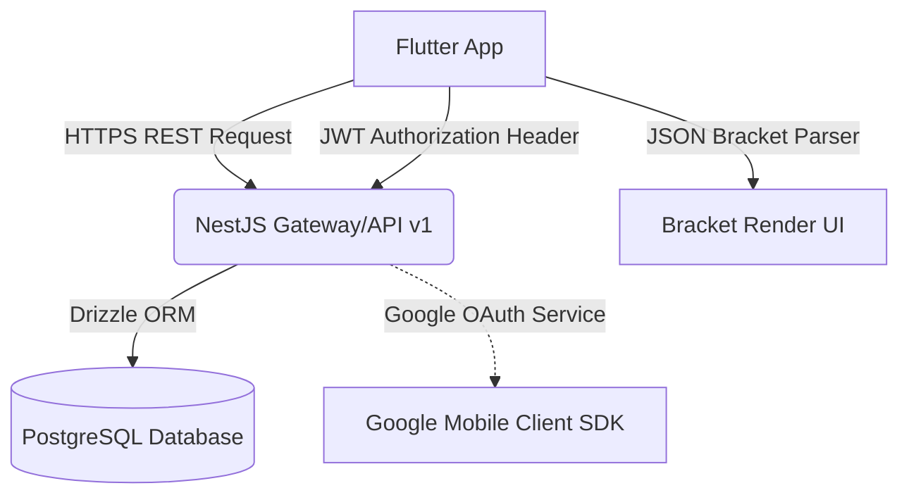

# 🏆 APP QUẢN LÝ GIẢI ĐẤU — PROJECT OVERVIEW (MOBILE EDITION)

Tài liệu này đặc tả chi tiết thiết kế, kiến trúc và phạm vi tính năng của ứng dụng di động Flutter sau khi tái cấu trúc. Toàn bộ hệ thống được chuyển từ hạ tầng Firebase cũ sang kết nối trực tiếp với **Custom Backend API (NestJS + PostgreSQL)**, đồng bộ ngôn ngữ thiết kế hiện đại, mượt mà lấy cảm hứng từ `baseline.vn` và giao diện Web Frontend của dự án.

---

## 1. Tầm Nhìn Dự Án & Định Hướng Giao Diện (Vision & UI Design)

* **Thiết kế Đồng bộ:** Loại bỏ giao diện phong cách cũ. UI/UX mới hướng tới sự tối giản, sang trọng với tone màu tối chủ đạo (Deep Dark Mode kết hợp Neon Blue/Violet accents), font chữ hiện đại (Inter/Outfit), bo góc mượt mà, hiệu ứng Glassmorphism và các micro-animations chuyển tab nhẹ nhàng.
* **Tối ưu trải nghiệm Vận động viên & Trọng tài:** App di động đóng vai trò là công cụ tương tác thực địa tốc độ cao. Các luồng cấu hình giải đấu cồng kềnh được giản lược để tối ưu hiệu năng và dung lượng app.

---

## 2. Phân Tích & Giữ Lại Di Sản Cốt Lõi (Core Mobile Engine)

Chúng ta giữ lại và nâng cấp những tính năng nghiệp vụ cốt lõi quan trọng nhất của ứng dụng:

### 2.1. Bộ giải mã và Giao diện Sơ đồ thi đấu (Bracket Viewer UI)
* **Khung hiển thị đồ họa (Bracket Tree):** Giữ lại phần vẽ sơ đồ hình cây (Single/Double Elimination) và sơ đồ bảng đấu (Round Robin).
* **Luồng dữ liệu mới:** Thay thế bộ lắng nghe Firestore Streams cũ sang cơ chế gọi REST API thông thường `/api/v1/tournaments/:id/bracket` để lấy full bracket JSON, sau đó parse sang model của Flutter để vẽ giao diện.

### 2.2. Giao diện Trọng tài nhập điểm trực tiếp (Referee Live Scoring UI)
* Giao diện độc quyền dành cho Trọng tài sân để cập nhật tỉ số theo thời gian thực (Live score).
* Trọng tài chọn trận đấu được phân công -> Chọn bắt đầu trận (`ONGOING`) -> Nhập điểm số của từng set (Set 1, Set 2, Set 3) -> Hệ thống tự tính toán thắng/thua, cập nhật trạng thái `COMPLETED` và gửi DTO kết quả lên Backend thông qua API `/api/v1/matches/:id/score`.

---

## 3. Các Phân Hệ Tính Năng Bị Loại Bỏ (Removed Features)

Để tinh gọn ứng dụng di động, các chức năng sau **không còn xuất hiện** trên App (quản lý hoàn toàn trên Web):
1. 🚫 **Khởi tạo giải đấu (Create Tournament Wizard):** BTC sẽ tạo giải đấu, cấu hình lệ phí, thiết lập sơ đồ và sinh mã mời 100% trên Web Frontend. Mobile chỉ dùng để xem giải đấu và đăng ký tham gia.
2. 🚫 **Mạng xã hội / Bảng tin Story (Social Feed):** Loại bỏ hoàn toàn hệ thống đăng bài viết, story chia sẻ để giữ ứng dụng tập trung vào tính năng thể thao thuần túy.

---

## 4. Đặc Tả Chi Tiết 4 Tab Điều Hướng & Thông Báo (Navigation & Layout)

Thanh điều hướng dưới cùng (Bottom Navigation Bar) được tối giản còn **4 Tabs**, đồng thời hệ thống **Thông báo** được chuyển lên góc trên cùng màn hình (AppBar) dạng nút bấm có đính kèm Badge số lượng thông báo chưa đọc.

```text
  [ Tab 1 ]       [ Tab 2 ]       [ Tab 3 ]               [ Tab 4 (Avatar) ]
 Khám Phá       Lịch Thi Đấu    Bảng Xếp Hạng ELO          Hồ Sơ Cá Nhân
```

### 🔔 Trung tâm Thông báo (Đặt ở góc trên màn hình - Top Corner)
* **Vị trí:** Nằm ở góc trên bên phải (Top-Right AppBar) của màn hình trang chủ.
* **Giao diện:** Nút Icon Bell (Cái chuông) đi kèm một chấm tròn đỏ (Badge) hiển thị số lượng thông báo chưa đọc.
* **Nội dung hiển thị:**
  - Lịch thi đấu mới được sắp xếp hoặc có thay đổi giờ/sân đấu.
  - Kết quả phê duyệt đơn đăng ký tham gia giải đấu (Duyệt/Từ chối).
  - Lời mời tham gia nhóm/đăng ký thi đấu đôi (Double) từ người chơi khác.

---

### Tab 1: Khám Phá Giải Đấu (Explore)
* **Giao diện:** Gồm Header chào hỏi kèm thanh tìm kiếm nhanh giải đấu. Banner trượt giới thiệu các giải đấu nổi bật nhất (Featured).
* **Danh sách:** Danh sách các chuỗi giải đấu (Tournament Chains) phân chia theo môn thể thao (Cầu lông, Pickleball, Tennis) và trạng thái giải đấu (`REGISTRATION_OPEN` - Đang mở đăng ký, `IN_PROGRESS` - Đang tranh tài).
* **Hỗ trợ:** Xem thông tin giải đấu mẹ (Parent Tournament) và các giải đấu con (Divisions) được phân hạng theo trình độ hoặc thể thức đấu đơn/đôi.

### Tab 2: Trận Đấu Của Tôi / Lịch Trọng Tài (My Matches & Schedule)
* **Giao diện:** Thiết kế dạng lịch trình (Timeline/Calendar).
* **Dành cho Người chơi:** Hiển thị danh sách các trận đấu mà người chơi sắp tham gia, kết quả các trận đã đấu kèm thông tin sân thi đấu và giờ đấu dự kiến.
* **Dành cho Trọng tài:** Hiển thị danh sách các trận đấu được phân công bắt chính. Tích hợp nút **"Nhập Điểm"** mở ra màn hình nhập điểm set đấu trực quan.

### Tab 3: Bảng Xếp Hạng ELO (Rankings)
* **Giao diện:** Bảng danh sách xếp thứ tự (Leaderboard) chuyên nghiệp.
* **Bộ lọc:** Lọc theo Môn thể thao (Pickleball, Cầu lông), lọc theo vùng miền (Toàn quốc, Tỉnh/Thành phố) hoặc bảng xếp hạng ELO nội bộ câu lạc bộ.
* **Chi tiết:** Hiển thị thứ hạng, Avatar, Tên VĐV, Điểm ELO và chỉ số tăng/giảm thứ hạng gần đây.

### Tab 4: Hồ Sơ Cá Nhân (Profile - Nơi Hiển Thị Avatar Cực Đẹp ở Cuối) 🌟
* **Điểm nhấn thiết kế:** Tab 4 (Tab cuối cùng) sử dụng **Ảnh Đại Diện (Avatar) hình tròn của chính người dùng**, được thiết kế viền Gradient sáng (Neon Cyan/Magenta) thay thế cho icon Vector tĩnh thông thường.
* **Trang cá nhân chi tiết:**
  - **Thông tin cơ bản:** Ảnh đại diện chất lượng cao, Họ tên, ID thành viên, Danh hiệu nổi bật.
  - **Chỉ số ELO:** Hiển thị điểm ELO hiện tại (ví dụ: 1245 ELO), huy hiệu hạng (Gold, Silver, Bronze) và biểu đồ lịch sử tăng giảm điểm ELO sau mỗi trận đấu.
  - **Thống kê thi đấu:** Tỉ lệ thắng (Win rate %), chuỗi thắng hiện tại (Streak), tổng số trận đã thi đấu.
  - **Lịch sử giải đấu:** Danh sách các giải đấu đã tham gia và thành tích đạt được.

---

## 5. Kiến Trúc Chuyển Đổi Kỹ Thuật (Firebase NoSQL -> PostgreSQL)



* **Authentication:** Chuyển từ Firebase Anonymous sang **JWT Authentication (Access Token trong Memory, Refresh Token trong Secure Storage)**. Mọi Request lên Backend đều đính kèm Header `Authorization: Bearer <token>`.
* **Data Refreshing:** Thay thế cho việc lắng nghe Stream Firestore liên tục gây tốn pin/băng thông, App Flutter thực hiện gọi API qua Service Repository và cập nhật trạng thái bằng **Riverpod State Management** (kết hợp REST API Polling cho Live Score hoặc WebSockets cho các sự kiện quan trọng).
