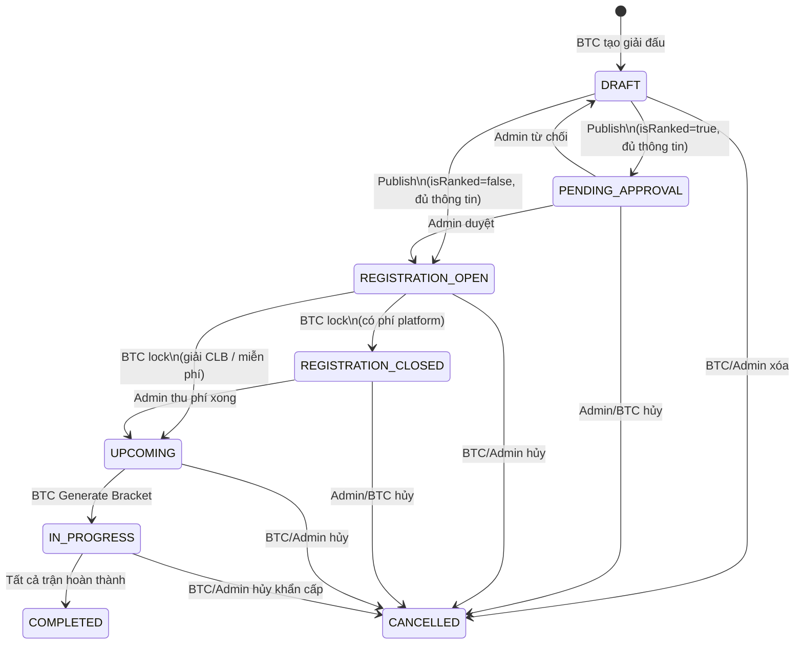

# 🏆 TOURNAMENT MODULE — Tổng quan Nghiệp vụ Giải đấu

> **Mục đích tài liệu:** Tổng hợp toàn diện nghiệp vụ, vòng đời, cấu trúc dữ liệu, và các ràng buộc kỹ thuật của module Giải đấu trong đồ án Quản lý Giải đấu Cầu lông / Pickleball.

---

## 1. Tổng quan hệ thống (System Overview)

### 1.1 Stack kỹ thuật

| Layer         | Công nghệ                                           |
| ------------- | --------------------------------------------------- |
| Frontend      | Next.js 14 (App Router) + TypeScript + Tailwind CSS |
| Backend       | NestJS + Drizzle ORM + PostgreSQL                   |
| Auth          | JWT (access token + refresh token)                  |
| File Upload   | Upload module riêng biệt                            |
| State quản lý | Zustand (frontend)                                  |

### 1.2 Các Actor trong hệ thống

| Actor                   | Quyền hạn                                          |
| ----------------------- | -------------------------------------------------- |
| **Admin (System)**      | Duyệt giải đấu, quản lý toàn bộ                    |
| **Organizer (BTC)**     | Tạo, quản lý, điều hành giải đấu của mình          |
| **Player (VĐV)**        | Đăng ký tham gia, xem kết quả, quản lý hồ sơ       |
| **Viewer (Khán giả)**   | Xem thông tin giải đấu, bracket, kết quả công khai |
| **Community Owner/Mod** | Tạo giải đấu nội bộ cộng đồng                      |

---

## 2. Vòng đời Giải đấu (Tournament Lifecycle)

### 2.1 Sơ đồ trạng thái đầy đủ



---

### 2.2 Chi tiết từng trạng thái & điều kiện chuyển tiếp

---

#### 🟡 `DRAFT` — Bản nháp

**Ý nghĩa:** Giải đấu vừa được tạo. Chưa công bố ra ngoài.

**Ai thấy:** Chỉ BTC (người tạo), Community Owner/Mod, Admin hệ thống.

**BTC có thể làm gì:**
- Cấu hình toàn bộ: tên, mô tả, format, matchType, entryFee, ELO limits, luật set...
- Upload banner/logo
- Thêm/xóa thông tin địa điểm, lịch trình
- Xóa giải đấu hoàn toàn

**Chuyển sang trạng thái tiếp theo — `POST /tournaments/:id/publish`:**

| Điều kiện | Kết quả |
|---|---|
| `entryFee` chưa được set (null) | ❌ Lỗi: `"Vui lòng cấu hình lệ phí tham gia trước khi công bố giải đấu."` |
| `isRanked = true` và đủ điều kiện | ✅ → chuyển sang **`PENDING_APPROVAL`** (chờ Admin duyệt) |
| `isRanked = false` và đủ điều kiện | ✅ → chuyển thẳng sang **`REGISTRATION_OPEN`** (không cần duyệt) |

> **Lưu ý Frontend:** Trước khi gọi API publish, frontend cần validate thêm:
> `locationAddress/venueId`, `registrationStartDate`, `registrationEndDate`, `format` — nếu thiếu thì hiển thị lỗi mà không gọi API.

---

#### 🔵 `PENDING_APPROVAL` — Chờ Admin duyệt

**Ý nghĩa:** BTC đã gửi yêu cầu công bố giải đấu có tính ELO ranking. Đang chờ Admin hệ thống xem xét.

**Ai thấy:** BTC + Admin. Chưa hiển thị công khai cho người chơi.

**BTC có thể làm gì:**
- Xem trạng thái chờ duyệt
- Hủy yêu cầu (quay về DRAFT)

**Admin có thể làm gì:**
- Duyệt → `REGISTRATION_OPEN`
- Từ chối (kèm lý do) → `DRAFT`

---

#### 🟢 `REGISTRATION_OPEN` — Đang mở đăng ký

**Ý nghĩa:** Giải đấu công khai. Cổng đăng ký mở. VĐV có thể nộp đơn.

**Ai thấy:** Toàn bộ người dùng (nếu `visibility = PUBLIC`). Riêng tư chỉ qua link mời.

**VĐV có thể làm gì:**
- Đăng ký tham gia (nếu đủ điều kiện ELO, còn slot, chưa quá hạn, cổng không bị khóa)

**BTC có thể làm gì:**
- Duyệt / Từ chối đơn đăng ký
- Toggle `isRegistrationLocked` (khóa/mở cổng thủ công)
- Thêm VĐV reserve slot (suất giữ chỗ)
- Xóa VĐV vi phạm (kick)
- Chỉnh sửa thông tin linh hoạt (không phải core field)

**Điều kiện đăng ký thất bại:**
- `isRegistrationLocked = true` → "Đăng ký đã bị khóa"
- `new Date() > registrationEndDate` → "Hạn đăng ký đã kết thúc"
- `participants.length >= maxParticipants` → "Hết slot"
- ELO không thỏa giới hạn (nếu `isRanked = true` và ELO limit > 0)

**Chuyển sang trạng thái tiếp theo — `POST /tournaments/:id/lock`:**

| Điều kiện | Kết quả |
|---|---|
| Số VĐV đã duyệt < 2 | ❌ Lỗi: `"Need at least 2 participants to lock"` |
| `tournamentType = 'CLUB'` **hoặc** `platformFeePerPlayer = 0` | ✅ → **`UPCOMING`** (bỏ qua bước thu phí) + tự động Generate Bracket |
| Có phí nền tảng (platformFeePerPlayer > 0) | ✅ → **`REGISTRATION_CLOSED`** (chờ thu phí xong) |

---

#### 🟠 `REGISTRATION_CLOSED` — Chờ thanh toán phí nền tảng

**Ý nghĩa:** BTC đã chốt danh sách. Hệ thống đang xử lý thu phí nền tảng từ BTC.

**Ai thấy:** BTC + Admin. Cổng đăng ký đã đóng với VĐV.

**Khi nào kết thúc:** Admin xác nhận đã thu đủ phí → `UPCOMING`

> ⚠️ Đây là bước **trung gian tự động** — thực tế với giải CLB hoặc miễn phí thì bỏ qua bước này.

---

#### 🔵 `UPCOMING` — Đã chốt, chờ khai mạc

**Ý nghĩa:** Danh sách đã chốt. Bracket nháp đã được sinh. Chờ BTC khai mạc chính thức.

**BTC có thể làm gì:**
- Xem Bracket nháp
- Điều chỉnh hạt giống (seed) VĐV
- Reset Bracket và sinh lại *(CHỈ được làm ở giai đoạn này, trước khi Khai mạc)*
- Cấu hình sân bãi, lịch trình từng trận
- Luật set đấu từng vòng

**Chuyển sang `IN_PROGRESS` — `POST /tournaments/:id/generate-bracket` (hoặc xác nhận khai mạc):**
- Bracket được "chốt" vĩnh viễn
- Cấu hình cốt lõi bị khóa hoàn toàn
- Giải đấu hiển thị công khai bracket cho khán giả

---

#### 🔴 `IN_PROGRESS` — Đang thi đấu

**Ý nghĩa:** Giải đấu đang diễn ra. Trọng tài nhập điểm, Bracket được cập nhật theo thời gian thực.

**BTC/Trọng tài có thể làm gì:**
- Nhập/sửa điểm từng trận (từng set)
- Xếp sân & giờ cho từng trận
- Phân công trọng tài
- Kick VĐV vi phạm (đội đối thủ được xử thắng tự động)
- Thay đổi nhẹ thông tin: banner, logo, thông báo

**KHÔNG thể làm:**
- Sửa format, matchType, entryFee, ELO limits
- Reset toàn bộ Bracket
- Thêm VĐV mới vào danh sách thi đấu

**Tự động chuyển sang `COMPLETED`:** Khi tất cả trận trong Bracket có trạng thái `COMPLETED`.

---

#### ✅ `COMPLETED` — Kết thúc

**Ý nghĩa:** Giải đấu hoàn thành. Kết quả chính thức.

**Có thể làm:**
- Xem toàn bộ kết quả, bracket, lịch sử điểm
- Yêu cầu Payout (BTC nhận tiền lệ phí)
- Nếu `isRanked = true` → hệ thống tính toán cập nhật ELO VĐV

---

#### ❌ `CANCELLED` — Đã hủy

**Ý nghĩa:** Giải đấu bị hủy. Toàn bộ lệ phí đã thu được hoàn trả tự động.

**Điều kiện:** Có thể hủy từ bất kỳ trạng thái nào TRỪ `COMPLETED` và `CANCELLED`.

---

### 2.3 Bảng tổng hợp — Ai làm được gì ở từng trạng thái

| Hành động | DRAFT | REG_OPEN | UPCOMING | IN_PROGRESS | COMPLETED |
|---|:---:|:---:|:---:|:---:|:---:|
| Sửa tên/mô tả | ✅ | ✅ | ✅ | ✅ (nhẹ) | ❌ |
| Sửa format/matchType | ✅ | ❌ | ❌ | ❌ | ❌ |
| Sửa entryFee/ELO | ✅ | ❌ | ❌ | ❌ | ❌ |
| Xem/Reset Bracket | ✅ (nháp) | ✅ (nháp) | ✅ (reset ok) | ❌ | ❌ |
| Duyệt VĐV | ❌ | ✅ | ❌ | ❌ | ❌ |
| Kick VĐV | ❌ | ✅ | ✅ | ✅ | ❌ |
| Xếp sân/giờ trận | ❌ | ❌ | ✅ | ✅ | ❌ |
| Nhập điểm trận | ❌ | ❌ | ❌ | ✅ | ❌ |
| Hủy giải đấu | ✅ | ✅ | ✅ | ✅ | ❌ |

---

## 3. Luồng nghiệp vụ chính (Key Business Flows)

### 3.1 Luồng Publish Giải đấu

**Điều kiện bắt buộc (tiền điều kiện cho Publish):**

- ✅ Lệ phí thi đấu (`entryFee`) đã được điền
- ✅ Địa điểm / Sân thi đấu (`locationAddress` hoặc `venueId`) đã được thiết lập
- ✅ Thời gian mở đăng ký (`registrationStartDate`) đã được đặt
- ✅ Thời gian đóng đăng ký (`registrationEndDate`) đã được đặt
- ✅ Hình thức thi đấu (`format`) đã được chọn

**Sau khi Publish — các trường bị KHÓA CỨNG (không thể sửa):**

- ❌ Hình thức thi đấu (format / bracketType)
- ❌ Loại trận đấu (matchType: SINGLES / DOUBLES / MIXED)
- ❌ Giới hạn ELO (`minElo`, `maxElo`, `maxCombinedElo`, `maxTeammateGap`) — **Nếu để `0` = không áp dụng giới hạn đó**
- ❌ Lệ phí tham gia (entryFee)

**Sau khi Publish — các trường VẪN có thể chỉnh sửa:**

- ✅ Tên giải đấu (chỉ sửa lỗi nhỏ)
- ✅ Mô tả, Banner, Logo
- ✅ Thời gian khai mạc / bế mạc
- ✅ Thời gian đăng ký (lùi hạn hoặc đóng sớm)
- ✅ Địa điểm thi đấu từng vòng
- ✅ Thông tin liên hệ, Giải thưởng

### 3.2 Luồng Đăng ký VĐV

```
VĐV tìm giải đấu → Nhập thông tin + Lệ phí → Backend kiểm tra:
  - status === 'REGISTRATION_OPEN'
  - isRegistrationLocked === false
  - Chưa hết registrationEndDate
  - Chưa đủ maxParticipants
  - ELO thỏa mãn giới hạn (nếu isRanked)
→ Thanh toán (nếu entryFee > 0)
→ Xác nhận đăng ký
```

### 3.3 Luồng Sinh Sơ đồ Thi đấu (Generate Bracket)

```
BTC chốt danh sách (status → UPCOMING)
→ Xem Bracket nháp (Preview seedings)
→ Điều chỉnh hạt giống nếu cần
→ Bấm "Khai mạc & Bắt đầu thi đấu"
→ Hệ thống Generate Bracket chính thức (CHỈ 1 LẦN)
→ status → IN_PROGRESS
→ Bracket bị khóa cứng hoàn toàn
```

**⚠️ Ràng buộc Generate Bracket:**

- Chỉ được Generate **1 lần duy nhất**
- Nút Generate biến mất vĩnh viễn sau lần đầu
- BYE được điền tự động cho bracket size = `2^n`

---

## 4. Cấu trúc Dữ liệu Cốt lõi (Core Data Model)

### 4.1 Bảng `tournaments`

| Field                   | Kiểu      | Mô tả                                                                      |
| ----------------------- | --------- | -------------------------------------------------------------------------- |
| `id`                    | uuid      | Primary key                                                                |
| `name`                  | varchar   | Tên giải đấu                                                               |
| `description`           | text      | Mô tả                                                                      |
| `status`                | enum      | DRAFT / REGISTRATION_OPEN / UPCOMING / IN_PROGRESS / COMPLETED / CANCELLED |
| `format`                | enum      | SINGLE_ELIMINATION / DOUBLE_ELIMINATION / ROUND_ROBIN                      |
| `matchType`             | enum      | SINGLES / DOUBLES / MIXED_DOUBLES                                          |
| `genderRestriction`     | enum      | MALE / FEMALE / MIXED                                                      |
| `visibility`            | enum      | PUBLIC / PRIVATE                                                           |
| `tournamentType`        | enum      | CLUB / PUBLIC                                                              |
| `entryFee`              | decimal   | Lệ phí (đồng VND)                                                          |
| `maxParticipants`       | int       | Số đội/VĐV tối đa                                                          |
| `isRanked`              | boolean   | Có tính ELO không                                                          |
| `isRegistrationLocked`  | boolean   | Cổng đăng ký bị khóa thủ công                                              |
| `registrationStartDate` | timestamp | Mở đăng ký                                                                 |
| `registrationEndDate`   | timestamp | Đóng đăng ký                                                               |
| `startDate`             | timestamp | Khai mạc                                                                   |
| `endDate`               | timestamp | Bế mạc                                                                     |
| `locationAddress`       | varchar   | Địa chỉ thi đấu                                                            |
| `venueId`               | uuid FK   | Sân thi đấu (liên kết bảng venues)                                         |
| `categoryId`            | uuid FK   | Bộ môn thi đấu                                                             |
| `organizerId`           | uuid FK   | BTC tạo giải đấu                                                           |
| `communityId`           | uuid FK   | Cộng đồng sở hữu (nếu là giải CLB)                                         |
| `parentId`              | uuid FK   | Giải đấu cha (nếu là nội dung/hình thức con)                               |
| `inviteCode`            | varchar   | Mã mời riêng tư                                                            |
| `tournamentConfig`      | jsonb     | Cấu hình ELO, bracketType, seedingMethod...                                |
| `sportRules`            | jsonb     | Luật set đấu mặc định                                                      |

### 4.2 Bảng `tournament_participants`

| Field            | Kiểu      | Mô tả                          |
| ---------------- | --------- | ------------------------------ |
| `id`             | uuid      | Primary key                    |
| `tournamentId`   | uuid FK   | Giải đấu                       |
| `registeredById` | uuid FK   | Người đại diện đăng ký         |
| `teamName`       | varchar   | Tên đội / tên VĐV              |
| `seed`           | int       | Hạt giống (null = chưa seeded) |
| `isPaid`         | boolean   | Đã thanh toán lệ phí chưa      |
| `teamStatus`     | enum      | PENDING / COMPLETE / WITHDRAWN |
| `registeredAt`   | timestamp | Thời điểm đăng ký              |

### 4.3 Bảng `bracket_stages`

| Field          | Kiểu    | Mô tả                                                        |
| -------------- | ------- | ------------------------------------------------------------ |
| `id`           | uuid    | Primary key                                                  |
| `tournamentId` | uuid FK | Giải đấu                                                     |
| `name`         | varchar | Tên vòng (VD: "Vòng chính")                                  |
| `type`         | enum    | SINGLE_ELIMINATION / DOUBLE_ELIMINATION / ROUND_ROBIN        |
| `order`        | int     | Thứ tự giai đoạn                                             |
| `roundConfig`  | jsonb   | Cấu hình luật trận: sets_to_win, max_sets, points_per_set... |

### 4.4 Bảng `bracket_groups`

Nhóm nhánh trong một stage (Winners Bracket, Losers Bracket trong Double Elimination).

### 4.5 Bảng `matches`

| Field              | Kiểu      | Mô tả                                    |
| ------------------ | --------- | ---------------------------------------- |
| `id`               | uuid      | Primary key                              |
| `groupId`          | uuid FK   | Nhóm nhánh                               |
| `participant1Id`   | uuid FK   | Đội/VĐV bên trái                         |
| `participant2Id`   | uuid FK   | Đội/VĐV bên phải                         |
| `roundNumber`      | int       | Số vòng đấu                              |
| `matchOrder`       | int       | Số thứ tự trận trong vòng                |
| `bracketBranch`    | varchar   | WINNERS / LOSERS / FINAL                 |
| `status`           | enum      | PENDING / ONGOING / COMPLETED            |
| `isBye`            | boolean   | Trận BYE (miễn đấu)                      |
| `winnerId`         | uuid FK   | Đội/VĐV thắng                            |
| `p1SetsWon`        | int       | Số set thắng của P1                      |
| `p2SetsWon`        | int       | Số set thắng của P2                      |
| `scoreDetails`     | jsonb     | Chi tiết điểm từng set                   |
| `nextMatchId`      | uuid FK   | Trận tiếp theo (nhánh thắng)             |
| `loserNextMatchId` | uuid FK   | Trận tiếp theo (nhánh thua, Double Elim) |
| `courtName`        | varchar   | Sân thi đấu                              |
| `scheduledAt`      | timestamp | Giờ dự kiến                              |
| `completedAt`      | timestamp | Giờ kết thúc thực tế                     |

---

## 5. Thanh tiến trình trực quan (Visual Stepper)

Trên trang Dashboard quản lý giải đấu của BTC (`/organizer/tournaments/[id]/manage`), hiển thị thanh tiến trình:

```
[DRAFT]  →  [1. Nhận Đăng ký]  →  [2. Sơ đồ & Lịch đấu]  →  [3. Đang Thi đấu]  →  [4. Kết thúc]
```

| Bước   | Trạng thái tournament | Nút chuyển tiếp  | Điều kiện              |
| ------ | --------------------- | ---------------- | ---------------------- |
| DRAFT  | `DRAFT`               | Công bố giải đấu | Đủ thông tin cơ bản    |
| Bước 1 | `REGISTRATION_OPEN`   | Chốt đăng ký     | —                      |
| Bước 2 | `UPCOMING`            | Khai mạc         | Phải có Bracket        |
| Bước 3 | `IN_PROGRESS`         | Kết thúc         | Tất cả trận hoàn thành |
| Bước 4 | `COMPLETED`           | —                | —                      |

---

## 6. Kiến trúc Backend (NestJS Module)

### 6.1 Các module liên quan

| Module          | Vai trò                                                 |
| --------------- | ------------------------------------------------------- |
| `tournaments`   | CRUD giải đấu, Publish, Lock, Generate Bracket, Đăng ký |
| `matches`       | Cập nhật tỷ số, Schedule, Phân công trọng tài           |
| `payments`      | Xử lý lệ phí, hoàn tiền                                 |
| `rankings`      | Cập nhật ELO sau giải đấu                               |
| `notifications` | Gửi thông báo cho VĐV                                   |
| `communities`   | Giải đấu nội bộ CLB                                     |
| `venues`        | Quản lý sân bãi                                         |
| `categories`    | Bộ môn thi đấu                                          |

### 6.2 API Endpoints chính

| Method | Endpoint                            | Mô tả                      |
| ------ | ----------------------------------- | -------------------------- |
| POST   | `/tournaments`                      | Tạo giải đấu mới           |
| GET    | `/tournaments/public`               | Danh sách giải công khai   |
| GET    | `/tournaments/my`                   | Giải đấu của tôi (BTC)     |
| GET    | `/tournaments/:id`                  | Chi tiết giải đấu          |
| PATCH  | `/tournaments/:id`                  | Cập nhật thông tin         |
| DELETE | `/tournaments/:id`                  | Xóa giải đấu (chỉ DRAFT)   |
| POST   | `/tournaments/:id/publish`          | Công bố giải đấu           |
| POST   | `/tournaments/:id/lock`             | Chốt danh sách đăng ký     |
| POST   | `/tournaments/:id/register`         | VĐV đăng ký tham gia       |
| POST   | `/tournaments/:id/generate-bracket` | Sinh sơ đồ thi đấu         |
| GET    | `/tournaments/:id/bracket`          | Xem sơ đồ thi đấu          |
| GET    | `/tournaments/:id/participants`     | Danh sách VĐV đã đăng ký   |
| PATCH  | `/matches/:id/schedule`             | Xếp sân & giờ cho trận đấu |

### 6.3 Thuật toán Generate Bracket

**Single Elimination:**

1. Tính bracket size = `2^ceil(log2(n))` (n = số VĐV/đội)
2. Seed VĐV vào vị trí theo ELO hoặc random
3. Điền BYE cho các vị trí thừa
4. Sinh matches theo vòng, link `nextMatchId` giữa các vòng

**Double Elimination:**

1. Sinh Winners Bracket như Single Elimination
2. Sinh Losers Bracket: nhận đội thua từ mỗi vòng của Winners
3. Grand Final: Winner của Winners Bracket vs Winner của Losers Bracket

**Round Robin:**

1. Sử dụng thuật toán "Circle Method"
2. Cố định team[0], rotate các team còn lại
3. Mỗi vòng có `n/2` trận, tổng `n-1` vòng

---

## 7. Ràng buộc Kinh doanh quan trọng (Business Rules)

### 7.1 Khóa cứng sau Publish

```typescript
// Backend: tournaments.service.ts - update()
const CORE_LOCKED_FIELDS = [
  "format",
  "matchType",
  "entryFee",
  "tournamentConfig.minElo",
  "tournamentConfig.maxElo",
  "tournamentConfig.maxCombinedElo",
  "tournamentConfig.maxTeammateGap",
];

if (tournament.status !== "DRAFT") {
  // Throw BadRequestException nếu cố sửa trường cốt lõi
}
```

### 7.2 Kiểm tra ELO khi đăng ký

```typescript
// Nếu isRanked === true:
// - Kiểm tra ELO từng người trong đội thỏa [minElo, maxElo]   → nếu minElo=0 thì bỏ qua check min; nếu maxElo=0 thì bỏ qua check max
// - Kiểm tra ELO tổng cộng <= maxCombinedElo                  → nếu maxCombinedElo=0 thì bỏ qua
// - Kiểm tra chênh lệch ELO giữa 2 đồng đội <= maxTeammateGap → nếu maxTeammateGap=0 thì bỏ qua
// Quy tắc: Giá trị 0 = "không áp dụng giới hạn đó"
```

### 7.3 Khóa đăng ký thủ công

```typescript
// Cờ isRegistrationLocked trong DB
// API /register và /join-team kiểm tra cờ này
if (existing.isRegistrationLocked) {
  throw new BadRequestException(
    "Đăng ký giải đấu đã tạm thời bị khóa bởi Ban tổ chức",
  );
}
```

### 7.4 Hết hạn đăng ký tự động

```typescript
if (
  existing.registrationEndDate &&
  new Date() > new Date(existing.registrationEndDate)
) {
  throw new BadRequestException("Hạn đăng ký giải đấu đã kết thúc");
}
```

---

## 8. Cấu trúc Frontend (Next.js Pages)

### 8.1 Các trang chính

| Route                                | Mô tả                             |
| ------------------------------------ | --------------------------------- |
| `/tournaments`                       | Trang khám phá giải đấu công khai |
| `/tournaments/[id]`                  | Trang chi tiết giải đấu (public)  |
| `/tournaments/[id]/register`         | Trang đăng ký tham gia            |
| `/organizer/tournaments`             | Danh sách giải đấu của BTC        |
| `/organizer/tournaments/create`      | Tạo giải đấu mới                  |
| `/organizer/tournaments/[id]/manage` | Dashboard quản lý giải đấu        |

### 8.2 Các tab trong trang Manage

| Tab            | Chức năng                                                   |
| -------------- | ----------------------------------------------------------- |
| `basic`        | Thông tin cơ bản (tên, mô tả, hình ảnh, hình thức, liên hệ) |
| `schedule`     | Lịch thi đấu & Địa điểm                                     |
| `config`       | Cấu hình thi đấu (ELO, lệ phí, luật set đấu)                |
| `registration` | Quản lý đăng ký VĐV (duyệt, từ chối, khóa cổng)             |
| `bracket`      | Xem & quản lý sơ đồ thi đấu                                 |
| `finance`      | Tài chính & Payout                                          |

---

## 9. Luồng Đăng ký Chi tiết theo Hình thức Thi đấu

> [!IMPORTANT]
> Sau khi giải đấu được Publish và chuyển sang `REGISTRATION_OPEN`, link đăng ký được mở ra cho VĐV. Form đăng ký thay đổi hoàn toàn tùy theo `matchType`.

### 9.1 Form đăng ký theo từng hình thức

#### 🎾 Đơn (SINGLES)
```
Form đăng ký:
  - [Tự động] Lấy profile của người đang đăng nhập (tên, ELO, avatar)
  - Không cần nhập thêm thông tin đồng đội
  - [Bắt buộc] Đồng ý điều khoản + xác nhận đóng lệ phí
  - Thanh toán: 1 × entryFee
```

#### 🎾🎾 Đôi (DOUBLES / MIXED_DOUBLES)
```
Form đăng ký:
  - [Tự động] Lấy profile người đăng nhập (người chơi 1)
  - [Bắt buộc] Nhập Gmail hoặc Số điện thoại đã đăng ký của người chơi 2
    → Backend tìm user theo email/phone
    → Nếu không tìm thấy: "Không tìm thấy tài khoản với thông tin này"
    → Nếu tìm thấy: hiển thị tên + avatar để xác nhận
  - Đặt tên đội (teamName) — tùy chọn, mặc định = "Tên P1 & Tên P2"
  - [Bắt buộc] Đồng ý + xác nhận đóng lệ phí
  - Thanh toán: 2 × entryFee (cả 2 người gộp chung 1 lần thanh toán)
```

#### 🃏 Wildcard / Suất Giữ chỗ (chỉ BTC thao tác)
```
BTC nhập từ trang Manage → Tab Registration → "Thêm suất giữ chỗ":
  - Nhập Gmail hoặc SĐT người chơi 1 → tìm user
  - Nếu đấu Đôi: nhập thêm Gmail/SĐT người chơi 2 → tìm user
  - Đặt tên đội
  - Lệ phí: BTC tự thu trực tiếp (ngoài hệ thống) hoặc hệ thống xuất link thanh toán
```

### 9.2 Ràng buộc thanh toán lệ phí

| Hình thức | Lệ phí |
|---|---|
| Đơn | `1 × entryFee` |
| Đôi / Hỗn hợp | `2 × entryFee` (tính cho cả đội, người đại diện thanh toán 1 lần) |

> **Quan trọng:** VĐV **phải thanh toán lệ phí ngay khi đăng ký** — không cho đăng ký trước, thanh toán sau. Chỉ sau khi thanh toán thành công thì đơn đăng ký mới được tạo với `isPaid = true`. Nếu thanh toán thất bại → đơn không được tạo.

### 9.3 Điều kiện đăng ký bị từ chối (Backend check)

```typescript
// Theo thứ tự kiểm tra:
1. tournament.status !== 'REGISTRATION_OPEN'     → "Giải đấu không trong giai đoạn nhận đăng ký"
2. tournament.isRegistrationLocked === true       → "Đăng ký đã bị khóa bởi Ban tổ chức"
3. new Date() > tournament.registrationEndDate   → "Hạn đăng ký giải đấu đã kết thúc"
4. participants.length >= tournament.maxParticipants → "Đã hết suất đăng ký"
5. isRanked && minElo > 0 && player.elo < minElo → "ELO không đủ điều kiện tham gia"
6. isRanked && maxElo > 0 && player.elo > maxElo → "ELO vượt quá giới hạn của giải"
7. (Đôi) isRanked && maxCombinedElo > 0 && (p1.elo + p2.elo) > maxCombinedElo → "Tổng ELO đội vượt giới hạn"
8. (Đôi) isRanked && maxTeammateGap > 0 && |p1.elo - p2.elo| > maxTeammateGap → "Chênh lệch ELO giữa 2 đồng đội quá lớn"
```

---

## 10. Cơ chế Tự động Khóa & Mở Link Đăng ký

### 10.1 Tự động khoá khi hết hạn

- **Cơ chế:** `registrationEndDate` được lưu vào DB. Mỗi request đăng ký đều kiểm tra `new Date() > registrationEndDate`.
- **Frontend:** Khi hết hạn, nút "Đăng ký tham gia" chuyển thành disabled với label `"Hết hạn đăng ký"`.
- **Không cần cron job** — kiểm tra real-time mỗi lần có request.

### 10.2 Tự động mở link khi tới ngày

- **Cơ chế:** `registrationStartDate` được lưu vào DB. Trước ngày này, nút đăng ký hiển thị countdown `"Mở đăng ký sau X ngày"`, không cho bấm.
- **Backend:** API đăng ký cũng kiểm tra `new Date() < registrationStartDate` → từ chối.

### 10.3 Khóa/Mở thủ công bởi BTC

- Toggle `isRegistrationLocked` trong Tab Registration của trang Manage
- BẬT `isRegistrationLocked = true` → khóa ngay lập tức, không cần chờ hết hạn
- TẮT `isRegistrationLocked = false` → mở lại tức thì
- **Có thể bật tắt bất cứ lúc nào** miễn là giải đang ở `REGISTRATION_OPEN`

### 10.4 BTC có quyền Not-Approve hoặc Kick VĐV

| Thao tác | Khi nào | Kết quả |
|---|---|---|
| **Từ chối đơn** (teamStatus → REJECTED) | Khi `status = PENDING`, giải đang `REGISTRATION_OPEN` | VĐV bị loại, slot được trả lại, **hoàn tiền** |
| **Kick VĐV** đã duyệt | Bất kỳ giai đoạn nào trước `COMPLETED` | VĐV bị loại khỏi giải, **hoàn tiền** |
| **Kick khi IN_PROGRESS** | Giải đang thi đấu | Đội đối thủ được xử thắng WO (Walkover) |

---

## 11. Ràng buộc Ngày tháng Bắt buộc (Date Constraints)

### 11.1 Trước khi Publish — bắt buộc phải có

> [!IMPORTANT]
> Những trường sau **BẮT BUỘC phải được điền trước khi nhấn Publish**. Frontend validate và không gọi API nếu thiếu.

| Trường | Bắt buộc | Lý do |
|---|:---:|---|
| `entryFee` | ✅ | Backend check — thiếu sẽ lỗi 400 |
| `registrationStartDate` | ✅ | Để hệ thống biết khi nào mở cổng |
| `registrationEndDate` | ✅ | Để hệ thống biết khi nào đóng cổng |
| `startDate` (ngày khai mạc) | ✅ | Bắt buộc phải có ngày khai mạc |
| `endDate` (ngày bế mạc) | ✅ | Bắt buộc phải có ngày kết thúc |
| `format` (hình thức bracket) | ✅ | Cần để sinh sơ đồ sau này |
| `locationAddress` hoặc `venueId` | ✅ | VĐV cần biết thi đấu ở đâu |

### 11.2 Thứ tự logic thời gian phải thỏa mãn

```
registrationStartDate  <  registrationEndDate  ≤  startDate  <  endDate
```

Ví dụ hợp lệ:
```
Mở đăng ký: 01/07/2025
Đóng đăng ký: 20/07/2025
Khai mạc: 25/07/2025
Bế mạc: 27/07/2025
```

### 11.3 Sau khi Publish — vẫn được sửa ngày

> Ngày khai mạc và bế mạc **vẫn có thể chỉnh sửa sau khi Publish** — vì thực tế hay có trường hợp dời lịch. Chỉ cần đảm bảo thứ tự logic vẫn đúng.

| Trường | Sau Publish | Sau Lock (UPCOMING) | Sau IN_PROGRESS |
|---|:---:|:---:|:---:|
| `registrationStartDate` | ✅ sửa được | ❌ | ❌ |
| `registrationEndDate` | ✅ sửa được | ❌ | ❌ |
| `startDate` | ✅ sửa được | ✅ (dời lịch) | ✅ (dời lịch) |
| `endDate` | ✅ sửa được | ✅ (dời lịch) | ✅ (dời lịch) |

---

## 12. Hủy Giải & Hoàn Tiền khi Không đủ Người

### 12.1 Khi nào cần hủy giải vì thiếu người

Sau khi hết hạn đăng ký, nếu số VĐV/đội quá ít để tổ chức thi đấu:

| Hình thức | Số tối thiểu để tiến hành | Hành động nếu không đủ |
|---|:---:|---|
| Đơn | **4 VĐV** | BTC nên hủy → hoàn tiền 100% |
| Đôi / Hỗn hợp | **4 đội** (8 người) | BTC nên hủy → hoàn tiền 100% |
| Round Robin | **4 VĐV/đội** | BTC nên hủy → hoàn tiền 100% |

> Backend hiện enforce tối thiểu **2** để Lock. Nhưng nghiệp vụ thực tế cần ít nhất **4** để có ý nghĩa thi đấu.

### 12.2 Quy trình hủy giải và hoàn tiền

```
BTC → Tab Finance hoặc nút "Hủy giải đấu"
  → Xác nhận hủy (kèm lý do)
  → Backend: tournament.status → CANCELLED
  → Hệ thống tự động hoàn tiền 100% lệ phí cho tất cả VĐV đã thanh toán
  → Thông báo push đến tất cả VĐV đã đăng ký
  → Giải đấu vẫn hiển thị trên hệ thống với badge "Đã hủy"
```

### 12.3 Chính sách hoàn tiền

| Thời điểm hủy | Hoàn tiền VĐV | Phí nền tảng |
|---|---|---|
| Trước `REGISTRATION_OPEN` (DRAFT) | Không cần (chưa ai đăng ký) | Không thu |
| Trong `REGISTRATION_OPEN` | 100% lệ phí đã thu | Không thu |
| Sau `UPCOMING` (đã chốt) | 100% lệ phí đã thu | Không thu |
| Sau `IN_PROGRESS` (đang thi đấu) | 100% hoàn tiền, kèm thông báo khẩn | Platform xem xét case-by-case |

---

## 13. Cấu hình Hình thức Thi đấu sau khi Chốt Bracket

### 13.1 Sau khi Generate Bracket — Điền luật cho từng vòng

Khi BTC bấm "Chốt & Khai mạc" (generate bracket chính thức), hệ thống sinh ra các `tournament_stages`. BTC **bắt buộc phải điền thông tin** cho từng vòng trước khi trận đấu bắt đầu:

```
tournament_stages:
  ├── Stage 1: "Vòng loại" (type: ROUND_ROBIN)
  │     roundConfig:
  │       setsToWin: 2          ← thắng 2 set mới thắng trận
  │       maxSets: 3            ← tối đa 3 set
  │       pointsPerSet: 21      ← chạm 21 điểm thắng set
  │       winByTwo: true        ← phải hơn 2 điểm (deuce)
  │       tiebreakAt: 20        ← deuce bắt đầu từ 20-20
  │       maxTiebreakerPoints: 30 ← trần deuce tại 30-30 (ai dẫn thắng)
  │
  ├── Stage 2: "Tứ kết" (type: SINGLE_ELIMINATION)
  │     roundConfig: { setsToWin: 2, maxSets: 3, pointsPerSet: 21, winByTwo: true }
  │
  ├── Stage 3: "Bán kết" (type: SINGLE_ELIMINATION)
  │     roundConfig: { setsToWin: 2, maxSets: 3, pointsPerSet: 21, winByTwo: true }
  │
  └── Stage 4: "Chung kết" (type: SINGLE_ELIMINATION)
        roundConfig:
          setsToWin: 3          ← chung kết thắng 3 set (best of 5)
          maxSets: 5
          pointsPerSet: 21
          winByTwo: true
```

### 13.2 Giải thích các trường `roundConfig`

| Trường | Kiểu | Mô tả |
|---|---|---|
| `setsToWin` | int | Số set cần thắng để thắng trận (ví dụ: 2 trong best-of-3) |
| `maxSets` | int | Tổng số set tối đa (best-of-3 = 3, best-of-5 = 5) |
| `pointsPerSet` | int | Số điểm cần đạt để thắng 1 set (thường 21) |
| `winByTwo` | bool | Có cần hơn 2 điểm khi deuce không (true = cần, false = chạm đúng số là thắng) |
| `tiebreakAt` | int | Điểm bắt đầu deuce (thường 20, nghĩa là 20-20 mới bắt đầu deuce) |
| `maxTiebreakerPoints` | int | Trần deuce — ai đạt số này thắng luôn dù không hơn 2 điểm (thường 30) |

### 13.3 Ví dụ thực tế — Giải Pickleball Doubles

```
Vòng loại bảng (Round Robin):
  best-of-3: thắng 2 set / chạm 11 / win-by-2 / deuce từ 10-10 / trần 15

Vòng loại (Elimination rounds):
  best-of-3: thắng 2 set / chạm 11 / win-by-2 / deuce từ 10-10 / trần 15

Bán kết & Chung kết:
  best-of-5: thắng 3 set / chạm 11 / win-by-2 / deuce từ 10-10 / trần 15
```

### 13.4 UI Điền luật từng vòng

Nằm trong Tab **Lịch trình** (`activeTab === 'schedule'`) → Bảng "Chi tiết lịch & địa điểm từng vòng đấu":

```
┌─────────────┬─────────────┬───────────────────────────────┬──────────────┐
│ Vòng đấu    │ Ngày dự kiến│ Luật set đấu                  │ Hành động    │
├─────────────┼─────────────┼───────────────────────────────┼──────────────┤
│ Vòng loại   │ 25/07/2025  │ Best-of-3 / 21pts / Deuce@20  │ [Sửa đổi]   │
│ Tứ kết      │ 26/07/2025  │ Best-of-3 / 21pts / Deuce@20  │ [Sửa đổi]   │
│ Bán kết     │ 26/07/2025  │ Best-of-3 / 21pts / Deuce@20  │ [Sửa đổi]   │
│ Chung kết   │ 27/07/2025  │ Best-of-5 / 21pts / Deuce@20  │ [Sửa đổi]   │
└─────────────┴─────────────┴───────────────────────────────┴──────────────┘
```

---

## 14. Các vấn đề đang cần hoàn thiện (Open Issues)

> [!WARNING]
> Các hạng mục dưới đây chưa hoàn chỉnh hoặc cần rà soát kỹ trước khi demo/chấm điểm.

1. **Bracket UI:** Tab Bracket trong trang Manage đang render theo cột (round-based), nhưng thiếu đường kết nối trực quan giữa các trận. Cần dùng SVG line hoặc thư viện bracket.
2. **Double Elimination:** Generator đã sinh 2 nhánh (Winners + Losers), nhưng logic ghép Grand Final chưa được kiểm tra đủ edge case.
3. **Khóa trường cốt lõi ở Frontend:** `isAllConfigLocked` đã có nhưng cần kiểm tra kỹ tất cả input field trong tab `config`.
4. **Round Robin Standings:** Bảng xếp hạng vòng tròn tính điểm chỉ hiển thị trên public page, cần thêm vào trang Manage.
5. **Tự động chuyển trạng thái COMPLETED:** Chưa có logic tự động set `COMPLETED` khi tất cả match kết thúc — hiện tại BTC phải bấm thủ công.
6. **Payout BTC:** Module finance đã có skeleton nhưng chưa tích hợp cổng thanh toán thực.
7. **ELO Update sau giải:** Rankings module tồn tại nhưng chưa trigger sau khi giải COMPLETED.
8. **Hoàn tiền tự động khi Kick/Từ chối:** Backend kick có nhưng chưa trigger hoàn tiền tự động — cần tích hợp payments module.
9. **Form đăng ký Đôi:** Chưa implement trường tìm đồng đội qua email/SĐT — hiện tại form chỉ nhập tên đội thủ công.
10. **Validate ngày trước Publish:** Frontend chưa validate đầy đủ 5 trường bắt buộc trước khi gọi API publish.

---

## 15. Ghi chú cho AI khi làm việc với module này

> [!IMPORTANT]
> Khi implement tính năng mới liên quan đến Tournament, cần đọc kỹ:
>
> - `TOURNAMENT_PUBLISH_LOCKING_PLAN.md` — Quy tắc khóa/mở khóa trường.
> - File `tournaments.service.ts` — Logic nghiệp vụ backend.
> - File `tournaments.repository.ts` — Query database.
> - File `manage/page.tsx` — UI quản lý (rất dài ~2900 dòng, chia thành nhiều tab).

**Các biến trạng thái quan trọng trong `manage/page.tsx`:**

- `tournament` — Dữ liệu giải đấu (luôn fresh sau mỗi `fetchTournamentData()`)
- `bracket` — Sơ đồ thi đấu (`{ stages: BracketStage[] }`)
- `participants` — Danh sách VĐV
- `isAllConfigLocked` — `true` khi status là `IN_PROGRESS` hoặc `COMPLETED`
---

## 16. Hệ thống Thông báo (Notification System)

### 16.1 Hiện trạng

| Thành phần | Trạng thái |
|---|---|
| **Backend schema** (`notifications` table) | ✅ Đã có — lưu DB |
| **NotificationsRepository** | ✅ Đã có — CRUD cơ bản |
| **NotificationsService** | ✅ Đã có — `sendNotification`, `getMyNotifications`, `markAsRead` |
| **NotificationsGateway** (Socket.IO `/notifications`) | ✅ Đã có — push real-time đến từng user |
| **Trigger từ business events** | ❌ Chưa có — `sendNotification` chưa được gọi từ bất kỳ module nào |
| **Frontend UI** (bell icon, dropdown list) | ❌ Chưa có |
| **Frontend Socket connection** | ❌ Chưa có |

---

### 16.2 Cấu trúc dữ liệu Notification

**Bảng `notifications` (DB):**

| Field | Kiểu | Mô tả |
|---|---|---|
| `id` | uuid | Primary key |
| `receiverId` | uuid FK | Người nhận thông báo |
| `senderId` | uuid FK (nullable) | Người kích hoạt (null nếu là system trigger) |
| `type` | varchar(100) | Loại thông báo — xem Section 16.3 |
| `title` | text | Tiêu đề hiển thị |
| `content` | text | Nội dung chi tiết |
| `redirectUrl` | text (nullable) | Link điều hướng khi click |
| `isRead` | boolean | Đã đọc chưa (mặc định `false`) |
| `createdAt` | timestamp | Thời điểm tạo |

**Socket.IO flow:**
```
Backend event xảy ra
  → NotificationsService.sendNotification(dto)
    → lưu vào DB (notifications table)
    → NotificationsGateway.pushNotification(receiverId, record)
      → emit 'notification:new' đến room `user:{receiverId}`
        → Frontend nhận, hiển thị badge + toast
```

---

### 16.3 Danh sách các loại thông báo cần implement (type enum)

#### 🏆 Nhóm Tournament — Dành cho VĐV (người đăng ký)

| Type | Trigger khi nào | Người nhận | Title mẫu | redirectUrl |
|---|---|---|---|---|
| `TOURNAMENT_PUBLISHED` | BTC publish giải đấu | Thành viên community (nếu là giải CLB) | "Giải đấu mới: {tên giải}" | `/tournaments/{id}` |
| `REGISTRATION_APPROVED` | BTC duyệt đơn đăng ký | VĐV đăng ký | "Đơn đăng ký đã được duyệt" | `/tournaments/{id}` |
| `REGISTRATION_REJECTED` | BTC từ chối đơn | VĐV đăng ký | "Đơn đăng ký bị từ chối" | `/tournaments/{id}` |
| `REGISTRATION_DEADLINE_REMINDER` | Scheduler: còn 24h hết hạn | VĐV đang PENDING | "Sắp hết hạn đăng ký: {tên giải}" | `/tournaments/{id}/register` |
| `TOURNAMENT_STARTING_SOON` | Scheduler: còn 24h khai mạc | Tất cả VĐV đã duyệt | "Giải đấu sắp khai mạc ngày mai" | `/tournaments/{id}` |
| `MATCH_SCHEDULED` | BTC xếp lịch trận | 2 VĐV của trận đó | "Trận đấu của bạn: {giờ} tại {sân}" | `/tournaments/{id}/bracket` |
| `MATCH_RESULT` | Trọng tài nhập điểm xong | 2 VĐV của trận | "Kết quả trận đấu: {P1} {s1}-{s2} {P2}" | `/tournaments/{id}/bracket` |
| `KICKED_FROM_TOURNAMENT` | BTC kick VĐV | VĐV bị kick | "Bạn đã bị loại khỏi giải: {tên giải}" | `/tournaments/{id}` |
| `TOURNAMENT_CANCELLED` | BTC hủy giải | Tất cả VĐV đã đăng ký | "Giải đấu {tên giải} đã bị hủy. Hoàn tiền trong 3-5 ngày." | `/tournaments` |
| `TOURNAMENT_COMPLETED` | Giải kết thúc | Tất cả VĐV | "Giải đấu {tên giải} đã kết thúc. Xem kết quả!" | `/tournaments/{id}` |
| `WILDCARD_ASSIGNED` | BTC gán suất wildcard | VĐV được gán | "Bạn nhận được suất đặc cách vào giải: {tên giải}" | `/tournaments/{id}` |

#### 👤 Nhóm Admin — Dành cho hệ thống

| Type | Trigger khi nào | Người nhận | Title mẫu | redirectUrl |
|---|---|---|---|---|
| `TOURNAMENT_PENDING_REVIEW` | BTC publish giải isRanked=true | Tất cả Admin | "Giải đấu mới chờ duyệt: {tên giải}" | `/admin/moderation` |
| `TOURNAMENT_APPROVED` | Admin duyệt giải | BTC tạo giải | "Giải đấu đã được duyệt, đang mở đăng ký" | `/organizer/tournaments/{id}/manage` |
| `TOURNAMENT_REJECTED` | Admin từ chối giải | BTC tạo giải | "Giải đấu bị từ chối. Lý do: {reason}" | `/organizer/tournaments/{id}/manage` |

#### 🏘️ Nhóm Community (tùy chọn, thấp ưu tiên)

| Type | Trigger khi nào | Người nhận | Title mẫu |
|---|---|---|---|
| `COMMUNITY_JOIN_REQUEST` | User xin vào cộng đồng | Owner/Mod | "Yêu cầu tham gia cộng đồng mới" |
| `COMMUNITY_REQUEST_APPROVED` | Mod duyệt | User | "Yêu cầu tham gia được chấp nhận" |
| `COMMUNITY_ROLE_CHANGED` | Owner đổi role thành viên | Thành viên | "Vai trò của bạn đã thay đổi thành {role}" |

#### 👥 Nhóm Social (tùy chọn)

| Type | Trigger khi nào | Người nhận | Title mẫu |
|---|---|---|---|
| `FOLLOW_NEW` | A follow B | B | "{tên A} đã theo dõi bạn" |
| `CHALLENGE_RECEIVED` | A thách đấu B | B | "{tên A} muốn thách đấu bạn" |

---

### 16.4 Nơi cần gắn trigger `sendNotification()` trong backend

```typescript
// 1. tournaments.service.ts - publish()
await this.notificationsService.sendNotification({
  receiverId: adminId,  // broadcast đến tất cả admin
  type: 'TOURNAMENT_PENDING_REVIEW',
  title: `Giải đấu mới chờ duyệt: ${tournament.name}`,
  content: `BTC ${btcName} vừa gửi yêu cầu công bố giải đấu có tính ELO.`,
  redirectUrl: `/admin/moderation`,
});

// 2. admin.service.ts - approveTournament()
await this.notificationsService.sendNotification({
  receiverId: tournament.createdBy,
  type: 'TOURNAMENT_APPROVED',
  title: 'Giải đấu của bạn đã được duyệt',
  content: `Giải "${tournament.name}" đã được Admin duyệt và đang mở đăng ký.`,
  redirectUrl: `/organizer/tournaments/${tournament.id}/manage`,
});

// 3. tournaments.service.ts - updateParticipantStatus()
await this.notificationsService.sendNotification({
  receiverId: participant.registeredBy,
  type: status === 'APPROVED' ? 'REGISTRATION_APPROVED' : 'REGISTRATION_REJECTED',
  title: status === 'APPROVED' ? 'Đơn đăng ký đã được duyệt' : 'Đơn đăng ký bị từ chối',
  content: `Giải: ${tournament.name}`,
  redirectUrl: `/tournaments/${tournament.id}`,
});

// 4. tournaments.service.ts - cancelTournament()
// → Loop qua tất cả participants → gửi TOURNAMENT_CANCELLED cho từng người

// 5. matches.service.ts - khi updateScore() hoàn thành 1 trận
// → gửi MATCH_RESULT cho 2 VĐV của trận đó
```

---

### 16.5 Frontend cần implement

#### A. Hook kết nối WebSocket Notifications

```typescript
// src/hooks/useNotifications.ts
import { useEffect } from 'react';
import { io, Socket } from 'socket.io-client';
import { useAuthStore } from '@/lib/zustand/authStore';

let socket: Socket | null = null;

export function useNotifications() {
  const { user, accessToken } = useAuthStore();

  useEffect(() => {
    if (!user || !accessToken) return;

    socket = io(`${process.env.NEXT_PUBLIC_API_URL}/notifications`, {
      auth: { token: accessToken },
    });

    // Subscribe vào room của user
    socket.emit('subscribe', user.id);

    // Lắng nghe thông báo mới
    socket.on('notification:new', (notification) => {
      // 1. Tăng badge counter
      // 2. Hiển thị toast popup
      // 3. Thêm vào list notifications
    });

    return () => {
      socket?.disconnect();
    };
  }, [user, accessToken]);
}
```

#### B. Notification Bell Component (Header)

```
Header
  └── NotificationBell
        ├── BellIcon + BadgeCount (số chưa đọc, màu đỏ)
        └── [Click] → NotificationDropdown
              ├── "Thông báo" + "Đánh dấu tất cả đã đọc"
              └── NotificationList
                    └── NotificationItem[]
                          ├── Icon theo type
                          ├── Title (bold nếu chưa đọc)
                          ├── Content (truncate 2 dòng)
                          ├── Thời gian (relative: "5 phút trước")
                          └── [Click] → redirect đến redirectUrl + markAsRead()
```

#### C. API calls cần thiết

| Endpoint | Method | Mô tả |
|---|---|---|
| `/notifications` | GET | Lấy 20 thông báo gần nhất của user |
| `/notifications/:id/read` | PATCH | Đánh dấu 1 thông báo đã đọc |
| `/notifications/read-all` | PATCH | Đánh dấu tất cả đã đọc (cần thêm vào backend) |

---

### 16.6 Thứ tự ưu tiên implement

| Ưu tiên | Việc cần làm | Phức tạp |
|---|:---:|---|
| 🔴 **P1** | Gắn trigger `sendNotification` cho 3 sự kiện: Publish→Admin, Admin duyệt→BTC, BTC duyệt VĐV→VĐV | Thấp |
| 🔴 **P1** | Frontend: `useNotifications` hook + kết nối socket | Trung bình |
| 🔴 **P1** | Frontend: Bell icon + badge số chưa đọc ở Header | Thấp |
| 🟡 **P2** | Frontend: Dropdown list notifications | Trung bình |
| 🟡 **P2** | Trigger: Hủy giải → thông báo tất cả VĐV | Thấp |
| 🟡 **P2** | Trigger: Kết quả trận đấu → thông báo 2 VĐV | Trung bình |
| 🟢 **P3** | `POST /notifications/read-all` endpoint | Thấp |
| 🟢 **P3** | Scheduler: Reminder 24h trước khai mạc | Cao |
| 🟢 **P3** | Community & Social notifications | Cao |

---

### 16.7 Open Issues — Notifications

> [!WARNING]
> Toàn bộ phần notification hiện chỉ là bộ khung, chưa có bất kỳ trigger nào được gắn vào business logic.

1. `sendNotification()` chưa được `inject` vào bất kỳ module nào ngoài notifications module.
2. NotificationsGateway chưa có auth guard → bất kỳ ai cũng có thể subscribe vào room của người khác (cần thêm `WsJwtGuard` và verify `userId` match với token).
3. Chưa có `PATCH /notifications/read-all` endpoint.
4. Schema thiếu field `matchId` (nullable) để link thông báo kết quả trận về match cụ thể.
5. Frontend hoàn toàn chưa tích hợp — không có `socket.io-client` trong `package.json`.

---

## 17. Hệ thống Phân quyền (Roles & Permissions)

### 17.1 Hiện trạng phân quyền

**System-level roles** (bảng `roles` + `user_to_roles`):

| Role slug | Mô tả | Ai được cấp |
|---|---|---|
| `PLAYER` | Người chơi thông thường — **có thể tạo giải đấu đơn lẻ (public/CLB)** | Mặc định khi đăng ký |
| `ORGANIZER` | Ban tổ chức chuyên nghiệp — **có thể tạo chuỗi giải đấu (Parent Tournament)** + có **sao uy tín** | Admin cấp sau khi xét duyệt hồ sơ |
| `ADMIN` | Quản trị viên hệ thống | Seed thủ công / Admin tự cấp |

> **Lưu ý:** `REFEREE` **chưa tồn tại** như một system role. Trọng tài hiện được xử lý qua field `refereeId` trong bảng `matches` — chỉ là FK đến `users.id`, không có role riêng.

---

### 17.2 Phân biệt PLAYER tạo giải vs ORGANIZER tạo chuỗi

| Loại | Ai tạo được | Bảng DB | Mục đích |
|---|---|---|---|
| **Giải đấu đơn lẻ** (individual tournament) | Mọi user (PLAYER trở lên) | `tournaments` | Một giải cụ thể: có đăng ký VĐV, Bracket, kết quả |
| **Chuỗi giải đấu** (parent tournament / series) | Chỉ `ORGANIZER` | `parent_tournaments` | Nhóm nhiều giải con lại, đại diện cho một thương hiệu/mùa giải |

**Ví dụ thực tế:**
```
[ORGANIZER] Tây Nguyên Badminton Club tạo chuỗi:
  parent_tournament: "Giải Tây Nguyên Open 2026"
    ├── tournament: "Nội dung Đôi Nam"   (PLAYER nào cũng đăng ký được)
    ├── tournament: "Nội dung Đôi Nữ"
    └── tournament: "Nội dung Hỗn Hợp"
```

---

### 17.3 Hệ thống Sao Uy tín (Reputation Stars) của ORGANIZER

> Đây là tính năng **chưa implement** nhưng cần document để thiết kế sau.

**Mục đích:** Cho phép VĐV đánh giá chất lượng tổ chức giải đấu của từng ORGANIZER, tạo động lực tổ chức giải tốt hơn.

**Đề xuất nghiệp vụ:**

| Thành phần | Mô tả |
|---|---|
| **Sao tổng** | Trung bình cộng từ tất cả đánh giá của VĐV sau mỗi giải |
| **Số giải đã tổ chức** | Tổng số giải `COMPLETED` do ORGANIZER này tạo |
| **Tỷ lệ hoàn thành** | `COMPLETED / (COMPLETED + CANCELLED)` — giải bị hủy ảnh hưởng uy tín |
| **Sao mặc định mới** | 0 sao (chưa có giải nào) |

**Cần thêm vào schema:**
```sql
-- Bảng đánh giá sau giải đấu
organizer_reviews (
  id uuid PK,
  tournamentId uuid FK → tournaments.id,
  reviewerId uuid FK → users.id,   -- VĐV đánh giá
  organizerId uuid FK → users.id,  -- ORGANIZER được đánh giá
  rating integer (1-5),            -- số sao
  comment text,
  createdAt timestamp
)

-- Field thêm vào profiles
profiles.reputationScore numeric(3,2)  -- VD: 4.7
profiles.totalTournamentsOrganized integer
```

**Hiển thị trên UI:**
- Trang profile ORGANIZER: badge ⭐4.7 · 12 giải
- Trang chi tiết giải đấu: avatar + tên + sao uy tín của ORGANIZER
- Bộ lọc tìm kiếm giải đấu: lọc theo sao uy tín ORGANIZER ≥ 4

---

### 17.4 Logic kiểm tra quyền hiện tại trong Backend

```typescript
// Pattern dùng xuyên suốt tournaments.service.ts:
let isAuthorized = systemRoles.includes('ADMIN') || tournament.createdBy === userId;

if (!isAuthorized && tournament.communityId) {
  const member = await this.tournamentsRepository.findCommunityMember(communityId, userId);
  if (member && (member.role === 'OWNER' || member.role === 'MODERATOR')) {
    isAuthorized = true;
  }
}

if (!isAuthorized) throw new ForbiddenException(...);
```

**Tức là:** chỉ có **3 nhóm** được thao tác tournament:
1. `ADMIN` system role
2. Người tạo giải (createdBy) — bất kỳ user nào
3. Community OWNER / MODERATOR (chỉ với giải nội bộ CLB)

**Riêng Parent Tournament** (chuỗi giải): chỉ `ORGANIZER` hoặc `ADMIN` mới tạo được → cần guard ở `POST /tournaments/parent`.

---

### 17.5 Community-level roles

**Bảng `community_members`** (field `role`):

| Role | Mô tả |
|---|---|
| `OWNER` | Chủ cộng đồng (tạo ra community) |
| `MODERATOR` | Quản trị viên cộng đồng |
| `MEMBER` | Thành viên thường |

---

### 17.6 Vấn đề: Trọng tài (Referee) chưa có phân quyền riêng

**Hiện trạng:**
- Schema `matches.refereeId` → FK đến `users.id` ✅ (lưu được ai là trọng tài)
- `matches.scoreConfirmedBy` → FK đến `users.id` ✅ (ai xác nhận điểm)
- **Nhưng:** Backend không kiểm tra xem người gọi API nhập điểm có phải là trọng tài được phân công không, và chưa có API nào để assign referee cho match

**Đề xuất nhanh (Option A — đủ cho đồ án):**
```typescript
// Thêm vào check quyền nhập điểm:
const isReferee = match.refereeId === userId;
const canUpdateScore = isAuthorized || isReferee;
```

**Đề xuất đầy đủ (Option B — production):**
- Thêm bảng `tournament_referees` (tournamentId, userId, assignedBy, assignedAt)
- API phân công: `PATCH /matches/:id/assign-referee`
- Trọng tài chỉ nhập điểm trận được phân công

---

### 17.7 Checklist các quyền cần kiểm tra / fix

| Tính năng | Cần quyền | Hiện có chưa | Ghi chú |
|---|---|:---:|---|
| Tạo giải đấu đơn lẻ | Mọi user đã đăng ký | ⚠️ Cần kiểm tra guard | Không yêu cầu ORGANIZER |
| Tạo chuỗi giải (parent) | `ORGANIZER` hoặc `ADMIN` | ⚠️ Cần kiểm tra guard | Endpoint `POST /tournaments/parent` |
| Publish giải đấu | Người tạo / Admin / Community Mod | ✅ | Có trong service |
| Duyệt VĐV | Người tạo / Admin | ✅ | Có trong service |
| Nhập điểm trận | Người tạo / Admin | ⚠️ Thiếu Referee | refereeId không được check |
| Xác nhận điểm (scoreConfirmedBy) | — | ❌ Chưa implement | Field có nhưng chưa có flow |
| Phân công trọng tài | Người tạo / Admin | ❌ Chưa có API | Không có endpoint assign referee |
| Kháng cáo kết quả (matchDisputes) | VĐV trong trận | ⚠️ Schema có, chưa rõ guard | Cần kiểm tra |
| Kick VĐV | Người tạo / Admin | ✅ | Có trong service |
| Hủy giải đấu | Người tạo / Admin / Community Mod | ✅ | Có trong service |
| Xem admin dashboard | `ADMIN` | ✅ | RolesGuard |
| Duyệt hồ sơ ORGANIZER | `ADMIN` | ✅ | Verification tickets |
| Cấm user (ban) | `ADMIN` | ✅ | userBans table |

---

### 17.8 Luồng xét duyệt ORGANIZER (Verification)

```
User nộp hồ sơ xin làm BTC chuyên nghiệp (ORGANIZER)
  → POST /verification-tickets (gửi evidenceUrls, contactPhone)
  → Admin xem xét trong /admin/moderation
  → Admin APPROVE:
      → verificationTicket.status → APPROVED
      → profiles.isVerified → true
      → userToRoles: gán role ORGANIZER cho user
      → User có thể tạo Parent Tournament (chuỗi giải đấu)
      → Hiển thị badge uy tín trên profile
  → Admin REJECT:
      → verificationTicket.status → REJECTED (kèm rejectReason)
      → User vẫn là PLAYER, vẫn tạo được giải đơn lẻ
```

---

### 17.9 Thiếu sót cần fix

> [!CAUTION]
> Các vấn đề sau có thể ảnh hưởng đến tính toàn vẹn khi demo và chấm điểm:

1. **Guard `POST /tournaments/parent`** — cần đảm bảo chỉ `ORGANIZER` + `ADMIN` mới tạo được chuỗi giải.
2. **Referee chưa được check** trong API nhập điểm — thêm `isReferee = match.refereeId === userId`.
3. **Chưa có API phân công trọng tài** — `refereeId` trong matches schema không có endpoint để set.
4. **`scoreConfirmedBy` chưa dùng** — flow xác nhận điểm 2 bước chưa có.
5. **Reputation stars chưa có schema** — cần thêm bảng `organizer_reviews` và field `reputationScore` vào profiles nếu muốn implement.

---

## 18. Hệ thống Tài chính & Payout (Finance)

### 18.1 Schema hiện có

**Bảng `organizer_payouts`** — Yêu cầu rút tiền của BTC:

| Field | Mô tả |
|---|---|
| `totalCollected` | Tổng lệ phí thu được từ VĐV |
| `amountRequested` | Số tiền BTC muốn rút |
| `platformFeeRetained` | Phí nền tảng giữ lại |
| `bankName/bankAccountNumber/bankAccountName` | Thông tin tài khoản ngân hàng |
| `status` | `PENDING` → `APPROVED` → `DISBURSED` / `REJECTED` |
| `holdUntil` | Thời điểm được phép rút (null = rút ngay) |
| `payoutTrigger` | `MANUAL` hoặc trigger tự động |
| `transactionProofUrl` | Ảnh chụp chuyển khoản từ Admin |

---

### 18.2 Quy tắc Payout theo loại người tạo giải

> [!IMPORTANT]
> `holdUntil` đã có trong schema nhưng **chưa được gán giá trị** theo logic dưới đây — cần implement.

| Loại BTC | Được rút tiền khi nào | `holdUntil` |
|---|---|---|
| **ORGANIZER** (đã xét duyệt, có sao uy tín) | Khi bracket chốt và giải bắt đầu (`IN_PROGRESS`) | `null` — rút ngay |
| **PLAYER thường** (tạo giải đơn lẻ) | Sau khi giải kết thúc hoàn toàn (`COMPLETED`) | `tournament.endDate` |

**Logic cần implement:**
```typescript
// Khi BTC request payout:
const isOrganizer = user.systemRoles.includes('ORGANIZER');

// Điều kiện cho phép submit payout:
if (isOrganizer && !['IN_PROGRESS','COMPLETED'].includes(tournament.status)) {
  throw new BadRequestException('Giải chưa bắt đầu');
}
if (!isOrganizer && tournament.status !== 'COMPLETED') {
  throw new BadRequestException('Giải chưa kết thúc');
}

// Gán holdUntil khi tạo payout:
holdUntil = isOrganizer ? null : tournament.endDate;
```

---

### 18.3 Xin rút tiền sớm (Early Payout) — Dành cho PLAYER

Nếu là PLAYER thường muốn rút trước khi giải kết thúc:

```
BTC (PLAYER) → Tab Finance → "Xin rút tiền sớm"
  → Điền form:
      - Lý do xin rút sớm (bắt buộc, ≥ 50 ký tự)
      - Số tiền muốn rút
      - Thông tin ngân hàng nhận
  → Tạo payout với status = PENDING + note "EARLY_REQUEST"
  → Admin nhận notification → xem xét → APPROVED / REJECTED
```

> Admin có toàn quyền từ chối — đây là ngoại lệ, không phải quyền mặc định.

---

### 18.4 Phí nền tảng (System Configs)

| Config Key | Mặc định | Mô tả |
|---|---|---|
| `PLATFORM_FEE_PERCENTAGE_PUBLIC_RANKED` | 5% | Giải public có tính ELO |
| `PLATFORM_FEE_PERCENTAGE_PUBLIC_UNRANKED` | 5% | Giải public không tính ELO |
| `PLATFORM_FEE_PERCENTAGE_CLUB` | 0% | Giải nội bộ CLB (miễn phí) |
| `TOURNAMENT_PUBLISH_FEE_PUBLIC_RANKED` | 100,000 VNĐ | Phí đăng giải có ELO |
| `TOURNAMENT_PUBLISH_FEE_PUBLIC_UNRANKED` | 50,000 VNĐ | Phí đăng giải không ELO |
| `TOURNAMENT_PUBLISH_FEE_CLUB` | 0 VNĐ | Miễn phí với giải CLB |

> **Bug hiện tại:** `requestPayout()` đang hardcode `totalCollected = 20,000,000` thay vì query thực từ bảng `payments`. Cần sửa.

---

## 19. Đăng ký làm Trọng tài trong Giải đấu

### 19.1 Hiện trạng

- `matches.refereeId` — FK đến users.id: **có trong schema** ✅
- `matches.scoreConfirmedBy` — ai xác nhận điểm: **có trong schema** ✅
- API phân công trọng tài: **chưa có** ❌
- Bảng quản lý danh sách trọng tài của giải: **chưa có** ❌
- Giao diện nhập điểm cho trọng tài: **chưa có** ❌

### 19.2 Đề xuất Schema cần thêm

```sql
tournament_referees (
  id uuid PK,
  tournamentId uuid FK → tournaments.id,
  userId uuid FK → users.id,
  assignedBy uuid FK → users.id,
  status varchar(50),   -- INVITED | ACCEPTED | DECLINED
  assignedAt timestamp,
  createdAt timestamp
)
```

### 19.3 Luồng đề xuất

```
BTC → Tab Manage → Tab "Trọng tài"
  → Thêm trọng tài: nhập email/SĐT → tìm user → gửi lời mời
  → User nhận notification "BTC mời bạn làm trọng tài giải: {tên giải}"
  → User ACCEPTED → vào danh sách trọng tài của giải

Sau khi bracket được tạo:
  → BTC phân công từng trọng tài cho từng trận
  → API: PATCH /matches/:id/assign-referee { refereeId }
  → Trọng tài nhận notification: "Bạn phụ trách trận A vs B - 14:00 - Sân 3"

Khi thi đấu:
  → Trọng tài vào /tournaments/:id/referee
  → Xem danh sách trận được phân công
  → Nhập điểm từng set → hoàn thành trận
```

### 19.4 Giao diện Referee View (cần tạo mới)

Route: `/tournaments/:id/referee`

```
Màn hình trọng tài:
  ├── Danh sách trận được phân công (lịch, sân, đối thủ, trạng thái)
  ├── [Trận đang diễn ra] → Màn hình nhập điểm:
  │     Set 1: [P1 ___] - [P2 ___]  [Lưu Set]
  │     Set 2: [P1 ___] - [P2 ___]  [Lưu Set]
  │     Set 3: [P1 ___] - [P2 ___]  [Lưu Set]  (nếu cần)
  │     [Xác nhận kết quả trận]
  └── Lịch sử trận đã hoàn thành
```

---

## 20. Tổng hợp Thiếu sót Nghiệp vụ (Business Gaps Review)

> [!WARNING]
> Danh sách đầy đủ các điểm chưa đúng hoặc chưa có sau khi nghiên cứu toàn bộ codebase.

### 20.1 Backend — Chưa implement / Cần sửa

| # | Mô tả | Ưu tiên |
|---|---|:---:|
| 1 | `holdUntil` trong payout chưa gán theo ORGANIZER vs PLAYER | 🔴 |
| 2 | `totalCollected` đang mock 20M — chưa query thực từ `payments` table | 🔴 |
| 3 | `sendNotification()` chưa được inject vào bất kỳ module nào | 🔴 |
| 4 | Validate thứ tự ngày: `regStart < regEnd ≤ startDate < endDate` chưa có ở Backend | 🟡 |
| 5 | `refereeId` không được check khi nhập điểm | 🟡 |
| 6 | Chưa có API `PATCH /matches/:id/assign-referee` | 🟡 |
| 7 | `scoreConfirmedBy` có trong schema nhưng chưa có flow 2-step confirm | 🟡 |
| 8 | Tự động chuyển `COMPLETED` khi tất cả match xong — chưa có trigger | 🟡 |
| 9 | ELO update sau giải `COMPLETED` — chưa trigger | 🟡 |
| 10 | Hoàn tiền tự động khi kick/từ chối VĐV — chưa có | 🟡 |
| 11 | Guard `POST /tournaments/parent` — chưa verify chỉ ORGANIZER mới tạo được | 🟡 |
| 12 | Bảng `tournament_referees` chưa tồn tại | 🟢 |
| 13 | `organizer_reviews` (sao uy tín) chưa có schema | 🟢 |
| 14 | Endpoint tìm user qua email/SĐT để ghép đôi đăng ký | 🟢 |

### 20.2 Frontend — Chưa implement

| # | Mô tả | Ưu tiên |
|---|---|:---:|
| 1 | Notification bell + WebSocket (`socket.io-client` chưa install) | 🔴 |
| 2 | Validate 7 trường bắt buộc trước khi Publish | 🔴 |
| 3 | Form đăng ký Đôi — nhập email/SĐT tìm đồng đội | 🔴 |
| 4 | Toggle ELO limits với hint "0 = không áp dụng" trong Tab Config | 🟡 |
| 5 | Countdown "Mở đăng ký sau X ngày" trên public page | 🟡 |
| 6 | Trang Referee View `/tournaments/:id/referee` | 🟡 |
| 7 | Bảng điền luật set đấu từng vòng trong Tab Schedule | 🟡 |
| 8 | Early Payout Request form trong Tab Finance | 🟡 |
| 9 | Reputation stars trên profile ORGANIZER | 🟢 |

### 20.3 Nghiệp vụ còn mơ hồ / cần xác nhận thêm

| # | Câu hỏi | Ghi chú |
|---|---|---|
| 1 | Khi cancel giải `IN_PROGRESS` — hoàn tiền auto hay thủ công? | Hiện tại chưa có logic hoàn tiền tự động |
| 2 | `matchDisputes` — ai xử lý kháng cáo? Admin hay BTC? | Schema có `resolvedBy` nhưng chưa có API/UI |
| 3 | Payout với giải CLB (phí = 0) — BTC nhận tiền thế nào? | Không có giao dịch → payout table trống → edge case |
| 4 | Bracket Double Elimination Grand Final edge case | Cần test với số VĐV lẻ |
| 5 | PLAYER thường tạo giải có cần xác thực gì không? | Cần kiểm tra guard ở `POST /tournaments` controller |

> **Đã xác nhận — câu trả lời chính thức:**

| # | Câu hỏi | ✅ Đáp án xác nhận |
|---|---|---|
| 1 | Hủy giải → hoàn tiền auto hay thủ công? | **Auto** — hủy giải phải có đủ tiền to refund; nếu không đủ thì không cho hủy. Backend kiểm tra balance trước khi đổi status |
| 2 | `matchDisputes` ai xử lý? | **Không implement** — BTC và VĐV tự thỏa thuận ngoài hệ thống. Bỏ qua feature này |
| 3 | Giải CLB phí = 0, payout thế nào? | **Không tạo payout record** — Tab Finance hiển thị "Giải nội bộ — không có giao dịch tài chính" |
| 4 | Double Elimination edge case | **Tạo file riêng** — xem `BRACKET_PLAN.md` trong docs/ |
| 5 | PLAYER tạo giải public cần gì? | **Chỉ cần đóng phí publish** — `JwtAuthGuard` + thanh toán phí platform là đủ, không cần role ORGANIZER |
| 6 | Đồng đội từ chối ghép cặp (Thể thức Đôi) | **Hủy và hoàn tiền 100%** cho người đăng ký chính. Nếu VĐV tự hủy đăng ký trước hạn chốt thì hoàn tiền 100%, sau hạn thì mất tiền. BTC kick VĐV luôn hoàn tiền 100%. |
| 7 | Hủy giải đấu khi đang thi đấu | **Chặn tự động** — BTC chỉ được hủy giải ở các trạng thái trước thi đấu (`REGISTRATION_OPEN`, `REGISTRATION_CLOSED`, `UPCOMING`). Khi đã `IN_PROGRESS` thì không thể tự hủy trên Dashboard mà phải gửi yêu cầu lên Admin xử lý thủ công. |
| 8 | Suất miễn đấu (BYE Slot) | **Tự động đi tiếp** — Backend tự động chuyển trận đấu có BYE sang `COMPLETED`, điền VĐV thực tế thắng và tiến vào vòng tiếp theo ngay khi bracket được tạo, đồng thời gửi thông báo. |
| 9 | Bảo mật API nhập điểm | **Validate chặt chẽ** — Chỉ trọng tài được phân công bắt trận đấu đó (`matches.refereeId`) hoặc chính BTC tạo giải đấu (`tournaments.createdBy`) mới có quyền gọi API cập nhật điểm số. |

---

## 21. Luồng Người dùng trên Web (User Journey)

### 21.1 User mới đăng ký — Thấy gì sau khi vào app?

```
Trang chủ (/)
  ├── [Chưa đăng nhập]
  │     ├── Banner giới thiệu app
  │     ├── Danh sách giải đấu PUBLIC đang mở đăng ký
  │     ├── Top ORGANIZER uy tín cao
  │     └── [Đăng nhập / Đăng ký]
  │
  └── [Đã đăng nhập]
        ├── Feed giải đấu gợi ý (theo môn + khu vực trong profile)
        ├── Giải đấu của cộng đồng tôi đang tham gia
        ├── Lịch trận sắp tới (nếu đang tham gia giải nào)
        ├── Notification bell (số chưa đọc)
        └── Shortcut: [Tạo giải] [Khám phá] [Cộng đồng của tôi]
```

### 21.2 Luồng Player thường — Tìm và đăng ký giải đấu

```
1. Vào /tournaments → Lọc theo: môn thể thao, khu vực, hình thức, ELO, phí
2. Click vào giải đấu → Xem trang chi tiết:
      - Thông tin giải (tên, mô tả, format, thể thức)
      - Thông tin BTC (tên, sao uy tín, số giải đã tổ chức)
      - Ngày đăng ký / khai mạc / bế mạc
      - Countdown hết hạn đăng ký
      - Giải thưởng (nếu có)
      - Danh sách VĐV đã đăng ký (public)
      - Tab Bracket (xem sơ đồ khi giải đã bắt đầu)
3. Nhấn "Đăng ký tham gia":
      - Kiểm tra điều kiện ELO (nếu có)
      - Form đăng ký theo hình thức (Đơn/Đôi)
      - Xác nhận lệ phí → Thanh toán
      - Nhận notification xác nhận đơn
4. Chờ BTC duyệt → Nhận notification "Đơn đăng ký đã được duyệt"
5. Theo dõi giải:
      - Tab "Giải đấu của tôi" → Xem lịch trận, bracket, kết quả
      - Nhận notification khi có trận sắp đấu, kết quả trận
```

### 21.3 Luồng Player — Trong và sau giải đấu

```
Khi giải IN_PROGRESS:
  ├── Xem bracket real-time
  ├── Xem lịch trận của mình (sân, giờ, đối thủ)
  ├── Nhận notification khi trọng tài nhập điểm xong
  └── Xem kết quả trận của toàn bộ giải

Sau giải COMPLETED:
  ├── Xem kết quả chính thức + thứ hạng
  ├── Xem ELO thay đổi (nếu isRanked = true)
  └── Đánh giá sao uy tín cho BTC (nếu tính năng được implement)
```

---

## 22. Luồng Trọng tài (Referee Journey)

> [!IMPORTANT]
> **Phân chia platform:**
> - **Web app** — BTC mời trọng tài, trọng tài xem danh sách trận được phân công
> - **Mobile app** — Trọng tài nhập điểm trực tiếp tại sân thi đấu
> - Web KHÔNG có giao diện nhập điểm cho trọng tài

### 22.1 Trọng tài được mời như thế nào?

```
BTC → Tab Manage → Tab "Trọng tài"
  → Nhập email/SĐT người muốn mời
  → Tìm thấy user → Preview tên + avatar
  → "Gửi lời mời trọng tài"
  → System: Tạo bản ghi tournament_referees với status = INVITED
  → User nhận notification: "Bạn được mời làm trọng tài cho giải: {tên giải}"
```

### 22.2 User xem và chấp nhận lời mời

```
User → Notification → "Xem lời mời"
  → Trang chi tiết lời mời:
      - Tên giải, BTC, thời gian diễn ra
      - Vai trò: Trọng tài
      - Thù lao (nếu có)
  → [Chấp nhận] → tournament_referees.status = ACCEPTED
  → [Từ chối] → tournament_referees.status = DECLINED
  → BTC nhận notification về quyết định
```

### 22.3 BTC phân công trọng tài vào từng trận

```
Sau khi bracket được tạo (status = UPCOMING):
  BTC → Tab Bracket → Click vào từng trận
    → "Phân công trọng tài"
    → Dropdown: danh sách trọng tài ACCEPTED của giải
    → Chọn → PATCH /matches/:id/assign-referee
    → Trọng tài nhận notification:
        "Bạn phụ trách trận: {P1} vs {P2}
         Giờ: {scheduledAt}  |  Sân: {courtName}"
```

### 22.4 Trọng tài xem lịch trận trên Web (chỉ xem, không nhập điểm)

```
Trọng tài vào /tournaments/:id/referee (WEB)
  ├── Danh sách trận được phân công:
  │     ├── Sân, giờ, đối thủ
  │     ├── SCHEDULED → Chưa tới giờ (countdown)
  │     ├── ONGOING   → Đang diễn ra (badge xanh)
  │     └── COMPLETED → Kết quả đã có (chỉ xem)
  └── KHÔNG có nút nhập điểm — nhập điểm thực hiện trên Mobile App
```

### 22.5 Trọng tài nhập điểm trên Mobile App (tương lai)

```
[Mobile App] Trọng tài mở app tại sân
  → Xem danh sách trận được phân công hôm nay
  → Chọn trận đang diễn ra
  → Màn hình nhập điểm:
        [P1 Name]    vs    [P2 Name]
        Set 1: [  ] ──  [  ]   [Lưu Set]
        Set 2: [  ] ──  [  ]   [Lưu Set]
        Set 3: [  ] ──  [  ]   [Lưu Set]
        [Xác nhận kết quả]
  → Sau khi xác nhận:
        match.status → COMPLETED
        winnerId được set
        Bracket tự cập nhật
        Notification gửi cho 2 VĐV

⚠️ Mobile App chưa được develop — đây là kế hoạch tương lai.
   Hiện tại BTC có thể nhập điểm thay trọng tài qua trang Manage trên Web.
```

### 22.6 Quyền hạn của Trọng tài

| Platform | Được làm | Không được làm |
|---|---|---|
| **Web** | Xem danh sách trận, xem bracket, xem kết quả | Nhập điểm, sửa thông tin giải, duyệt VĐV, kick VĐV |
| **Mobile** *(tương lai)* | Nhập/sửa điểm trận được phân công | Nhập điểm trận người khác phụ trách |

---

## 23. Luồng BTC (Organizer Journey) — Tóm tắt đầy đủ

```
1. DRAFT → Cấu hình giải:
   Tab Basic   → Tên, mô tả, banner, logo, hình thức, môn thể thao
   Tab Schedule → Ngày khai mạc/bế mạc, ngày đăng ký, địa điểm
   Tab Config  → Format bracket, matchType, entryFee, ELO limits, luật set
   [Lưu nháp bất cứ lúc nào]

2. Publish → Kiểm tra 7 trường bắt buộc → Đóng phí publish → Chờ duyệt (nếu isRanked)

3. REGISTRATION_OPEN → Tab Registration:
   ├── Xem danh sách đơn đăng ký
   ├── [Duyệt] / [Từ chối] từng đơn
   ├── Toggle isRegistrationLocked (khóa/mở tức thì)
   └── Thêm suất Wildcard

4. Lock → Chốt danh sách → Tạo Bracket nháp

5. UPCOMING → Tab Bracket:
   ├── Xem & điều chỉnh seed VĐV
   ├── Reset & tạo lại bracket (chỉ ở giai đoạn này)
   └── Tab Trọng tài: Mời & quản lý trọng tài

6. Generate Bracket chính thức → IN_PROGRESS

7. IN_PROGRESS → Tab Bracket:
   ├── Xem real-time
   ├── Phân công trọng tài cho từng trận
   └── Xếp sân & giờ từng trận

8. COMPLETED → Tab Finance:
   ORGANIZER → Rút tiền ngay (đã rút từ IN_PROGRESS)
   PLAYER    → Rút tiền (đã chờ đến COMPLETED)
```

---

## 24. Thiết kế ELO Cặp đôi Lâu dài (Doubles ELO History)

### 24.1 Đặt vấn đề
Trong thể thức Đôi (`DOUBLES`, `MIXED_DOUBLES`), thay vì chỉ tính toán ELO của từng cá nhân đơn lẻ, hệ thống cần gán và duy trì một điểm số ELO độc lập cho từng **Cặp đôi (Pair/Team)**. Cặp đôi này sẽ được định danh duy nhất bởi 2 thành viên.
- Khi hai người chơi A và B tạo cặp lần đầu, họ sẽ nhận một ELO cặp đôi ban đầu bằng **trung bình cộng ELO đánh đôi cá nhân** của họ.
- Điểm ELO của cặp đôi này sẽ tăng/giảm sau mỗi giải đấu có tính ELO mà họ thi đấu cùng nhau.
- Điểm số này được lưu giữ lâu dài. Nếu sau này họ tham gia giải khác với đồng đội khác (A cặp với C), ELO của cặp A-C sẽ được tính độc lập. Nếu A và B tái hợp ở giải tiếp theo, họ sẽ sử dụng lại ELO cặp đôi A-B cũ đã lưu trước đó.

### 24.2 Thiết kế Schema Database (Đề xuất)
```sql
pair_ranks (
  id uuid PK,
  user1_id uuid FK → users.id,     -- Luôn lưu UUID nhỏ hơn để đảm bảo duy nhất
  user2_id uuid FK → users.id,     -- Luôn lưu UUID lớn hơn
  category_id uuid FK → categories.id,
  elo_points integer DEFAULT 1000,
  matches_played integer DEFAULT 0,
  matches_won integer DEFAULT 0,
  win_streak integer DEFAULT 0,
  updated_at timestamp DEFAULT now()
)
-- Index unique: (user1_id, user2_id, category_id)
```

### 24.3 Luồng hoạt động (Lifecycle Workflow)
1. **Đăng ký giải**:
   - Khi cặp đôi A-B đăng ký vào một giải đấu Đôi có tính ELO:
     - Kiểm tra trong `pair_ranks` xem đã có bản ghi cho cặp A-B ở môn này (`categoryId`) chưa.
     - Nếu có: Lấy ELO của cặp đôi làm hạt giống.
     - Nếu chưa có: Tạo bản ghi mới, gán `elo_points` = `(elo_ca_nhan_A + elo_ca_nhan_B) / 2`.
2. **Cập nhật kết quả & Kết thúc giải**:
   - Tính toán ELO thay đổi sau trận đấu cho cả ELO cá nhân và ELO cặp đôi.
   - Cập nhật điểm ELO mới vào bảng `pair_ranks`.
   - Giữ lại lịch sử trận đấu của cặp đôi này độc lập.
