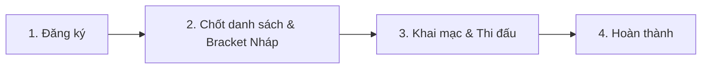

# Kế hoạch Thiết kế: Ràng buộc Khóa Cấu hình & Reset Bracket Trước/Sau khi Công bố (Publish)

Tài liệu này đặc tả quy tắc nghiệp vụ (Business Rules) và thiết kế giao diện (UI UX) cho việc cho phép thay đổi cấu hình giải đấu, reset nhánh đấu (`bracket`) khi giải đấu chưa được công bố (`Draft/Unpublished`) và khóa cứng các thông số cốt lõi sau khi giải đấu đã chính thức phát hành (`Published`).

---

## 1. Trạng thái Chưa Công bố (`Draft` / `Unpublished`)

Khi giải đấu mới ở dạng bản nháp hoặc chưa được công bố ra cộng đồng để bắt đầu đăng ký:

### Quyền hạn của Ban tổ chức (BTC):
- **Thay đổi toàn bộ cấu hình cốt lõi:**
  - Loại hình thi đấu (Đơn / Đôi).
  - Thể thức nhánh đấu (Single Elimination, Double Elimination, Round Robin).
  - Ràng buộc giới hạn ELO (Min ELO, Max ELO, Max Combined ELO, Max Teammate Gap).
  - Lệ phí tham gia giải đấu (Amount).
  - Số lượng người/đội tham gia tối đa.
- **Tạo và Reset Bracket tự do (Trong chế độ nháp trước khi chốt danh sách):**
  - BTC có quyền tạo thử sơ đồ thi đấu nháp. Tuy nhiên, sau khi chốt danh sách đăng ký chính thức, việc sinh sơ đồ thi đấu thực tế sẽ bị giới hạn nghiêm ngặt.

### Ràng buộc bắt buộc để gửi yêu cầu Công bố (Publish):
> [!IMPORTANT]
> - **Điền đầy đủ thông tin Lệ phí (Entry Fee):** BTC bắt buộc phải nhập và cấu hình đầy đủ thông tin lệ phí tham gia giải đấu. Hệ thống sẽ chặn hành động gửi yêu cầu Publish và báo lỗi nếu trường thông tin lệ phí chưa được thiết lập.
> - **Gửi phê duyệt sớm:** Đối với giải đấu có cấu hình ngày bắt đầu đăng ký (Registration Start Date), BTC phải gửi yêu cầu Publish sớm để Ban quản trị hệ thống kịp thời phê duyệt trước khi cổng đăng ký chính thức mở tự động theo đúng lịch trình.

### Chỉ dẫn trên giao diện (UI Note):
- Hiển thị một **Banner Cảnh báo Màu Xanh lá / Xanh dương (Info/Draft Mode)** ở đầu trang quản trị giải đấu:
  > ℹ️ **Chế độ Nháp:** Giải đấu chưa được công bố. Hãy cấu hình đầy đủ Lệ phí thi đấu và thông số ELO để sẵn sàng gửi yêu cầu Công bố (Publish).
- Bên cạnh nút **"Công bố giải đấu"** (Publish), bổ sung tooltip/note giải thích:
  > ⚠️ **Chú ý:** Sau khi Công bố giải đấu, các thông số cấu hình cốt lõi (Thể thức, Match Type, ELO Limits, Lệ phí) sẽ bị khóa cứng hoàn toàn nhằm bảo vệ quyền lợi và tính minh bạch cho các VĐV đăng ký tham gia.

---

## 2. Trạng thái Đã Công bố (`Published` / `Active` / `Registration`)

Khi BTC đã click nút **"Công bố giải đấu"** (hoặc trạng thái chuyển sang nhận đăng ký/đang thi đấu):

### Các thông số cốt lõi bị KHÓA CỨNG (Read-only / Disabled):
1. **Thể thức thi đấu (Bracket Type):** Không được chuyển từ Loại trực tiếp sang Vòng tròn hoặc ngược lại.
2. **Thể thức trận đấu (Match Type):** Không được đổi giữa Đơn và Đôi.
3. **Giới hạn ELO (ELO Limits):** Không được thay đổi chặn ELO.
4. **Lệ phí tham gia (Entry Fee):** Khóa hoàn toàn trường nhập lệ phí ngay khi Publish để tránh thay đổi giá trị tiền sau khi các VĐV bắt đầu nộp tiền và đăng ký thi đấu.
5. **Tạo lại nhánh đấu:** Khóa hoàn toàn tính năng tự do xáo trộn sơ đồ.

### Ràng buộc sinh sơ đồ thi đấu (Bracket Generation Constraint):
> [!WARNING]
> - **Chỉ được tạo sơ đồ thi đấu duy nhất 1 lần:** Sau khi danh sách VĐV đã chốt đầy đủ và hoàn tất việc phân chia ngày thi đấu/sân bãi, thao tác sinh sơ đồ thi đấu chính thức (Generate Bracket) **chỉ được phép thực hiện 1 lần duy nhất**. Hệ thống sẽ khóa vĩnh viễn nút sinh sơ đồ thi đấu ngay sau lần click đầu tiên để tránh làm xáo trộn kết quả xếp lịch và dữ liệu giải đấu.

### Các thông tin ĐƯỢC PHÉP CHỈNH SỬA để đảm bảo vận hành linh hoạt:
1. **Lịch thi đấu & Sân bãi (Bắt buộc phải mở):**
   - **Giờ thi đấu của từng trận (Match Start Time):** Cho phép hoãn hoặc dời giờ thi đấu nếu xảy ra sự cố thời tiết, chấn thương hoặc trận đấu trước kéo dài.
   - **Số sân/bàn thi đấu (Court/Table Number):** Cho phép chuyển trận đấu sang sân trống khác để đẩy nhanh tiến độ giải.
   - **Phân công trọng tài (Referees):** Cho phép thay đổi hoặc chỉ định trọng tài bắt chính cho từng trận đấu cụ thể.
   - **Thời gian đăng ký:** Cho phép lùi hạn đăng ký (nếu chưa đủ người) hoặc đóng đăng ký sớm (nếu các suất đã đầy).

2. **Quản lý Nhân sự & Danh sách thành viên:**
   - **Thay thế đồng đội chấn thương (Substitutions):** Đối với thể thức đấu Đôi, nếu có VĐV chấn thương trước giờ đấu, BTC được phép duyệt đổi người đồng đội khác (với điều kiện hệ thống tự động kiểm tra ELO của người mới vẫn thỏa mãn giới hạn giải đấu).
   - **Đồng ý đơn từ danh sách chờ (Waitlist):** Cho phép duyệt đôn các VĐV/Đội từ danh sách chờ vào các slot trống sau khi kick thành viên cũ.

3. **Truyền thông & Luật bổ sung:**
   - **Thông tin liên hệ & Nhà tài trợ:** Thêm/sửa logo các nhà tài trợ mới gia nhập giải đấu trong suốt tiến trình.
   - **Nội quy phụ phát sinh:** Bổ sung thể lệ phụ (quy định trang phục, xử phạt trễ giờ, cách tính điểm phụ khi hòa...).
   - **Tên giải đấu:** Chỉ cho phép sửa đổi nhẹ (sửa lỗi chính tả), không được phép đổi tên sang một giải hoàn toàn khác.

4. **Cấu hình Luật trận đấu (Chỉ chỉnh sửa trước khi trận đấu bắt đầu):**
   - **Thể thức tính điểm set đấu:** Số set thi đấu (3 set thắng 2, hoặc 1 set chạm 9), điểm chạm thắng set (chạm 4 hay chạm 6, có tie-break không). Cho phép thay đổi nếu BTC buộc phải rút ngắn trận đấu vì lý do thiếu thời gian/cháy giáo án.

### Các hành động quản trị nhánh đấu (Bracket Action):
- Loại bỏ (Kick) thành viên vi phạm quy chế (tự động đôn đối thủ TBD hoặc xử thua).
- Duyệt thành viên thay thế vào vị trí trống của đội.
- Hủy giải đấu (Cancel) hoàn tiền 100%.

### Chỉ dẫn trên giao diện (UI Note):
- Ở tab **Cấu hình** (`activeTab === 'config'`), các trường nhập liệu thuộc nhóm cốt lõi sẽ bị mờ đi (`disabled`), hiển thị biểu tượng ổ khóa 🔒. Khi hover vào sẽ hiện Tooltip giải thích lý do:
  > 🔒 *Cấu hình này đã bị khóa vì giải đấu đã công bố. Không thể chỉnh sửa để đảm bảo tính công bằng cho người tham gia.*
- Giao diện Bracket sẽ không còn nút "Tạo lại nhánh đấu/Reset" tự do nữa. Mọi sự thay đổi về nhánh đấu phải đi qua luồng chuẩn: Kick/Thay thế VĐV hoặc Cập nhật tỷ số trận đấu.

---

## 3. Quy trình Vòng đời Giải đấu & Khóa Nhánh đấu (Bracket Lifecycle Flow)

Để giải quyết bài toán thực tế khi phân chia nhánh đấu, vòng đời giải đấu được quản lý chặt chẽ qua 3 bước chuyển tiếp trạng thái:

### Bước 1: Giai đoạn Đăng ký & Nhận VĐV (Registration Phase)
* Người chơi đăng ký và BTC duyệt danh sách.
* Cấu hình giải đấu và cấu hình luật ELO vẫn có thể điều chỉnh linh hoạt.
* **Chưa có sơ đồ thi đấu (Bracket).**

### Bước 2: Chốt danh sách & Cấu hình Phân lịch thi đấu (Finalization & Scheduling Phase)
* Khi hết hạn đăng ký và danh sách VĐV đã được chốt chính thức, BTC thực hiện phân bổ lịch trình thi đấu, cấu hình sân bãi, giờ thi đấu của các vòng.

### Bước 3: Sinh nhánh đấu chính thức & Bắt đầu thi đấu (Official Bracket Generation & Ongoing Phase)
* **Thao tác sinh nhánh đấu (Generate Bracket) chỉ được nhấn 1 lần duy nhất:** Ngay sau khi chốt danh sách đăng ký và hoàn thành phân phối lịch, BTC bấm nút **"Tạo sơ đồ thi đấu" (Generate Bracket)**.
* **Ngay khi bấm tạo lần đầu:**
  1. Hệ thống sẽ sinh ra toàn bộ các trận đấu trên sơ đồ nhánh chính thức (Winners, Losers, Grand Finals) theo danh sách đăng ký đã chốt.
  2. Nút "Tạo sơ đồ thi đấu" (Generate Bracket) sẽ bị **khóa vĩnh viễn / biến mất hoàn toàn**.
  3. Trạng thái giải đấu tự động chuyển sang **`ONGOING`** (Đang thi đấu) và sơ đồ Bracket được công khai tức thì cho khán giả và người chơi ngoài trang chủ.
  4. **Khóa cứng sơ đồ nhánh và cấu hình cốt lõi:** BTC tuyệt đối không thể xóa/xáo trộn lại nhánh đấu hàng loạt, đồng thời đóng băng 100% các cấu hình cốt lõi (Lệ phí, ELO, Match Type).

* **Các thông tin DUY NHẤT được phép chỉnh sửa/thao tác trong giai đoạn Ongoing:**
  - **Lịch thi đấu & Địa điểm:** Giờ bắt đầu trận đấu, số sân/bàn thi đấu của từng trận.
  - **Nhân sự trận đấu:** Phân công hoặc thay đổi Trọng tài bắt chính cho từng trận.
  - **Tỷ số:** Ghi nhận và nhập điểm số trực tiếp cho các set đấu (bởi Trọng tài được phân công hoặc BTC).
  - **Sự cố VĐV (Chấn thương/Vi phạm):** 
    - Duyệt đổi đồng đội chấn thương trước giờ đấu (hệ thống check ELO tự động).
    - Thao tác loại bỏ (Kick) hoặc xử thua VĐV vi phạm.
  - **Truyền thông:** Đổi ảnh bìa, ảnh đại diện, bổ sung logo nhà tài trợ, bài viết tin tức.
  - **Luật bổ sung:** Chỉnh sửa ghi chú, điều lệ phụ dạng văn bản.
  - **Tình huống khẩn cấp:** Hủy giải đấu (Cancel) hoàn tiền tự động.

---

## 4. Thanh tiến trình trạng thái trực quan (Visual Progress Stepper)

Tại màn hình Dashboard Quản lý Giải đấu của Ban tổ chức, hệ thống hiển thị một **Thanh tiến trình trực quan (Stepper)** để BTC biết rõ giải đấu đang ở giai đoạn nào và các việc cần làm tiếp theo:



### Chi tiết hiển thị của Stepper trên giao diện:
1. **Trạng thái 1: Nhận Đăng ký (Registration)**
   - *Mô tả hiển thị:* VĐV đăng ký tham gia.
   - *Hành động khả dụng:* Duyệt/Từ chối đơn đăng ký, cấu hình ELO/lệ phí.
   - *Nút chuyển tiếp:* **"Chốt đăng ký & Xem nhánh đấu nháp"**.

2. **Trạng thái 2: Thiết lập nhánh đấu nháp (Draft Bracket)**
   - *Mô tả hiển thị:* Đã chốt danh sách đăng ký. Hệ thống đang hiển thị sơ đồ hạt giống nháp.
   - *Hành động khả dụng:* Xem thử sơ đồ, thay đổi hạt giống, bấm "Reset Bracket" tạo lại nhánh đấu thoải mái. Chỉnh sửa luật set đấu.
   - *Nút chuyển tiếp:* **"Khai mạc & Bắt đầu thi đấu"** (Yêu cầu xác nhận cảnh báo khóa thông tin).

3. **Trạng thái 3: Đang thi đấu (Ongoing)**
   - *Mô tả hiển thị:* Giải đấu đang diễn ra. Các trận đấu đang được cập nhật điểm số.
   - *Hành động khả dụng:* Đổi giờ đấu, đổi sân đấu, phân công trọng tài, nhập điểm số, xử lý VĐV chấn thương/kick.
   - *Nút chuyển tiếp:* Tự động hoàn thành khi tất cả các trận trong sơ đồ Bracket/Vòng tròn được cập nhật kết quả chung cuộc.

4. **Trạng thái 4: Kết thúc (Completed)**
   - *Mô tả hiển thị:* Giải đấu kết thúc thành công.
   - *Hành động khả dụng:* Xem kết quả trao giải, lịch sử điểm số, gửi yêu cầu thanh toán (Payout) cho BTC.

---

## 5. Bản đồ Thiết kế chi tiết cho Phát triển (Implementation Roadmap)

### A. Database & Backend (API Constraints):
- Thêm check trong Service Update cấu hình giải đấu:
  ```typescript
  if (tournament.status !== 'DRAFT') {
    // Ném lỗi BadRequestException nếu cố tình gửi các trường thay đổi thể thức, ELO limits, hoặc lệ phí
  }
  ```
- Thêm cột trạng thái `is_published` hoặc check trực tiếp qua trạng thái giải đấu `status`.

### B. Giao diện Frontend:
- Sử dụng hook kiểm tra trạng thái giải đấu. Nếu `tournament.status !== 'DRAFT'` (hoặc `isPublished === true`), tự động truyền prop `disabled={true}` vào các Component Input tương ứng trong Form cấu hình.
- Ẩn/Hiện nút Reset Bracket dựa trên trạng thái Draft.

---

## 6. Cơ chế Tự động Hết hạn & Khóa Đăng ký Thủ công (Registration Expiry & Locking Mechanism)

Để tối ưu hóa quản lý số lượng VĐV đăng ký tham gia, hệ thống áp dụng cơ chế kết hợp giữa Tự động và Thủ công để kiểm soát link đăng ký:

### A. Tự động Hết hạn theo Thời gian (Automatic Expiration):
- **Cơ sở dữ liệu:** Sử dụng trường `registrationEndDate` (Thời hạn đăng ký) trong bảng `tournaments`.
- **Backend Validation:**
  - Trong các API đăng ký (`/register` và `/join-team`), hệ thống tự động kiểm tra thời gian hiện tại:
    ```typescript
    if (existing.registrationEndDate && new Date() > new Date(existing.registrationEndDate)) {
      throw new BadRequestException('Hạn đăng ký giải đấu đã kết thúc');
    }
    ```
- **Frontend UI:**
  - Màn hình thông tin giải đấu ngoài trang chủ: Nếu thời gian hiện tại vượt quá `registrationEndDate`, nút **"Đăng ký tham gia"** tự động chuyển sang trạng thái disabled với nhãn `"Hết hạn đăng ký"`.

### B. Khóa Đăng ký Thủ công bởi Ban tổ chức (Manual Registration Locking):
- **Mục đích:** Khi số lượng đăng ký vượt quá kỳ vọng hoặc BTC muốn chốt sớm để phân lịch trước hạn, BTC có quyền đóng cổng đăng ký lập tức.
- **Thiết kế Database:**
  - Bổ sung cột `isRegistrationLocked` (`boolean`, mặc định `false`) vào bảng `tournaments` để quản lý trạng thái khóa độc lập với thời gian.
- **Quy trình Quản trị (BTC):**
  - Trên màn hình Dashboard Quản lý Giải đấu của BTC, bổ sung nút toggle **"Khóa đăng ký" (Lock Registration)** / **"Mở khóa đăng ký" (Unlock Registration)**.
  - Khi BTC click **"Khóa đăng ký"**: hệ thống gọi API patch cập nhật `isRegistrationLocked: true`.
- **Quy trình Kiểm tra (Backend):**
  - Thêm check cờ khóa trong API đăng ký:
    ```typescript
    if (existing.isRegistrationLocked) {
      throw new BadRequestException('Đăng ký giải đấu đã tạm thời bị khóa bởi Ban tổ chức');
    }
    ```
- **Quy trình hiển thị (VĐV):**
  - Khi `isRegistrationLocked === true`, link đăng ký sẽ lập tức bị vô hiệu hóa. 
  - Nút đăng ký hiển thị nhãn `"Đã khóa đăng ký"` kèm thông báo: *"Giải đấu đã tạm ngưng nhận đăng ký mới từ Ban tổ chức."*

